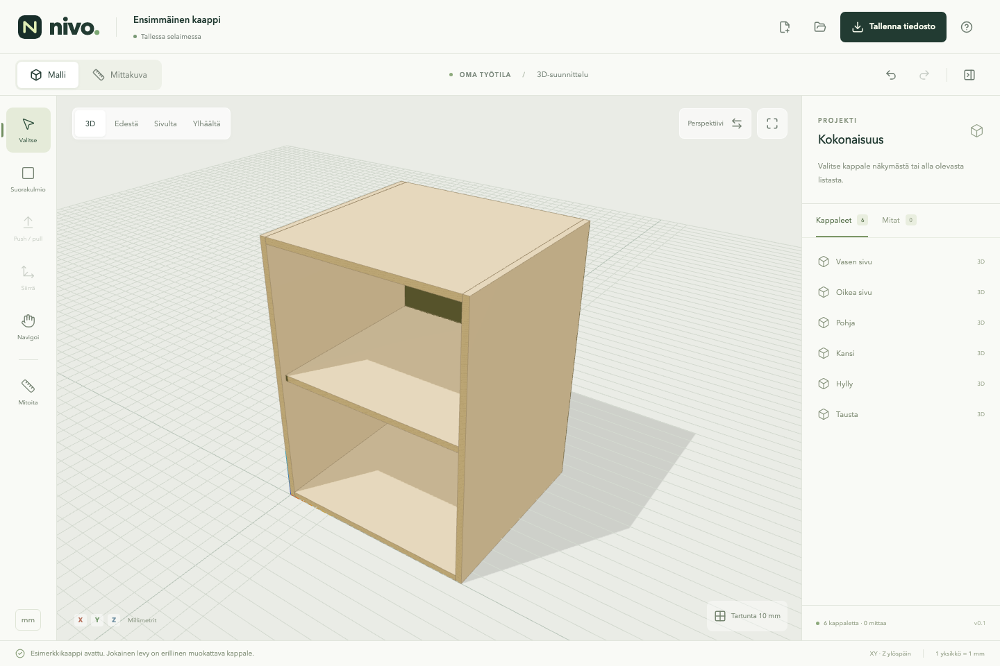

# Nivo

**Ideasta mitoitettuun muotoon.** Selaimessa toimiva avoimen lähdekoodin
3D-suunnittelutyökalu kalusteille, rakennusosille ja tiloille.

Versio 0.3 tuo pintakohtaisen push/pullin, reunasta vedettävät apuviivat ja
kynän suunnan lukituksen sekä pituuden poiminnan.
OpenCascade laskee tarkan geometrian Web Workerissa. Three.js näyttää siitä
johdetun verkon; projektin mitat eivät riipu renderöintikolmioista.



## Käynnistä

Node.js 22.12+ (testattu Node 24:llä).

```sh
npm ci
npm run dev
```

Avaa **http://127.0.0.1:5173** tai terminaalin ilmoittama osoite.
Sovellus ei tarvitse käyttäjätiliä, palvelintietokantaa tai API-avaimia.
Kaikki laskenta ja projektitallennus tapahtuvat selaimessa. Riippuvuuksien
asennus tarvitsee verkkoyhteyden; paikallinen sovellus ei käytä ulkoisia
fontteja, CDN-kirjastoja tai laskentapalveluja.

```sh
npm run build       # tyyppitarkistus ja dist/
npm run preview     # tuotantopaketin paikallinen esikatselu
```

## Ensimmäinen työnkulku

1. Piirrä suorakulmio XY-tasolle vetämällä tai kirjoittamalla tarkat mitat.
2. Enter tai vedon päättäminen hyväksyy luonnoksen. Paina **E**, osoita pintaa
   ja vedä sille paksuus. Samalla työkalulla voi muokata kappaleen muitakin tasopintoja.
3. Valitse kappale tai pinta, siirrä, kopioi ja poista kappaleita.
4. Tartu verteksiin, reunojen keskipisteisiin, apuviivoihin tai 10 mm ruudukkoon.
   Hae toisen osan keskipiste kohdistimella ja pidä Shift pohjassa: pisteestä
   lähtevät suuntalinjat ohjaavat piirtämistä ja siirtoa.
5. Vaihda perspektiivin ja rinnakkaisprojektion välillä. Käytä etu-, sivu-, ylä-
   ja 3D-näkymiä sekä sovita valinta näkymään.
6. Avaa **Mittakuva**, valitse kappale ja lisää leveys-, syvyys- tai korkeusmitta.
   Mitat seuraavat kappaleen muutoksia.
7. Vie A4-vaaka-arkki SVG:nä valitussa fyysisessä mittakaavassa. Näkyvät ja
   piilossa olevat viivat lasketaan CAD-geometriasta.
8. Peru ja palauta muutoksia. Lataa `.nivo`-tiedosto ja avaa se uudelleen.

Mittasyöttö hyväksyy `600`, `18 mm`, `1,8 cm`, `2,4 m` ja siirroissa negatiiviset
arvot. Oletusyksikkö on millimetri ja Z-akseli osoittaa ylöspäin.
Automaattitallennus palauttaa työn samassa selaimessa. **Lataa myös oma
projektitiedosto:** selaimen tallennustila ei ole varmuuskopio.

Tyhjästä työtilasta voi avata **600 × 800 × 560 mm esimerkkikaapin**. Sen kuusi
levyä ovat itsenäisiä osia. Esimerkissä ei vielä ole ovea tai linkitettyjä
komponentteja.

## Piirtämisen perustyökalut

- **Push / pull (E):** pinnan korostus seuraa kohdistinta. Paina ja vedä pintaa
  normaalinsa suunnassa tai valitse pinta, paina E ja kirjoita siirtymä. Positiivinen
  arvo vetää ulospäin, negatiivinen työntää sisään. Toimii laatikon kaikilla kuudella
  pinnalla, kynämuodoilla ja yhdistettyjen osien tasopinnoilla.
- **Kynä:** aseta verteksit näkymän tasolle tai tartu mallin pisteisiin. X/Y/Z
  lukitsee akselin. Shift lukitsee aloitetun viivan suunnan: toisen pisteen
  napsautus projisoi sen lukitulle viivalle ja määrää pituuden. Esimerkiksi
  suorakulmion kolmannen sivun pituuden voi poimia ensimmäisestä pisteestä.
  Vapauta Shift ja sulje muoto tarttumalla aloitusverteksiin. Myös pysty- ja
  vinotasot käyvät, kun kaikki suljettavan muodon pisteet ovat samalla tasolla.
  Numeroilla annetut X/Y/Z-siirtymät ovat suhteessa edelliseen pisteeseen;
  lukitussa suunnassa syötetään yksi pituus. Enter lisää tarkan pisteen tai sulkee muodon.
- **Mittatyökalu:** ensimmäinen painallus aktivoi apuviivan. Toinen painallus
  avaa valinnan apuviivan ja vapaan mittaviivan välillä. Apuviiva alkaa kappaleen
  verteksistä tai reunasta. Reunasta vetäminen tekee reunan suuntaisen apuviivan
  halutulle etäisyydelle. Siihen voi tarttua myös jatkeen kohdalta. Vapaa mittaviiva näyttää
  kahden pisteen etäisyyden. Vedä tai napsauta alku- ja loppupisteet.
- **Apuviivan suunta:** oletuksena 45° suunnat; X/Y/Z lukitsee akselin, Esc vapauttaa.
  R kiertää 45°, Shift+R käynnistää vapaan kierron. Kulman, pituuden tai reunaetäisyyden
  voi kirjoittaa. Valmista viivaa voi valita näkymästä tai Viivat-listasta ja kiertää.
- **Apuviivan näkyvyys:** sininen katkoviiva peittyy normaalisti kappaleen taakse.
  Viivat-listan x-ray näyttää valitun viivan kappaleiden läpi. Näkymän asetuksista
  saa x-rayn kaikille apuviivoille. Molemmat asetukset tallentuvat projektiin.
- **Kelluva mittaikkuna:** numero aloittaa ensimmäisestä kentästä, Tab vaihtaa
  kenttää, Enter hyväksyy. Hiiren vapautus hyväksyy vedon. Kirjoitetut mitat eivät
  muutu hiiren liikkeestä. Kenttää voi valita myös napsauttamalla.
- **Erilliset osat:** jokaisella objektilla on oma mesh. Monivalinta tai
  Shift/Ctrl/Cmd-napsautus valitsee useita osia. Yhdistä tekee niistä yhden
  CAD-kappaleen ja meshin; päällekkäiset tilavuudet yhdistyvät. Peru palauttaa
  erilliset osat. Yhdistäminen vaatii paksuuden.


## Ohjaus

- Napautus valitsee. Työkalun yhden sormen veto hyväksytään sormen noustessa.
  Kosketuksella **Poimi viite** ja pisteen napautus korvaavat Shiftillä poimimisen.
- Kahden sormen ele panoroi ja zoomaa. **Navigoi**-tilassa yksi sormi kiertää.
- Hiiren oikea painike kiertää, keskipainike panoroi ja rulla zoomaa.
  Navigoi-tilassa myös vasen painike kiertää.
- V = valitse, R = suorakulmio (apuviivaa muokattaessa kierto), E = push/pull, M = siirrä, K = kynä,
  T = mittatyökalu, H = navigoi.
  X/Y/Z lukitsevat siirron, kynän tai apuviivan akselin. Enter hyväksyy.
  Esc vapauttaa ensin suuntalukon; ilman lukkoa se peruu työkalun.
  Ctrl/Cmd+Z peruu, Ctrl/Cmd+Shift+Z palauttaa.
- Keskeiset toiminnot löytyvät painikkeista ilman näppäimistöä.

## Tarkistukset

```sh
npm test
npx playwright install chromium
npm run test:e2e
npm run build
NIVO_PREVIEW=1 npm run test:e2e
npm run format:check
```

Geometriatestit käyttävät oikeaa WASM-ydintä. Selaintestit kattavat työpöytäkoon
ja Chromiumin kosketusemuloinnin. Fyysistä iPadia/Safaria ei ole vielä testattu.
[Testiraportti](docs/validation.md) kuvaa tarkistukset ja rajat.

## Rajaus ja jatko

V0.3 tukee suorakulmioita, tasomaisia kynämuotoja, kaikkien nykyisten mallien
tasopintojen push/pullia sekä tilavuuskappaleiden yhdistämistä. Kaarevien pintojen
muokkaus ei ole mukana. Apuviivoihin tartunta edellyttää samaa piirtotasoa;
haettu viitepiste projisoidaan piirtotasoon. Reunan tartunta tukee suoria CAD-reunoja.
Yleinen pintamuokkaus tallentaa tarkan BRep-geometrian. Sen muuttamien vanhojen
verteksiviitteiden sekä yhdistämisessä poistuneiden osien viitteet näytetään
rikkoutuneina; undo palauttaa ne. Pintaan piirtäminen ja sen jakaminen, leikkaukset,
mesh-tuonti, layerit, ryhmät, komponentit, pintamateriaalit, scenet sekä PDF-,
STEP-, STL- ja GLB-vienti ovat seuraavien vaiheiden töitä.

Piirustus sisältää yhden ortografisen näkymän ja osien kokonaismittoja. Monien
mittaviivojen sijoittelu, useat näkymät ja leikkaukset kuuluvat vaiheeseen 6.
**Käytettävyys ja perustyökalut ovat seuraavien vaiheiden etusijalla.**
Layerit, ryhmät ja komponentit seuraavat toimivaa mallinnuksen perustaa.

- [Alkuperäinen määrittely](docs/requirements.fi.md)
- [Arkkitehtuuri ja päätökset](docs/architecture.md)
- [Projektiformaatti v3](docs/project-format.md)
- [Toteutusvaiheet](docs/roadmap.md)

## Lisenssi

Nivon oma koodi: [MIT](LICENSE). Replicad ja Three.js: MIT.
OpenCascade.js/WASM: LGPL-2.1; OCCT sisältää oman lisenssipoikkeuksensa.
[Kirjastojen lisenssit ja lähdelinkit](public/licenses/NOTICE.txt) ovat mukana
myös tuotantopaketissa.
