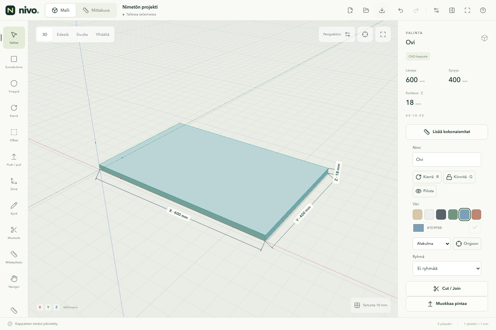

# Nivo

**Ideasta mitoitettuun muotoon.** Selaimessa toimiva avoimen lähdekoodin
3D-suunnittelutyökalu kalusteille, rakennusosille ja tiloille.

Versio 0.6.0 lisää osien näkyvät kokonaismitat 3D-näkymään ja mittakuvaan,
yhteisen väripaletin sekä push/pullin kohdistuksen toiseen pintaan.
**Lisää kokonaismitat** merkitsee valittujen osien X/Y/Z-ulkomitat yhdellä painalluksella.
Mitat seuraavat muokkausta ja siirtyvät SVG-vientiin. **E** toimii myös kahdella
klikkauksella: lähtöpinta → tavoitepinta. Vihreä mitta ja numerokenttä käyttävät
samaa nimeä **Toteutuva kokonaismitta**.
OpenCascade laskee tarkan geometrian Web Workerissa. Three.js näyttää siitä
johdetun verkon; projektin mitat eivät riipu renderöintikolmioista.



## Käynnistä

Node.js 22.12+ (testattu Node 24:llä).

```sh
npm ci
npm run dev
```

Avaa **http://127.0.0.1:5173** tai terminaalin ilmoittama osoite.
Sovellus ei tarvitse käyttäjätiliä, palvelintietokantaa tai API-avaimia.
Kaikki laskenta ja projektitallennus tapahtuvat selaimessa. Riippuvuuksien
asennus tarvitsee verkkoyhteyden; paikallinen sovellus ei käytä ulkoisia
fontteja, CDN-kirjastoja tai laskentapalveluja.

```sh
npm run build       # tyyppitarkistus ja dist/
npm run preview     # tuotantopaketin paikallinen esikatselu
```

## Ensimmäinen työnkulku

1. Piirrä suorakulmio XY-tasolle vetämällä tai kirjoittamalla tarkat mitat.
2. Enter tai vedon päättäminen hyväksyy luonnoksen. Paina **E**, osoita pintaa
   ja vedä sille paksuus. Samalla työkalulla voi muokata kappaleen muitakin tasopintoja.
3. Klikkaa koko kappale valituksi. M siirtää; pidä Ctrl pohjassa vedon aikana
   tehdäksesi kopion. Osoita pintaa ja paina E tai O pinnan muokkaamiseen.
4. Tartu verteksiin, reunojen keskipisteisiin, apuviivoihin tai 10 mm ruudukkoon.
   Hae toisen osan keskipiste kohdistimella ja pidä Shift pohjassa: pisteestä
   lähtevät suuntalinjat ohjaavat piirtämistä ja siirtoa.
5. Vaihda perspektiivin ja rinnakkaisprojektion välillä. Käytä etu-, sivu-, ylä-
   ja 3D-näkymiä sekä sovita valinta näkymään.
6. Valitse osa ja paina **Lisää kokonaismitat**. Mitat näkyvät heti 3D:ssä ja
   **Mittakuvassa** sekä seuraavat osan muutoksia. Valitse osan väri väripaletista.
7. Vie A4-vaaka-arkki SVG:nä valitussa fyysisessä mittakaavassa. Näkyvät ja
   piilossa olevat viivat lasketaan CAD-geometriasta.
8. Peru ja palauta muutoksia. Lataa `.nivo`-tiedosto ja avaa se uudelleen.

Mittasyöttö hyväksyy `600`, `18 mm`, `1,8 cm`, `2,4 m` ja siirroissa negatiiviset
arvot. Oletusyksikkö on millimetri ja Z-akseli osoittaa ylöspäin.
Automaattitallennus palauttaa työn samassa selaimessa. **Lataa myös oma
projektitiedosto:** selaimen tallennustila ei ole varmuuskopio.

Tyhjästä työtilasta voi avata **600 × 800 × 560 mm esimerkkikaapin**. Sen kuusi
levyä ovat itsenäisiä osia. Esimerkissä ei vielä ole ovea tai linkitettyjä
komponentteja.

## Työtila ja kopiointi

Yksi 60 px yläpalkki sisältää Nivon, **Malli / Mittakuva** -vaihdon, projektin
nimen ja tallennustilan, tiedostopainikkeet, historian, asetukset ja avun.
**Siirry koko näyttöön** piilottaa selaimen palkit. Sama painike tai Esc palauttaa
tavallisen ikkunan. Kapealla näytöllä tiedostot ja muut lisätoiminnot avataan
**Lisää toimintoja** -painikkeesta.

Yksi klikkaus valitsee koko objektin. Pintakorostus osoittaa, mihin E tai O
kohdistuu. **M** siirtää osaa siitä verteksistä tai kohdasta, josta tartuit.
Pidä **Ctrl** (tai Alt) pohjassa vedon aikana ja vapauta hiiri: kopio asettuu
kohteeseen, alkuperäinen pysyy paikoillaan. Jos vapautat Ctrl:n ennen hiirtä,
tulos on tavallinen siirto. **Siirrä kopio** -valinnalla voi myös kirjoittaa
siirtymän tai käyttää toimintoa kosketuksella. Esc peruu keskeneräisen kopion;
Peru poistaa hyväksytyn kopion yhdellä askeleella. Kopio säilyttää tarkan
geometrian, värin ja ryhmän, mutta saa oman tunnisteen.

## Mitat ja osavärit

Valitse yksi tai useita osia ja paina **Lisää kokonaismitat**. Toiminto lisää
puuttuvat X-, Y- ja Z-ulkomitat; samaa mittaa ei lisätä kahdesti. Mitat-listasta
voi poistaa yksittäisen mitan. 3D-näkymän asetuksissa voi näyttää kaikki lisätyt
mitat, vain valinnan mitat tai piilottaa mittamerkinnät. Suoraan katselusuunnan
suuntaista mittaa ei piirretä, koska sen pituus kuvassa on nolla. Piilotetun
osan mitat piiloutuvat mallinnusnäkymässä.

**Mittakuva** näyttää näkymään kuuluvat kaksi mittasuuntaa. Etukuvassa näkyvät
X/Z, sivukuvassa Y/Z ja yläkuvassa X/Y. Päällekkäiset mittaluvut sijoitetaan eri
riveille. Sovitus varaa myös mittaviivoille tilan, ja SVG käyttää valittua
fyysistä mittakaavaa. Mitat ovat mallin akseleiden suuntaisia ulkomittoja;
vinon osan oma reunapituus, kahden vapaan pisteen väliset mitat ja kulmamitat
ovat seuraavaa mitoituksen jatkokehitystä.


Valinnan **Väri** vaihtaa yhden tai kaikkien valittujen osien värin yhdellä
painalluksella. Oma väri hyväksytään värivalitsimen vieressä olevasta merkistä.
Muutos tallentuu projektiin ja peruuntuu yhtenä askeleena. Hold-kiinnitys näkyy
edelleen violetilla; osan oma väri palautuu näkyviin, kun kiinnitys vapautetaan.

## Piirtämisen perustyökalut

- **Pintaan piirtäminen:** pidä Muoto-valikon **Piirrä kappaleen pinnalle** päällä.
  Aloita suorakulmio, ympyrä tai kynämuoto kappaleen tasopinnasta. Ensimmäinen
  piste valitsee piirtotason; myös pysty- ja vinopinnat toimivat. Paksuus **0**
  jakaa pinnan ja valitsee rajatun alueen. Paina E ja vedä vain tätä aluetta.
  **Leikkaa läpi** tekee läpireiän; **Poimi syvyys pinnasta** asettaa siirtymän
  toisen pinnan osoitetusta pisteestä.
- **Ympyrä (C):** vedä keskipisteestä säde tai kirjoita halkaisija. Muoto-valikosta
  saa myös ellipsin kahdella halkaisijalla ja säännöllisen 3–64-sivuisen monikulmion.
  Kynällä voi tehdä muun tasomaisen suljetun ääriviivan. Ympyrät ja ellipsit ovat
  tarkkoja CAD-käyriä.
- **Muodon ominaisuudet:** anna nimi, mitat ja paksuus samassa valikossa.
  Pintaan liitetyn mallinnettavan muodon positiivinen paksuus lisää materiaalia,
  negatiivinen tekee syvennyksen. Muut muodot syntyvät itsenäisinä objekteina.
  **Rakentamisen apumuoto** näkyy sinisinä ääriviivoina ja tarjoaa tartunnat;
  se ei tule mittakuvaan. **Piirros** näkyy ääriviivoina myös mittakuvassa.
  **Nimetty osa** on itsenäinen osa; kopiot eivät ole linkitettyjä komponentteja.

- **Offset (O):** osoita vapaata tasopintaa ja paina O tai valitse työkalu ja
  vedä pinnasta. Hiiren liike säätää sisennystä, sininen ääriviiva näyttää tuloksen.
  Kirjoita halutessasi tarkka mitta: se säilyy hiiren liikkuessa. Klikkaus,
  vedon vapautus tai Enter hyväksyy. Esc peruu esikatselun. Kappale säilyy
  yhtenä objektina, jonka pintaan syntyy uusi muokattava alue. E:n **Toteutuva kokonaismitta**
  18 jättää kaappiin 18 mm takaseinän; **Leikkaa läpi**, vastapinnan ohi vetäminen tai
  toteutuva kokonaismitta 0 tekee aukon. Toimii myös ympyröillä ja vinoilla tasopinnoilla.
  Liian suuri tai erillisiksi alueiksi hajoava sisennys hylätään muuttamatta mallia.
- **Push / pull (E):** vapaan pinnan korostus seuraa kohdistinta jo valintatilassa. Paina ja vedä pintaa
  normaalinsa suunnassa tai valitse pinta, paina E ja kirjoita siirtymä. Positiivinen
  arvo vetää ulospäin, negatiivinen työntää sisään. Toimii laatikon kaikilla kuudella
  pinnalla, kynämuodoilla ja yhdistettyjen osien tasopinnoilla.
- **Push/pull tavoitepintaan:** klikkaa E-työkalulla lähtöpintaa, osoita toisen
  osan tai saman osan toista tasopintaa ja klikkaa hyväksyäksesi. Myös veto ja
  vapautus tavoitepinnan päällä toimii. Sininen korostus näyttää kohteen.
  Yhdensuuntaiset pinnat tulevat samalle tasolle. Vinosta tavoitepinnasta
  poimitaan osoitetun pisteen taso lähtöpinnan normaalin suunnassa;
  lähtöpinta ei kallistu. Myös Hold-osa käy viitteeksi. Kirjoitettu mitta
  ohittaa tartunnan, Esc peruu. Kaarevia tavoitepintoja ei vielä käytetä.
- **Toteutuva kokonaismitta:** push/pull näyttää siirtymän ja toteutuvan kokonaismitan.
  652 mm osassa siirtymä `−150` jättää 502 mm. Paina Tab: sama luku muuttuu
  lopulliseksi mitaksi 150 mm, ja siirtymäksi lasketaan −502 mm. Shift+Tab
  vaihtaa takaisin. Kenttää napsauttamalla voit syöttää toteutuvan kokonaismitan suoraan.
  Suurempi mitta pidentää osaa; vastapinta säilyy paikallaan myös vastakkaisilta
  sivuilta muokattaessa. Etumerkitön siirtymä seuraa vedon suuntaa (ilman vetoa
  ulospäin), `+` ja `−` määräävät suunnan erikseen. Toteutuva kokonaismitta on
  vähintään nolla; nolla avaa rajatun alueen läpi. Koko osan poistava työntö hylätään.
  Vihreä mittaviiva kulkee ensimmäisestä vastapinnasta uuteen pintaan.
  Syvennyksessä voi näin jättää esimerkiksi 5 mm materiaalia. Vaihtelevan
  paksuuden osassa mitta koskee osoitettua kohtaa ja valitun pinnan normaalin suuntaa.
  Tyhjä tila tai erillinen solidi vastapinnan takana ei kasvata tätä mittaa.
- **Kynä:** aseta verteksit näkymän tasolle tai tartu mallin pisteisiin. X/Y/Z
  lukitsee akselin. Shift lukitsee aloitetun viivan suunnan: toisen pisteen
  napsautus projisoi sen lukitulle viivalle ja määrää pituuden. Esimerkiksi
  suorakulmion kolmannen sivun pituuden voi poimia ensimmäisestä pisteestä.
  Vapauta Shift ja sulje muoto tarttumalla aloitusverteksiin. Myös pysty- ja
  vinotasot käyvät, kun kaikki suljettavan muodon pisteet ovat samalla tasolla.
  Numeroilla annetut X/Y/Z-siirtymät ovat suhteessa edelliseen pisteeseen;
  lukitussa suunnassa syötetään yksi pituus. Enter lisää tarkan pisteen tai sulkee muodon.
- **Mittatyökalu:** ensimmäinen painallus aktivoi apuviivan. Toinen painallus
  avaa valinnan apuviivan ja vapaan mittaviivan välillä. Apuviiva alkaa kappaleen
  verteksistä tai reunasta. Reunasta vetäminen tekee reunan suuntaisen apuviivan
  halutulle etäisyydelle. Koko reuna korostuu ja tartuntapiste seuraa kohdistinta.
  Vedä kannen tai sivupinnan puolelle: siirto seuraa kyseistä pintaa.
  Siihen voi tarttua myös jatkeen kohdalta. Vapaa mittaviiva näyttää
  kahden pisteen etäisyyden. Vedä tai napsauta alku- ja loppupisteet.
- **Apuviivan suunta:** reunasta vedettäessä X/Y/Z lukitsee **siirtosuunnan**;
  viiva säilyttää reunan suunnan. Sama näppäin vapauttaa lukon. Verteksistä
  alkavan viivan X/Y/Z lukitsee viivan suunnan; oletuksena 45° ennakointi.
  R kiertää 45°, Shift+R käynnistää vapaan kierron. Kulman, pituuden tai reunaetäisyyden
  voi kirjoittaa. Valmista viivaa voi valita näkymästä tai Viivat-listasta ja kiertää.
- **Apuviivan näkyvyys:** sininen katkoviiva peittyy normaalisti kappaleen taakse.
  Viivat-listan x-ray näyttää valitun viivan kappaleiden läpi. Näkymän asetuksista
  saa x-rayn kaikille apuviivoille. Molemmat asetukset tallentuvat projektiin.
- **Mittaikkuna:** oletuksena oikeassa sivupaneelissa, mallin ulkopuolella.
  Vedä otsikosta haluamaasi paikkaan; paikka säilyy työkalujen välillä.
  Palautuspainike telakoi ikkunan takaisin oikeaan reunaan.
  Numero aloittaa ensimmäisestä kentästä, Tab vaihtaa
  kenttää, Enter hyväksyy. Hiiren vapautus hyväksyy vedon. Kirjoitetut mitat eivät
  muutu hiiren liikkeestä. Kenttää voi valita myös napsauttamalla.
- **Jatkuvat työkalut:** hyväksytty toiminto päättää vain nykyisen vedon.
  Aloita seuraava piirto, siirto, apuviiva tai pintamuokkaus samalla työkalulla.
  Siirrä-työkalulla voi tarttua suoraan seuraavaan kappaleeseen.
  Esc peruu keskeneräisen luonnoksen, tyhjentää valinnan ja palauttaa valintatyökaluun.
- **Erilliset osat:** jokaisella objektilla on oma mesh. Monivalinta tai
  Shift/Ctrl/Cmd-napsautus valitsee useita osia. Yhdistä tekee niistä yhden
  CAD-kappaleen ja meshin; päällekkäiset tilavuudet yhdistyvät. Peru palauttaa
  erilliset osat. Yhdistäminen vaatii paksuuden.


## Ohjaus


**Cut ja Join:** avaa **Muotoile (B)** tai muotovalikon Toiminto-kenttä.
Valitse ensin **Kohteet (Target bodies)** ja sitten **Työstökappaleet (Tool bodies)**
listasta tai näkymästä. Kumpikin joukko voi sisältää useita tilavuuskappaleita.
Sininen korostaa kohteet, punainen työstökappaleet. **Vaihda keskenään** kääntää
leikkauksen suunnan. **Säilytä työstökappaleet** on oletuksena päällä.

Cut vähentää kaikkien työstökappaleiden tilavuuden jokaisesta kohteesta. Join
yhdistää molemmat joukot yhdeksi osaksi; erilliset soliditkin sallitaan.
Undo palauttaa koko operaation, myös poistuneet lähteet. Ympyräpursotus sopii
lieriöreiän leikkuriksi, ellipsi soikeaan läpäisyyn ja kynämuoto vapaaseen ääriviivaan.
Paksuudettomat luonnokset eivät kelpaa. Jos leikkurit eivät osu kohteisiin,
sovellus ilmoittaa siitä ja säilyttää lähteet. Kokonaan leikattu kohde poistuu;
sen mitat jäävät rikkoutuneiksi viitteiksi, kunnes ne poistetaan tai toiminto perutaan.


- Napautus valitsee. Työkalun yhden sormen veto hyväksytään sormen noustessa.
  Kosketuksella **Poimi viite** ja pisteen napautus korvaavat Shiftillä poimimisen.
- Kahden sormen ele panoroi ja zoomaa. **Navigoi**-tilassa yksi sormi kiertää.
- Hiiren oikea painike kiertää, keskipainike panoroi ja rulla zoomaa.
  Navigoi-tilassa myös vasen painike kiertää.
- V = valitse, S = suorakulmio, R = kierrä (apuviivaa muokattaessa viivan kierto),
  O = Offset, E = push/pull, G = kiinnitä/vapauta, M = siirrä, K = kynä,
  C = ympyrä/muut muodot, B = Muotoile (Cut/Join), T = mittatyökalu, H = navigoi.
  X/Y/Z lukitsevat siirron, kynän tai apuviivan akselin. Enter hyväksyy.
  Sama X/Y/Z vapauttaa akselilukon. Esc päättää työkalun myös lukon ollessa päällä.
  Ctrl/Cmd+Z peruu, Ctrl/Cmd+Shift+Z palauttaa.
- Keskeiset toiminnot löytyvät painikkeista ilman näppäimistöä.

## Työtilan ja kappaleiden hallinta

- **Kierrä (R):** valitse yksi tai useampi kappale. Keskipiste ja origo ovat
  pikavalintoja; **Poimi kiertopiste** hyväksyy pisteen ja **Poimi kiertoakseli reunasta**
  suoran reunan. Vedä värirengasta tai kirjoita tarkka kulma. X/Y/Z valitsee akselin,
  Shift porrastaa vedon 15 asteeseen. Enter tai hiiren vapautus hyväksyy.
- **Origoon:** kohdista valinnan yhteinen alakulma tai keskipiste origoon yhdellä
  painikkeella. Kappaleiden keskinäiset sijainnit säilyvät. Näkymän ristikkopainike
  keskittää kameran origoon liikuttamatta mallia.
- **Kiinnitä (G):** paikalleen kiinnitetty osa näkyy violetilla. Sitä ei voi siirtää,
  kiertää, Offset-muokata tai push/pullata ennen vapauttamista.
- **Kappalelista:** valitse napsauttamalla, nimeä kaksoisnapsauttamalla tai
  Nimi-kentästä, piilota silmästä ja kiinnitä lukosta. **Ryhmä** kokoaa valitut osat.
  Ryhmän nimen voi kirjoittaa suoraan listaan ja koko ryhmän piilottaa silmästä.
  Ryhmän purkaminen säilyttää kappaleet. Ryhmät ovat tässä versiossa yksitasoisia.
- **Asetukset:** Hillitty/Korostettu vaihtaa akselien voimakkuuden; nimitekstit
  saa erikseen näkyviin. Mukautuva ruudukko jatkuu kauas. Näyttöruudukon tiheys
  muuttuu zoomauksen mukana, mutta valinnainen ruudukkotartunta pysyy 10 mm:nä.

## Tarkistukset

```sh
npm test
npx playwright install chromium
npm run test:e2e
npm run build
NIVO_PREVIEW=1 npm run test:e2e
npm run format:check
```

Geometriatestit käyttävät oikeaa WASM-ydintä. Selaintestit kattavat työpöytäkoon
ja Chromiumin kosketusemuloinnin. Fyysistä iPadia/Safaria ei ole vielä testattu.
[Testiraportti](docs/validation.md) kuvaa tarkistukset ja rajat.

## Rajaus ja jatko

V0.4 tukee suorakulmioita, ympyröitä, ellipsejä, tasomaisia kynämuotoja,
tasopintojen jakoa ja push/pullia sekä Cut/Join-operaatioita. Kaarevalle pinnalle
piirtäminen ja kaarevan sivupinnan push/pull eivät ole mukana.
Apuviivoihin tartunta edellyttää samaa piirtotasoa;
haettu viitepiste projisoidaan piirtotasoon. Reunan tartunta tukee suoria CAD-reunoja.
Yleinen pintamuokkaus tallentaa tarkan BRep-geometrian. Ennallaan säilyvät
CAD-verteksit säilyttävät viitteensä; poistuneet kohteet näytetään rikkoutuneina.
Join siirtää säilyvät lähdeviitteet tuloskappaleeseen. Siirtyvien tai muuttuvien
topologiakohteiden yleinen nimeäminen on jatkotyötä.
Tarkka kopiointi, mesh-tuonti, layerit, ryhmähierarkia,
linkitetyt komponentit, pintamateriaalit, scenet sekä PDF-,
STEP-, STL- ja GLB-vienti ovat seuraavien vaiheiden töitä.

Piirustus sisältää yhden ortografisen näkymän ja osien kokonaismittoja. Monien
mittaviivojen sijoittelu, useat näkymät ja leikkaukset kuuluvat vaiheeseen 6.
**Käytettävyys ja perustyökalut ovat seuraavien vaiheiden etusijalla.**
Layerit, ryhmähierarkia ja linkitetyt komponentit seuraavat toimivaa mallinnuksen perustaa.

- [Alkuperäinen määrittely](docs/requirements.fi.md)
- [Arkkitehtuuri ja päätökset](docs/architecture.md)
- [Projektiformaatti v4](docs/project-format.md)
- [Toteutusvaiheet](docs/roadmap.md)

## Lisenssi

Nivon oma koodi: [MIT](LICENSE). Replicad ja Three.js: MIT.
OpenCascade.js/WASM: LGPL-2.1; OCCT sisältää oman lisenssipoikkeuksensa.
[Kirjastojen lisenssit ja lähdelinkit](public/licenses/NOTICE.txt) ovat mukana
myös tuotantopaketissa.
