# Nivo

**Ideasta mitoitettuun muotoon.** Selaimessa toimiva avoimen lähdekoodin
3D-suunnittelutyökalu kalusteille, rakennusosille ja tiloille.

Versio **0.27.0** korjaa valmiiden pintojen ja käyräreunojen 3D-tartunnat.
Kynä ja vapaa mittaviiva voivat kulkea eri korkeuksien välillä; Shift poimii
viitemitan omaan lukittuun suuntaan myös alemmasta reunasta. Suorat kynäviivat
muodostavat pintoja valmiiden piirrosrajausten väliin: esimerkiksi neliön ja
10 mm alemman kaivoympyrän väliin. [Kaatopinnan työskentely](docs/through-shapes.fi.md#kaatopinta-kynällä).

Versio **0.26.0** lisää **Muodot → Muotojen läpi** -pintatyökalun: yhdistä
poikkileikkauksia tai vierekkäisiä sivukäyriä, tarkista esikatselu ja hyväksy
pinta tai umpiosa. Ympyrästä voi tehdä myös kartion kärkeen päättämällä.
Bézier kulkee nyt oletuksena napsautettujen pisteiden kautta. Käyriin voi lisätä
tartuntapisteitä ja niiden pisteitä muuttaa jälkikäteen. Rakennusympyrät ovat
oikeita ääriviivoja ilman täyttöpintaa.
[Käyttöohje, pullon esimerkki ja prototyypin rajat](docs/through-shapes.fi.md).

Versio **0.25.0** kokoaa esityskuvan **Materiaali / Valaistus / Kuva** -näkymiin.
Vedä aurinkoa suuntakehällä ja säädä korkeutta, sävyä, voimakkuutta sekä varjojen
pehmeyttä. Studio, päivänvalo, iltavalo ja omat valaisimet antavat neljä lähtökohtaa.
**Filminen** kuvailme ja kuvan tarkentuessa kevenevä kohinan pehmennys viimeistelevät
kuvaa. Valaistussäätö säilyttää geometrian ja PBR-kartat; kuvanvienti odottaa myös
heijastusympäristön valmistumisen. [Renderipassin toteutus](docs/overnight-2026-10-08-render.md).

Versio **0.24.2** nopeuttaa apuviivojen pisteiden ja mittatekstien näkyvyystarkistusta.
Käyttäjän pyöristetyllä 12 kaapin mallilla kamerakierto nousi testissä noin
20 → 120 kuvaan/s samoilla materiaaleilla ja apuviivoilla. Piirron yksityiskohdat säilyvät.
[Mittaus ja rajaukset](docs/performance.md).

Versio **0.24.1** keskeyttää työkalujen tartunta- ja osoitushakuja kameravedon ajaksi.
Siirrä-työkalun korostus ei enää vaihdu kameran alla ja aiheuta ylimääräisiä
tekstuurien GPU-latauksia. [Mittaus ja tutkimuksen rajat](docs/performance.md).

Versio **0.24.0** lisää kuparin, hapettuneen kuparin, mustan kromin ja kuusi
anodisoidun alumiinin sävyä. Metallin **sileä / harjattu** kuviointi, väri ja kiilto
säätyvät erikseen. Metallien kevyt studioheijastus näyttää värin jo mallintaessa.
Puun materiaali suuntautuu maalatessa osan pitkän sivun mukaan; olemassa oleville
pinnoille on **Suuntaa puunsyyt pituussuuntaan**. Kolme pähkinäviilua täydentävät
kokoelmaa: ruskea amerikanpähkinä sekä lämmin ja tumma euroopanpähkinä.
Aiemmat tekstuurit ja tallennetut sävyt säilyvät. Yhteensä 105 materiaalia, 28 PBR-pintaa.

Versio **0.23.0** laajentaa **Pintakokoelman** 25 PBR-pintaan ja 12 maalisävyyn.
Mukana ovat saarni, vaahtera, kirsikka, tiikki, bambu sekä lisää tammea ja pähkinää,
pellava, nahka, graniitti, terrazzo ja terrakotta. Puut, seinäpinnat, kivet ja laatat,
tekstiilit sekä maalit löytyvät saman kokoelman suodatuksesta. Kaikkiaan 93 materiaalia.
Uusien PBR-pintojen **Vaihda värisävy** säilyttää kuvion ja vaihtaa pohjan sävyä:
sininen ei muutu ruskean puukuvan kanssa lähes mustaksi. **Kuultava sävy** säilyttää
aiemman pohjaväriin yhdistämisen, jota myös vanhat projektit käyttävät.

Versio **0.22.1** säilyttää jaetun piirustuspinnan muut alueet, kun yhtä aluetta
pursotetaan. Esimerkiksi 1000 × 1000 mm neliön 250 mm offset ja keskiosan
400 mm nosto jättävät ulkokehän paikalleen. Myös kehää voi pursottaa, ja
keskiosan jatkomuokkaukset, mitat sekä tallennus huomioivat jäljelle jäävän pinnan.

Versio **0.22.0** nopeuttaa tarkentuvan kuvan valmistelua ja materiaalinvaihtoa.
Valotuksen säätö säilyttää jo lasketut näytteet. GPU:lla mustuneen lakkapinnan
laskentavirhe on korjattu. **Pintakokoelma** sisältää tässä versiossa yhdeksän paikallista CC0-PBR-materiaalia,
juuri niille tehdyt normal-, karheus- ja korkeuskartat sekä oikeat mittakaavat.
Yhteinen HDRI-studio, pehmeät studiovarjot, pois kytkettävä kohinan pehmennys ja tarkempi sisätilan
valolaskenta viimeistelevät renderiä. [Yöpassin seloste](docs/overnight-2026-10-08-render.md).

Versio **0.21.5** erottaa ensimmäisen renderinäytteen valmistelun varsinaisesta
tarkentumisesta ja poistaa tarpeettomien shader-versioiden valmistelua aloituksesta.
Katkennut kameraveto ei jätä tarkennusta tauolle, ja tavoitteen
saavuttanut kuva näytetään kokonaan tarkentuvana myös pienellä näytemäärällä.
Täysi tarkkuus toimii myös jo valmistuneen esikatselun jälkeen. Tarkentuva-painike
jatkaa myös käyttäjän tauottamaa laskentaa.

Versio **0.21.4** korjaa kynän ja vapaan mittaviivan aloituksen perspektiivissä:
tyhjässä tilassa piste seuraa näkyvää z=0-ruudukkoa, ja akselilukitus säilyttää
mittaviivan etenemissuunnan. **Peili** tarjoaa yhden tai kaksi heijastavaa puolta,
**100 × 200 mm seinälaatta** täydentää materiaalit 56 vaihtoehtoon. Matta-asetus
ohittaa kiiltoa palauttaneet pintalakan ja karheuskartan. Renderin kameraliike
ei enää lataa tekstuureja uudelleen; tarkennus jatkuu liikkeen päätyttyä.
Suorakulmaisia LED-valopintoja näytteistetään kohdennetusti myös heijastuneen
valon laskennassa. Nopea-tila ei laske epäsuoraa valaistusta; valon voimakkuus
on edelleen suhteellinen, ei lumenluku. Pienten valoaukkojen kohina vaatii jatkotyötä.

Versio **0.21.3** palauttaa 3D-orbitin aiemman liikelogiikan: pysty- ja vaakakierto
toimivat samalla vedolla ilman kertyvää sivuttaiskallistusta. Ylänäkymästä pääsee
kiertämään kumpaankin vetosuuntaan. **Maali · tasainen väri** lisää pelkän sävyn ja
kiillon ilman tekstuuria. Tarkentuva renderi lataa ohjelmakoodinsa sovelluksen
mukana, ja nopean esikatselun LED-valot huomioivat peittävän geometrian varjot.

Versio **0.21.2** kokoaa näkymän pikatoiminnot: kuutio vaihtaa katselusuuntaa
säilyttäen zoomin, ja näyttötilojen vieressä oleva **Yleisnäkymä** palauttaa koko
mallin näkyviin viistosta. Tämän version vapaan orbitin sivuttaiskallistus
korjattiin versiossa 0.21.3.
Valitse-työkalun Shift korostaa koko osan tai suljetun kokoonpanon ennen valintaa.
Push/pullin Shift säilyy viitehakuna.

Versio **0.21.1** näyttää tekstuurin sävyn heti väriä valitessa sekä mallissa että
renderöinnissä. Hyväksy sävy valintapainikkeesta tai peru esikatselu Escillä;
hyväksytty muutos on yksi historian askel. Uusien kopioiden nimet numeroidaan:
`Kynämuoto 122 (kopio #1)`, `(kopio #2)` jne. Myös kopion kopio jatkaa samaa sarjaa.

Versio **0.21.0** korjasi kynän suuntaan sidotun mittasyötön ja Shift-viitteet,
yhtenäistää risteystartunnat, lisää pyöritettävän näkymäkuution sekä näyttötilat
Solid / Tasaväri / Ghost / Wireframe. P-työkalulla voi asetella tekstuureja
ja vaihdella valittujen osien kuvioita. Materiaalin sävyä ja kiiltoa voi säätää.
Yksi viivainpainike piilottaa kaikki mallin mitta- ja apuviivat.
Kopioidut malliosat linkittyvät oletuksena; uniikiksi tekeminen on erillinen valinta.

Versio **0.20.0** lisäsi **Veitsen (N)**, pallon ja Bézier-käyrät. Veitsi paloittelee
valitut tai näkyvät vapaat kappaleet nykyisestä kamerasta: suora, taitettu reitti,
suljettu siluetti, sileä Bézier-viilto tai vapaa viilto. Molemmat puolet säilyvät,
ja yksi Peru palauttaa leikkauksen. **Muodot → Pallo** sijoittaa keskipisteen ja
halkaisijan; **Bézier-käyrä** käyttää alku- ja loppupistettä sekä kahta ohjauspistettä.
Osan valikon **Pehmennä reunat…** avaa kaikkien reunojen pyöristyksen esikatselun.

Valintaruutu valitsee myös apu- ja mittaviivat selvästi oranssina. Shift lisää,
Delete poistaa koko valinnan ja historia palauttaa myös viivavalinnat.
Samalle suoralle päällekkäin piirretyt mittaviivat yhdistyvät automaattisesti;
uudelleen piirretty sama osuus ei lisää turhaa kumoamistapahtumaa.
[Yöpassin toteutukset ja rajat](docs/overnight-2026-10-05-modeling.md).

Versio **0.19.2** yhtenäistää mittatyökalun: painike ottaa viimeksi käytetyn
mittaustilan, nuoli avaa valikon. Vapaa mittaviiva jatkuu pisteestä pisteeseen;
Enter tai Esc päättää ketjun. Shift pitää suunnan ja poimii pituuden toisesta
pisteestä. R käynnistää hiirikierron 22,5° välein, Shift+R vapaan kierron.
Tuplaklikkaa päätepistettä siirtääksesi sitä. Viivat pysyvät erillisinä:
muut viivat eivät liiku, ja yhteisessä päässä valitaan muokattava viiva.
Oikean napin valikko poistaa koko valitun mittaviivan. Peru palauttaa muutokset.

Versio **0.19.1** selkeyttää mitta- ja kynäviivojen pisteitä sekä reunatyökalun
oranssia korostusta. Päätepisteet ja risteykset tarttuvat myös kauempaa;
ruudukko ohjaa vapaata asettelua, mutta geometriaan tarttuminen säilyttää
esimerkiksi 13, 48 ja 98 mm:n tarkat mitat. Ruudukon askelta voi muuttaa asetuksista.

Versio **0.19.0** lisäsi maalatut kipsipinnat, tasoitetun seinän, raa'an ja
liipatun betonin, lisää kiviä, kolme laattapintaa ja öljytyn pähkinän: yhteensä
53 materiaalia. Materiaalihaku ja renderin jatkuvat **Valitse / Tekstuuri / Maalaa**
-työkalut nopeuttavat pintojen käsittelyä. Samat materiaalikuvat jaetaan osien
kesken myös tarkentuvassa renderöinnissä, mikä pienentää ison mallin muistinkulutusta.

Värikuvasta voi luoda normal- ja karheusrakenteen, kohokuvion syvyys säädetään
millimetreinä ja LED-/spottiasetukset löytyvät myös mallin Materiaali-kohdasta.

Mallista työkuvaksi: **Mittakuva → Luo mitta-arkki**
asettaa 1–6 näkymää, myös tallennetut poikkileikkaukset, samalle A4-arkille yhteisessä
mittakaavassa. Tallenna arkin kohde ja näkymät projektiin; vie PDF tai SVG.
Kokonaismitat seuraavat osajoukon tai ryhmän nykyisiä ulkorajoja myös osien
järjestyksen vaihtuessa. Puuttuvat viitteet ja liian suuri kuva estävät viennin.
Levyrunko syntyy kokoonpanoksi, **Muokkaa osia** avaa sen, ja linkitetyn osan
muokkauksen vaikutus näkyy heti yhdessä **Tee uniikki** -toiminnon kanssa.
[Mitattu suorituskyky ja rajat](docs/performance.md).

Pintaan piirretyn erillisen viivan tai muodon **Jaa pinta** rajaa muokattavan
alueen ilman osan avaamista. Sen jälkeen **E** tekee taskun tai läpireiän,
myös osittain reunan ylittävästä ympyrästä. **Leikkaa aukko** on käytettävissä
myös jo hyväksytylle suljetulle muodolle. Historiassa **Palaa leikkaukseen**
palauttaa mallin leikkausta edeltävään tilaan ja avaa muodon sekä kohteet,
kun kyseinen kumoamistila on yhä tallessa. **Palauta valinta** vaihtaa vain valinnan.

- Mallilista avautuu vasemmalta. Kiinnitä se nastasta tai piilota nuolesta. Työkalupalkin kahvaa voi vetää reunaan tai napsauttaa sijainnin valitsemiseksi.
- Napsauta valitun osan tai ryhmän otsikkonimeä nimetäksesi sen. Ryhmäpolku näkyy heti alla.
- **Luo kokoonpano** yhdistää valinnan käsiteltäväksi kokonaisuudeksi. Tuplaklikkaa avataksesi yksittäiset osat; Esc tai Sulje kokoonpano päättää. **Ryhmä** järjestää mallia kansion tavoin; ryhmän voi myös valita listasta siirtoa, piilotusta tai Holdia varten. Valitse-tilassa osan nimirivi valitsee nimenomaisen osan ja avaa sen kokoonpanon näkyvästi.
- **Kopioi**: malliosien kopiot jakavat geometrian ja oletuksena materiaalin ilman erillistä komponentiksi muuttamista. **Tee uniikiksi** irrottaa osan linkin. Ryhmän vastaava toiminto säilyttää sisäiset linkit ja irrottaa ulkopuoliset kopiot. Sijainti, kierto, nimi, näkyvyys ja Hold ovat esiintymäkohtaisia. Olemassa olevat osat voi linkittää valittuun lähtöosaan.
- **P – Maalipensseli**: valitse materiaali ja napsauta osia. Paletti kertoo, koskeeko maalaus koko valintaa ja linkitettyjä kopioita.
- Oikean napin napsautus tai **Toiminnot** avaa valinnan yhteisen valikon. Oikean napin veto kiertää kameraa. Delete/Backspace tai Valitse-tilassa X poistaa koko valinnan yhdellä peruttavalla toiminnolla.
- Siirron X/Y/Z-akseli näkyy tartuntapisteen kautta myös kappaleen läpi, ja mittalappu näyttää siirtymän.

OpenCascade laskee tarkan geometrian Web Workerissa. Three.js näyttää siitä
johdetun verkon; projektin mitat eivät riipu renderöintikolmioista.

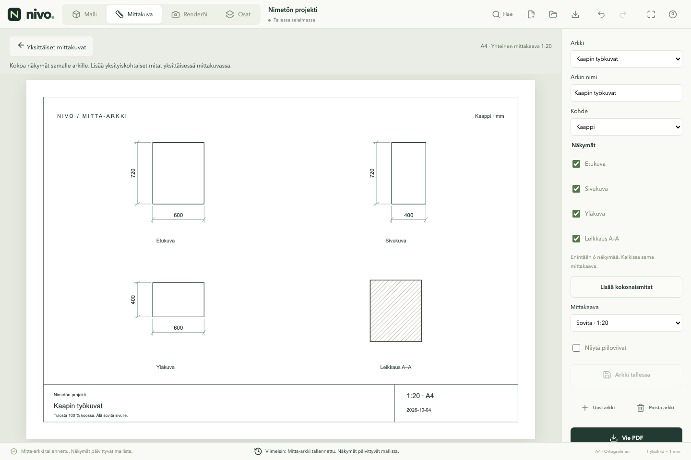

## Testaa selaimessa

[**Avaa Nivon beta**](https://alluharju-bot.github.io/nivo/). Käyttäjätiliä tai asennusta ei tarvita.
Aloita esimerkkikaapista tai valitse **Muodot → Levyrunko**. Kokeile osan valintaa,
siirtoa (M), pinnan muokkausta (E), mittakuvaa ja **Osat**-näkymää.

Tallennus on selain- ja laitekohtainen. Lataa `.nivo`-tiedosto yläpalkin
Tallenna-painikkeesta, kun haluat siirtää mallin toiselle käyttäjälle tai laitteelle.
Paikallisen osoitteen ja betaosoitteen tallennukset ovat erillisiä.
Sovellus ei lähetä malleja palvelimelle.

## Käynnistä

Node.js 22.12+ (testattu Node 24:llä).

```sh
npm ci
npm run dev
```

Avaa **http://127.0.0.1:5173** tai terminaalin ilmoittama osoite.
Sovellus ei tarvitse käyttäjätiliä, palvelintietokantaa tai API-avaimia.
Kaikki laskenta ja projektitallennus tapahtuvat selaimessa. Riippuvuuksien
asennus tarvitsee verkkoyhteyden; paikallinen sovellus ei käytä ulkoisia
fontteja, CDN-kirjastoja tai laskentapalveluja.

```sh
npm run build       # tyyppitarkistus ja dist/
npm run preview     # tuotantopaketin paikallinen esikatselu
```

## Yhteinen työskentelytapa

- Valintaruutu toimii Valitse-tilassa ja tyhjästä alkavana vetona myös
  siirtotyökalussa. **Vasemmalta oikealle: sininen, kokonaan sisällä**.
  **Oikealta vasemmalle: oranssi katkoreuna, alueeseen osuvat**. Shift lisää
  aiempaan valintaan. Osumat perustuvat mallin muotoon ja näkyvään leikkaukseen.
- Siirrossa numeron kirjoittaminen aloittaa vetosuunnan akselin kentästä.
  Esimerkiksi alaspäin aloitettu Z-siirto ja `150` antaa `−150 mm`.
  Kirjoitettu `+150` tai `−150` valitsee etumerkin suoraan; kentän napsautus
  ja Tab toimivat edelleen koordinaattikohtaisesti.
- Siirron tai kopioinnin jälkeen **Toista** jatkaa samalla välillä ja suunnalla.
  **Lisätoistoja 3** tekee kolme uutta toistoa viimeisen tuloksen jälkeen.
  Kopiointi säilyttää ryhmät ja komponenttien linkityksen. Siirron toisto
  siirtää samoja osia. Yksi Peru kumoaa koko toistosarjan. Uusi mallin muutos,
  Peru tai projektin vaihto päättää vanhan toiston; sitä ei tallenneta projektiin.
- Apuviiva toimii muodon aloituspisteenä myös tyhjässä tilassa ja säilyttää
  oikean piirtotason. Lattiasta ylös nostetusta apuviivasta voi jatkaa uutta
  rinnakkaista apuviivaa. Komponenttia osoitettaessa käytetään sen näkyvää pintaa;
  reunassa ja kulmassa kameran suunta auttaa valitsemaan viereisistä pinnoista.
- Paneelin yläosa kertoo työkalun, kohteen ja seuraavan vaiheen. **Uusi osa**
  ja **Muokkaa osaa** erottuvat toisistaan. Akseli ja kopiointitila näkyvät samassa yhteydessä.
- Napsauta muodon aloituspistettä ja vastapistettä tai vedä. Numeron kirjoittaminen
  aloittaa mittasyötön, Tab vaihtaa kenttää ja Enter hyväksyy. Leveys ja syvyys
  ovat vain yhdessä lomakkeessa; nimen ja muut lisäasetukset voi avata alta.
  Mittaikkunan voi edelleen vetää irti paneelista ja palauttaa oikeaan reunaan.
- **Esc** peruu keskeneräisen toiminnon säilyttäen työkalun ja valinnan.
  Seuraava Esc päättää työkalun. Osan muokkaustilassa vielä yksi Esc tai
  **Lopeta muokkaus** sulkee osan. **Lopeta työkalu** päättää työkalun suoraan.
  Hyväksytty toiminto jättää työkalun valmiiksi seuraavaan aloitukseen.
- **Hae** löytyy yläpalkista. ↑/↓ selaa ja Enter käynnistää toiminnon.
  Hakutulos kertoo syyn, jos toiminto vaatii esimerkiksi osan valinnan.
  Haun Esc sulkee vain haun ja säilyttää kesken olevan esikatselun.
- **Toiminnot → Valitse toinen** tai sama toimintohaku antaa valita päällekkäisistä
  osista. Hiirellä osoitus esikorostaa ja napsautus valitsee. Kosketuksella
  napauta nimeä esikorostusta varten ja vahvista **Valitse korostettu**.
  Suljetut kokoonpanot ovat yksi vaihtoehto. Piilotettuja osia tai avoimen
  muokkauskohteen ulkopuolisia osia ei tarjota.
- Valitun osan mitat ovat ennen lisäasetuksia. Komponenttien linkitys löytyy
  avattavasta **Komponentti ja linkitys** -osiosta.

## Ruudukko ja pinnalle piirtäminen

10 mm:n ruudukolla vapaa suorakulmion sivu, ympyrän halkaisija ja push/pullin toteutuva paksuus askeltavat 10 mm. Siirto askeltaa siirtymää lähtöpisteestä, joten se ei muuta muiden akselien sijaintia. Ruudukon askel on vaihdettavissa asetuksissa. Kirjoitettu tarkka mitta ja korostettu geometriatartunta ohittavat ruudukon: esimerkiksi 18 mm:n levyn pinnalle piirretty muoto pysyy levyn pinnalla.

Piirtämisen alku valitsee näkyvän pinnan. Yhteisessä nurkassa suositaan kameraa kohti olevaa pintaa; etupuolella oleva geometria estää takakulmaan tarttumisen. Suorakulmion ja ympyrän X/Y/Z valitsee piirtotason normaalin: X = YZ, Y = XZ ja Z = XY. Tason voi vaihtaa myös ensimmäisen pisteen jälkeen. Kynän X/Y/Z lukitsee viivan suunnan.

Samalla pinnalla oleva tasomuoto näkyy tukikappaleen päällä ja klikkaus poimii
muodon. Päällekkäisistä tasomuodoista uusin on päällimmäinen. Sama etusija
toimii E-push/pullissa ja siirron yhteisissä kulmapisteissä. Oikea edessä oleva
kappale peittää muodot edelleen. Muotoa ei siirretä millimetriäkään näkyvyyden
vuoksi. Rakennusmuoto valitaan edelleen ääriviivastaan; sen sisusta jättää
alla olevan pinnan käytettäväksi.

## Valinta siirtotyökalussa ja toimintohistoria

- **M:** ilman valintaa koko osoitettu osa tai kokoonpano korostuu ja on heti
  vedettävissä. Kun valinta on jo tehty, siirto alkaa vain siihen kuuluvasta osasta.
  Viereiseen kappaleeseen osuminen säilyttää valmistellun valinnan.
- **Shift-klikkaus** lisää tai poistaa osia myös valmiustilassa olevissa
  muokkaustyökaluissa. **Tyhjästä vedettävä laatikko** valitsee sen sisällä olevat
  osat; Shift lisää niitä nykyiseen valintaan. Tämä toimii siirrossa, kierrossa,
  pensselissä, kumituksessa, Offsetissä, reunatyökalussa ja apuviivatyökalussa.
  Cut/Joinissa laatikko täyttää aktiivista kohde-/työstövalintaa.
- Piirtäminen, push/pull, keskeneräinen työkaluele ja kiertokahvat säilyttävät
  omat toimintonsa. Valinta ei keskeytä luonnosta eikä Shiftin tavoitepoimintaa.
- Alapalkissa näkyy **Viimeisin toiminto**. Avaa **Toimintohistoria** nähdäksesi
  toiminnot ja niiden valinnat, esimerkiksi _Siirretty 48 kappaletta · X +100 mm_.
  **Palauta valinta** palauttaa osat valintaan muuttamatta niiden geometriaa.
  **Edellinen valinta** tarjoaa saman toiminnon yhdellä painalluksella.
- Myös työkalulle valmisteltu valinta säilytetään. Shift-klikkauksia ei kirjata
  erikseen; valmistelu yhdistyy hyväksyttyyn toimintoon. Lokissa on enintään
  **100 merkintää / 2 MiB:n tekstibudjetti**, ja se säilyy saman välilehden
  päivityksessä. Se ei sisällä CAD-kopioita. Poistetut ja piilotetut osat ohitetaan
  valinnan palautuksessa. Varsinainen Peru-historia on tästä erillinen.

## Poikkileikkaus ja pohjakuva

- Näkymän **Leikkaus**-painike lisää nimetyn tason. Valitse X/Y/Z tai **Pinnasta**,
  vedä tason nuolesta tai kirjoita sijainti millimetreinä. **Vaihda katselusuunta**
  vaihtaa näkyvää puolta. Kappaleet, tilavuudet ja leikkauslista pysyvät ennallaan.
- **Avaa leikkaus mittakuvaan** näyttää CAD-leikkausreunat ja viivoittaa vain
  umpinaisen aineen. Valitse näkyvä malli, valinta tai ryhmä. **Mitoita kahdesta
  pisteestä** poimii leikkausreunan pisteet; kolmas napsautus sijoittaa mittaviivan.
  Vie mittakaavallinen PDF tai SVG ja tulosta 100 % koossa. Muuttunut mittaviite
  merkitään ja se pitää korjata ennen vientiä.
- **Pohjakuva** tuo PNG-/JPEG-/WebP-kuvan XY-, XZ- tai YZ-tasolle. Poimi kaksi
  pistettä ja syötä tunnettu etäisyys. Kalibrointi säilyttää ensimmäisen pisteen
  paikallaan ja lukitsee kuvan. Lukituksen voi avata sijainnin tai tason vaihtamiseen.
  Näkyvyysliuku säätää läpinäkyvyyttä. Kuva tallentuu projektin sisään.
- **Eristä valinta** on näkymän painikkeessa ja valinnan toimintovalikossa.
  **Palauta näkymä** palauttaa täsmälleen aiemmat osien ja ryhmien piilotukset.
  Eristys on tilapäinen eikä muuta projektin näkyvyysasetuksia.

Yksi leikkaustaso on aktiivinen kerrallaan. Tarkan täytön laskenta tapahtuu
CAD-workerissa; tason liike näkyy heti ja täyttö valmistuu pysähdyksen jälkeen.
Leikkauspinta on näkymän esitys, ei push/pullilla muokattava uusi CAD-pinta.
Pohjakuvasta ei automaattisesti tunnisteta seinäviivoja tai tartuntapisteitä.

## Ensimmäinen työnkulku

1. Piirrä suorakulmio: napsauta alkukulmaa, siirrä osoitinta ja napsauta vastakulmaa.
   Voit myös vetää painike pohjassa tai kirjoittaa tarkat mitat.
2. Toinen napsautus, Enter tai vedon päättäminen hyväksyy luonnoksen. Paina **E**, osoita pintaa
   ja vedä sille paksuus. Samalla työkalulla voi muokata kappaleen muitakin tasopintoja.
3. Klikkaa koko kappale valituksi. M siirtää; paina Ctrl kerran vedon aikana
   tehdäksesi kopion (uusi painallus poistaa kopioinnin). Osoita pintaa ja paina E tai O pinnan muokkaamiseen.
4. Siirrossa korostus näyttää tartuntapisteen ennen painallusta. Poimi kulma,
   reuna tai keskipiste ja vie se toisen osan tarkkaan pisteeseen. Siirto valitsee vedon alussa yhden akselin; X/Y/Z
   vaihtaa sen. Vapaa siirto (XYZ) sallii usean akselin liikkeen.
   Vapaa siirtymä käyttää asetusten ruudukkoaskelta (oletus 10 mm).
   Lukitulla akselilla osoitettu piste antaa tämän akselin tavoitemitan.
   Liikkuva valinta ja siihen kiinnitetyt apuviivat eivät toimi omina kohteinaan.
5. Vaihda perspektiivin ja rinnakkaisprojektion välillä. Käytä etu-, sivu-, ylä-
   ja 3D-näkymiä sekä sovita valinta näkymään.
6. Valitse osa ja paina **Lisää kokonaismitat**. Mitat näkyvät heti 3D:ssä ja
   **Mittakuvassa** sekä seuraavat osan muutoksia. Valitse osan väri väripaletista.
7. Vie A4-vaaka-arkki SVG:nä valitussa fyysisessä mittakaavassa. Näkyvät ja
   piilossa olevat viivat lasketaan CAD-geometriasta.
8. Peru ja palauta muutoksia myös sivun päivityksen jälkeen. Lataa `.nivo`-tiedosto ja avaa se uudelleen.

Mittasyöttö hyväksyy `600`, `18 mm`, `1,8 cm`, `2,4 m` ja siirroissa negatiiviset
arvot. Oletusyksikkö on millimetri ja Z-akseli osoittaa ylöspäin.
Automaattitallennus palauttaa työn samassa selaimessa. **Lataa myös oma
projektitiedosto:** selaimen tallennustila ei ole varmuuskopio.

Tyhjästä työtilasta voi avata **600 × 800 × 560 mm esimerkkikaapin**. Sen kuusi
levyä ovat itsenäisiä osia. Esimerkissä ei vielä ole ovea tai linkitettyjä
komponentteja. Uusi **Viimeistelty kaappi · mitat ja materiaalit** avaa kaksi
pyöristettyä ovea, ovivälyksen dimension, tammen, messinkivetimet ja upotetun
kuvatekstuurin. [Avattava .nivo-esimerkki](public/examples/viimeistelty-kaappi.nivo).

## Työtila ja kopiointi

Yksi 60 px yläpalkki sisältää Nivon, **Malli / Mittakuva / Renderöi / Osat** -vaihdon, projektin
nimen ja tallennustilan, tiedostopainikkeet, historian, asetukset ja avun.
**Siirry koko näyttöön** piilottaa selaimen palkit. Sama painike tai Esc palauttaa
tavallisen ikkunan. Kapealla näytöllä tiedostot ja muut lisätoiminnot avataan
**Lisää toimintoja** -painikkeesta.

Yksi klikkaus valitsee koko objektin. Pintakorostus osoittaa, mihin E tai O
kohdistuu. **M** siirtää osaa siitä verteksistä tai kohdasta, josta tartuit.
Paina **Ctrl** (tai Alt) kerran vedon aikana: kopiointi kytkeytyy päälle ja
säilyy näppäimen vapautuksen jälkeen. Toinen painallus kytkee sen pois.
**Siirrä kopio** toimii myös numerosarjalla tai kosketuksella. Esc peruu keskeneräisen kopion;
Peru poistaa hyväksytyn kopion yhdellä askeleella. Kopio säilyttää tarkan
geometrian, värin ja ryhmän, mutta saa oman tunnisteen.

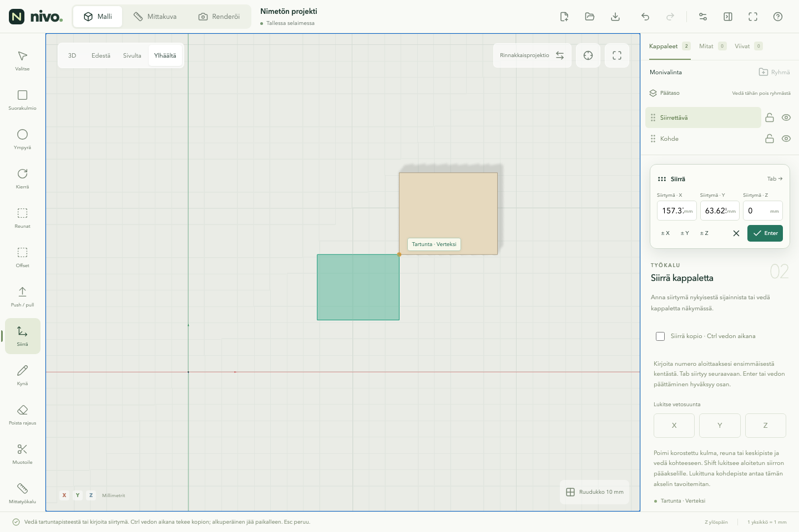

## Ryhmät ja yhteinen siirto

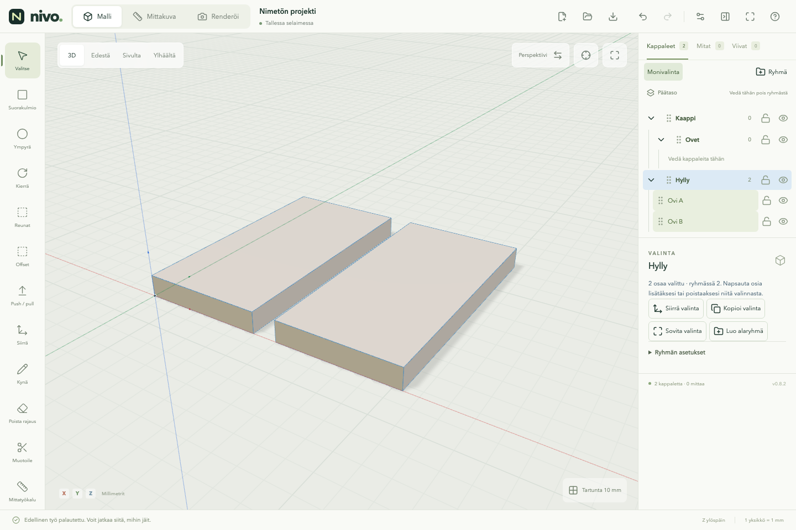

Kappalelista pysyy oikean paneelin yläosassa; valinnan tiedot tai aktiivinen
työkalu näkyvät sen alla. Väri, nimi/ryhmä, sijainti sekä mitoitus- ja
mallinnustoiminnot avataan tarvittaessa omista osioistaan.

**Vedä kappaleen nimi ryhmän päälle** siirtääksesi sen ryhmään. Pudota **Päätaso**-riville
siirtääksesi sen pois ryhmästä. Valitusta kappaleesta aloitettu veto vie koko
monivalinnan; valitsemattomasta aloitettu veto vie vain kyseisen kappaleen.
Ryhmän nimestä vedetään koko alaryhmä sisältöineen. Kohde korostuu ja vetolappu
näyttää kohderyhmän. Esc tai pudotus listan ulkopuolelle peruu. Listan reuna
vierittää pitkää listaa vedon aikana. Kosketuksella vedä rivin pistekahvasta;
nimen kohdalta voit vierittää listaa. Järjestely säilyttää osien 3D-sijainnit.

Kappalelistan **Ryhmä** kokoaa valitut osat. Napsautus valitsee, **kaksoisnapsautus
tai F2** avaa kappaleen tai ryhmän nimen kirjoitettavaksi. Ryhmän valinta ottaa
mukaan myös alaryhmien osat. Raahauksen vaihtoehtona **Nimi ja ryhmä → Ryhmä**
tai **Ryhmän asetukset → Yläryhmä** vaihtaa ryhmitystä valikolla. Ryhmää ei voi
siirtää itsensä tai oman alaryhmänsä sisään. **Luo alaryhmä** kokoaa valitut
osat uuden alaryhmän alle.

Ryhmän silmä ja lukko koskevat koko hierarkiaa. Ryhmän näyttäminen tai
vapauttaminen säilyttää osien omat piilotukset ja lukot. **Poista ryhmä** säilyttää
osat ja nostaa sen suorat osat sekä alaryhmät ylemmälle tasolle. Myös tyhjän
ryhmän voi poistaa painikkeella tai Delete-näppäimellä. Valitun, osia sisältävän
ryhmän Delete poistaa valitut osat; molemmat toiminnot ovat peruttavissa.
**Toiminnot → Siirrä ryhmään** siirtää osan, monivalinnan tai ryhmän
pudotusvalikosta valittuun ryhmään tai päätasolle muuttamatta sijaintia.

Valitse ryhmä ja napsauta osia ilman lisänäppäintä poistaaksesi tai lisätäksesi
niitä valintaan. Sininen korostus kertoo valitun joukon. **Sovita valinta** tuo
kaikki valitut osat näkymään. **Siirrä valinta** tai **M** siirtää koko joukkoa;
**Ctrl-painallus vedon aikana** vaihtaa kopioinnin päälle tai pois. **Kopioi valinta** aloittaa saman työkalun
kopiointitilassa. Kirjoita X/Y/Z-siirtymät ja hyväksy Enterillä tai vedä halutusta
tartuntapisteestä. Esc peruu keskeneräisen sijoituksen. Myös yksittäisen osan
Kopioi-painike aloittaa sijoituksen näin.

Ryhmän kopio säilyttää alaryhmät, osien geometrian, värit, kokonaismitat sekä
kopioituihin osiin ankkuroidut apuviivat. Kopiot ovat itsenäisiä osia. Yksi Peru
palauttaa koko siirron tai kopioinnin. Tallennus ja tiedoston uudelleenavaus
säilyttävät hierarkian.

## Viisteet ja pyöristykset

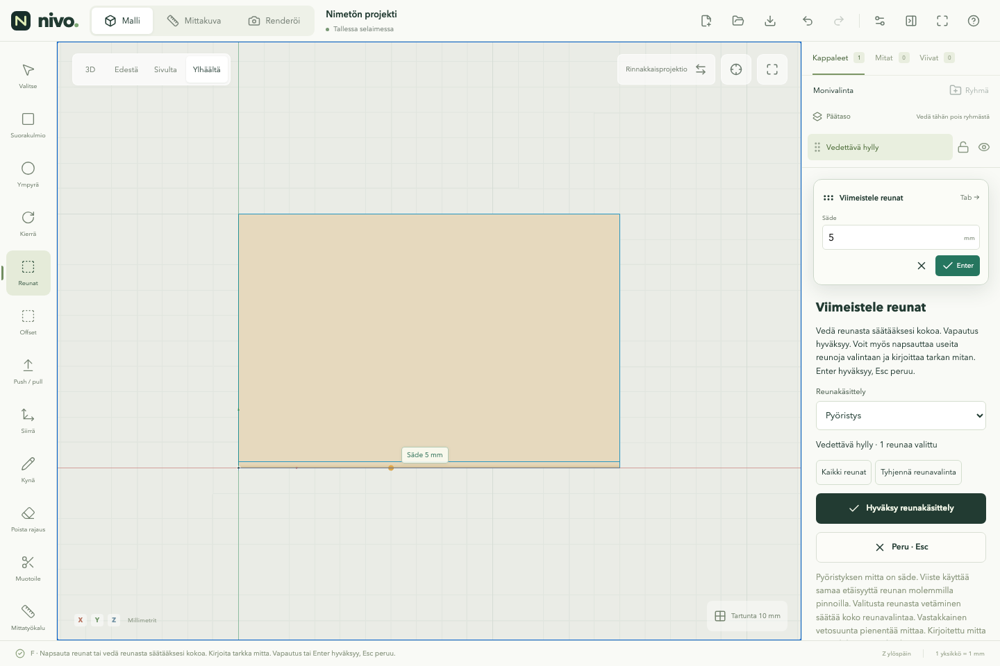

**Reunat (F)** avaa reunakäsittelyn. Valitse **Pyöristys** tai **Viiste** ja
**vedä mallin reunasta** säätääksesi kokoa. Aloitussuunta kasvattaa mittaa;
takaisin vetäminen pienentää sitä. Mitta näkyy reunan vieressä ja oikeassa
paneelissa. CAD-esikatselu päivittyy vedon aikana. **Vapautus hyväksyy**,
**Esc peruu**. Sama veto toimii yhdellä sormella; toinen sormi keskeyttää
vedon ja palauttaa sitä edeltäneen reunavalinnan sekä mitan.

Tavallinen napsautus lisää reunan valintaan tai poistaa sen siitä. Voit valita
useita reunoja ja vetää jo valitusta reunasta: koko valinta saa saman mitan.
**Kaikki reunat** valitsee nykyisen osan reunat kerralla. Kirjoita halutessasi
tarkka mitta kesken vedon; se lukitsee koon hiiren myöhemmistä liikkeistä
riippumatta. Enter tai **Hyväksy reunakäsittely** toimii myös ilman vetoa.
Uusi veto vapauttaa aiemman numerolukituksen.

Pyöristyksen mitta on säde. Viiste käyttää samaa etäisyyttä reunan molemmilla
pinnoilla. Suorat ja kaarevat CAD-reunat ovat valittavissa. Yhdellä toiminnolla
käsitellään yhden osan reunat; seuraava osa voidaan valita samalla työkalulla.
Liian suuri mitta tai geometrian kannalta mahdoton reunayhdistelmä näyttää
virheen ja säilyttää alkuperäisen osan. Hold suojaa myös tältä muokkaukselta.

Kun palaat käsiteltyyn osaan F:llä, sama reunavalinta ja mitta avautuvat.
Lisää kohtaavat sivureunat: kaikki lasketaan yhdessä tallennetusta lähteestä.
Reunan napsautus poistaa sen käsittelystä; **Poista käsittely** palauttaa
terävän lähteen. Kierto, siirto, kopio ja uudelleenavaus säilyttävät muokattavuuden.
**Viimeistele ja aloita uusi** liittää tuloksen geometriaan. Myös myöhempi
E/O/Cut/Join tekee näin, jotta sen muutokset eivät katoa sädettä vaihdettaessa.
Vanhasta BRepistä puuttuvia käsittelyparametreja ei päätellä.

## Kahden pisteen dimensio

Paina **T**, avaa aktiivisen mittatyökalun valikko ja valitse **Dimensio**.
Poimi kaksi pistettä, vie mittaviiva sivulle ja napsauta tai paina Enteriä.
Myös toisesta pisteestä aloitettu veto ja vapautus hyväksyy sijoituksen.
Pisteet voivat olla eri osissa. X/Y/Z vaihtaa akselimittaan; sama näppäin
uudelleen palauttaa todellisen pistevälin. Valmis mitan teksti on vedettävissä
Valitse-tilassa. Mitta ei muuta kappaleen kokoa.

Viite seuraa osan siirtoa ja säilyvää geometriaa. Poistunut viite näkyy
rikkoutuneena, eikä sitä siirretä arvauksella uuteen reunaan. Mittakuva ja
SVG näyttävät mitan vain näkymässä, jossa sen geometria ja sijoittelu
ovat tasossa. Näin vinon 3D-mitan lyhentynyttä projektiota ei merkitä
virheellisesti todelliseksi tasomitaksi. Osan X/Y/Z-kokonaismitat säilyvät.

## Rakennusviivana piirtäminen

Suorakulmion, ympyrän, ellipsin, monikulmion ja Kynän pienessä toimintovalikossa
on **Mittaus/rakennusviiva**. Valitse se ennen piirtämistä tai kesken luonnoksen.
Muoto syntyy nollapaksuiseksi apumuodoksi: katkoviivainen ääriviiva tarjoaa
piste- ja keskipistetartunnat eikä jaa, leikkaa tai pursota alla olevaa osaa.
Tämä toimii myös osan muokkaustilassa ja pystypinnalla. Kynän muoto suljetaan
palaamalla alkupisteeseen tai Sulje muoto -painikkeella.

**Kappale** palauttaa tavallisen piirtämisen. Muokkaustilassa se noudattaa
Piirtotapa-valintaa kuten ennenkin. Rakennusviivan ääriviivaa napsauttamalla
voi valita apumuodon; sen sisäpuolelta valitaan alla oleva osa. Apumuoto on myös
kappalelistassa, joten sen voi nimetä, siirtää tai poistaa erikseen. Se tallentuu
projektiin ja kuuluu Peru/Palauta-historiaan, mutta jää pois mittakuvasta ja
renderöinnistä. Käyttö-valinnan aiemmat kolmiulotteiset apumuodot säilyvät tuettuina.

Reunasta aloitettu mittaus tunnistaa myös loppupään reunan, nurkan ja reunan
keskipisteen. Korostus näkyy poimitussa kohdassa, ja tarkka tartunta ohittaa
ruudukon pyöristyksen. Rinnakkaisen apuviivan mitta on edelleen kohtisuora
etäisyys lähtöreunasta; vapaa mittaviiva mittaa päätepisteiden välin.

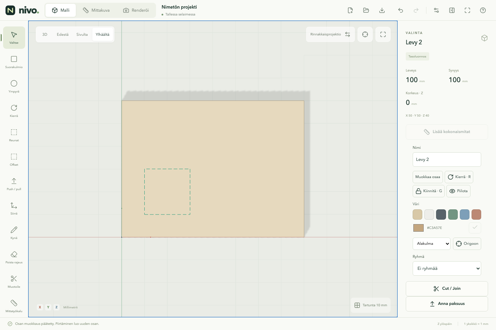

## Renderöinti ja kuvavienti

Materiaalit löytyvät jo **Malli → valitse osa → Materiaali**. Valitse preset, tuo värikuva tai tee osasta valaiseva pinta. **Pinnan rakenne · PBR** tarjoaa normal-, bump-/korkeus-, karheus- ja metallisuuskartat. Ne käyttävät samaa sijoittelua kuin värikuva. Normal-kartan suunnaksi voi valita OpenGL (+Y) tai DirectX (−Y). Bump muunnetaan normal-kartaksi alkuperäisessä kuvasuhteessa; **Kohokuvion syvyys** annetaan millimetreinä ja säilyy myös tekstuuria skaalattaessa. Datakuvat tallennetaan häviöttöminä PNG-kuvina enintään 1024 pikselin kokoon. Valmiit kuviot ovat paikallisesti tuotettuja, eivät valokuvattuja materiaaliskannauksia. Niiden mukana syntyvät normal- ja karheuskartat.

**Luo rakenne värikuvasta** muodostaa kuvan vaaleuseroista normal- ja karheuskartan.
Se on arvio pintarakenteesta; valokuvasta ei voi päätellä oikeaa korkeutta tai karheutta.
Tuotu PBR-kanava korvaa vastaavan generoidun kanavan. Kuvia ei monisteta projektitiedostoon.
Melamiinin puukuvion reliefi on hillitympi kuin massiivipuussa. Normal/bump muuttaa
valaistusta, ei CAD-geometriaa tai leikkausmittoja.

Sekä mallin **Materiaali** että renderin **Osa valonlähteenä** tarjoavat samat LED-,
taustavalo- ja spottiesiasetukset, värin, voimakkuuden ja spotin suunnan/keilan.
Suunta seuraa osan kiertoa. Nopea esikatselu arvioi kahdeksan voimakkaimman
LED-osan kahden laajan pinnan valaisun ilman niiden varjoja. Tarkentuva renderöinti
laskee kaikkien todellisten pintojen valon, peittymisen ja heijastukset; esikatselun
apuvalot poistetaan sekä tarkentuvasta kuvasta että taustalaskennasta.

Renderin **Materiaali**-välilehti sisältää erikseen avattavan Studion valaistus -kohdan. **Kuva** sisältää esikatselun ja viennin. Tarkentuva esikatselu päivittää koko kuvaa jokaisella näytteellä; erillinen PNG-työ voi jatkua mallinnuksen aikana.

**Renderöi** avaa esitysnäkymän. Valitse yksi osa, mallin valinta tai kaikki
näkyvät osat. Materiaaliryhmistä löytyvät seitsemän puuta, neljä metallia, kolme
lasia, neljä muovia, kahdeksan kiveä, kolme posliinia, kolme kalustepintaa,
kolme seinäpintaa, kaksi betonia, kolme laattaa ja kolme LED-valoa sekä
viisi melamiinia ja viisi kalustelevymateriaalia. Haku etsii kaikista ryhmistä.
Kuviot toimitetaan paikallisesti; eri puu- ja kivilajeilla on omat kuviot.
Väri, karheus, metallisuus, läpäisevyys ja pinnoite ovat säädettävissä.
Oman materiaalin voi tallentaa projektin materiaalikirjastoon.

**Lisää kuva** tuo PNG-, JPEG- tai WebP-tekstuurin (enintään 20 Mt).
Kuva pienennetään tarvittaessa 2048 pikseliin ja tallennetaan projektin mukaan.
**Muokkaa tekstuuria** avaa yhden osan sijoittelun: vedä pintaa siirtääksesi,
↗-kahvaa skaalataksesi ja ↻-kahvaa kiertääksesi. Leveys/korkeus ja siirtymät
syötetään millimetreinä, kierto asteina. Kuvasuhde on oletuksena lukittu.
Hiiriveto tallentaa yhden Peru-askeleen; Enter hyväksyy numeroarvot. Työkalu
pysyy päällä ja voit klikata toista osaa jatkaaksesi sen tekstuurin käsittelyä.
Esc peruu keskeneräiset numeroarvot ja lopettaa työkalun. Jo tallennetut vedot
säilyvät. **Valitse** tai **Maalaa** vaihtaa työkalua. Maalaa-tilassa valitse
siveltimen materiaali ja klikkaa osia; materiaalin valinta ei itsessään maalaa.
Kuvio seuraa kappaleen siirtoa, kiertoa ja kopiota. Kuvan sisältö jaetaan,
mutta osien sijoittelut ovat itsenäisiä.

Oikea painike kiertää kohdistimen alla olevan pinnan ympäri ja rulla zoomaa
kohdistimeen myös tekstuuria muokattaessa. Valitse Studio, Lämmin tai Tumma
valaistus sekä valotus ja varjot. **Tallenna PNG** vie nykyisen kameran kuvan
800, 1600 tai 2400 pikselin levyisenä. Hold säilyy mallissa, mutta sen korostus,
rakennusmuodot, apuviivat ja valintakahvat eivät tule esityskuvaan.

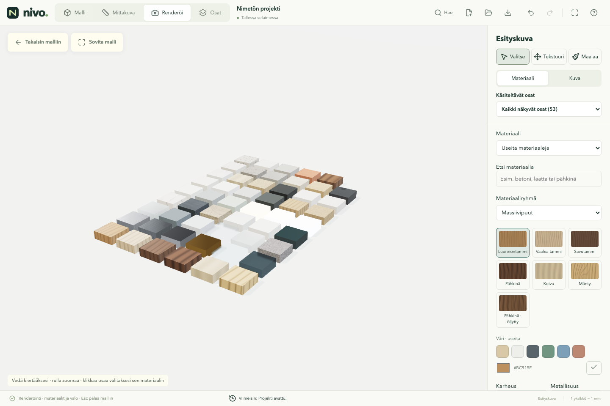

Nopea esikatselu ja valinnainen tarkentuva path tracing käyttävät WebGL2:ta. Omat valaistusympäristöt ja erillinen
UV-saarekkeiden editori ovat jatkotyötä. Kuviointi käyttää kappaleen omaan
koordinaatistoon sidottua tasoprojektiota pinnan normaalin mukaan. Kaarevien
pintojen projektiosaumojen parantaminen on backlogissa.

## Avoin kynäviiva ja nopea aukko

**Kynä → kaksi tai useampia pisteitä → Enter / Valmis viiva** tekee avoimen
viivan. Tavallisen kappaleen tai avatun osan pinnalla reunasta reunaan kulkeva
viiva jakaa pinnan heti viimeisen pisteen vahvistuksessa. Alueita voi muokata E:llä.
Ensimmäisen viivan toinen piste auttaa valitsemaan reunalla oikean piirtopinnan,
jotta kynä ei jää lattian ohuen sivun tasoon perspektiivissä.
Pinnalle kesken päättyvää viivaa voi jatkaa; Enter tallentaa sen erillisenä piirrosviivana.
Suljettua komponenttia viiva ei muokkaa automaattisesti: avaa osa tuplaklikkaamalla
tai valitse valmis piirrosviiva ja oikeasta paneelista **Jaa pinta**.
Viivan voi valita, siirtää, tallentaa ja poistaa; U kumittaa myös piirrosviivan.
Suljettu muoto syntyy edelleen palaamalla alkupisteeseen tai **Sulje muoto** -painikkeella.

**Leikkaa aukko** löytyy valmiin nollapaksuisen muodon yhteydestä sekä valitun
muodon Toiminnot-valikosta. Suorakulmio, ympyrä, ellipsi, monikulmio tai suljettu
kynämuoto leikkaa kohtisuoraan molempiin suuntiin näkyvien, vapaiden osien läpi.
Oikean reunan paneeli listaa ja korostaa todelliset kohteet; yksittäisen osan voi
jättää pois. Piilotetut ja Hold-osat säilyvät. Leikattavat komponentit tehdään
uniikeiksi, jotta eri kohdassa olevaan linkitettyyn kopioon ei synny aukkoa.
Piirretty muoto poistuu oletuksena; **Säilytä piirretty muoto** jättää sen malliin.
Yksi Peru palauttaa koko leikkauksen. Cut/Join säilyy yleistä kappaletyöstöä varten.

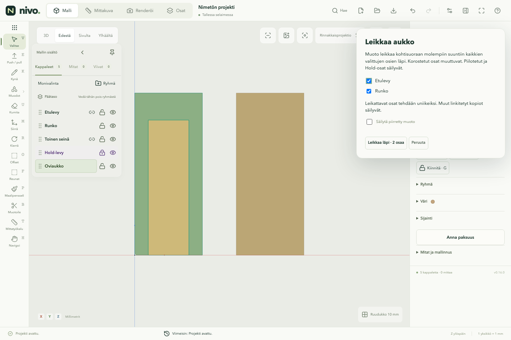

## Uusi osa, muokkaustila ja kumitus

**Normaalitilassa piirtäminen luo uuden osan.** Kaapin pinta antaa piirtotason
ja tartunnat, mutta ei muuta piirrosta kaapin pintamuokkaukseksi. Tämä koskee
myös pientä, kokonaan pinnan sisään mahtuvaa suorakulmiota tai ympyrää.

**Valitse-työkalulla (V) tuplaklikkaa osaa 3D-näkymässä** tai valitse osa ja paina **Muokkaa osaa**.
Mallinnusalueen yläreunan **Muokkaustila**-palkki, osan nimi ja hillitty reunus kertovat kohteen.
Toisen osan napsautus näyttää ohjeen myös kohdistimen lähellä. Muut osat himmenevät,
mutta niiden pisteet, reunat ja pinnat tarjoavat edelleen tartunnat ja viitteet.
Piirtotapa on **Pinnan alue**: aloita avattavan osan pinnalta ja piirrä rajaus.
Positiivinen paksuus lisää materiaalia, negatiivinen tekee syvennyksen ja nolla
tekee E:llä muokattavan alueen. **Uusi osa** on valittavissa myös muokkaustilassa;
avattu osa pysyy muokkauksen kohteena. Sääntö on sama tavallisille ja nimetyille osille.

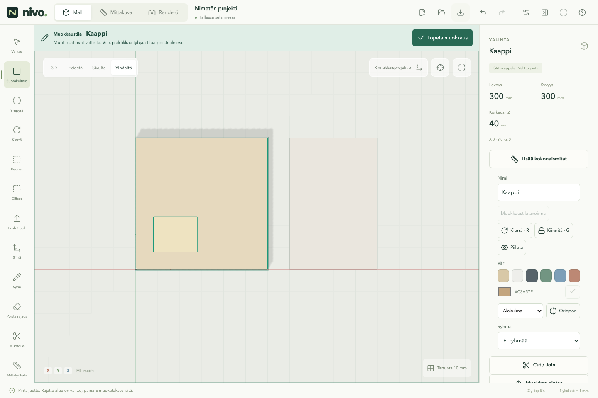

**Lopeta muokkaus** sulkee muokkaustilan. Myös Valitse-työkalun tuplaklikkaus
tyhjään tilaan sulkee sen. Yksittäinen ohiklikkaus, veto tai kameran liikuttaminen
ei sulje muokkaustilaa. **Esc** peruu ensin keskeneräisen toiminnon;
ilman keskeneräistä toimintoa se sulkee muokkaustilan. Sivun uudelleenavaus
alkaa normaalitilassa. **E ja O** toimivat suoraan myös normaalitilassa eivätkä
avaa pysyvää piirtomuokkausta. Cut/Join tehdään muokkaustilan ulkopuolella.

**Poista rajaus (U)**: osoita pintojen välistä jakoviivaa, tarkista korostetut
alueet ja klikkaa. Koko kyseisten kahden tasopinnan yhteinen rajaus poistuu.
Muut jaot, kappaleen ulkomitat, tilavuus, nimi ja väri säilyvät. Toiminto sopii
myös ympyrärajoihin ja vinoihin tasopintoihin ja toimii ilman aiempaa historiaa.
Rakenteellisia kulmia, syvennyksiä ja aukkoja ei kumiteta; niiden täyttö on jatkotyötä.
Hold estää muokkauksen. Peru palauttaa poistetun rajauksen.

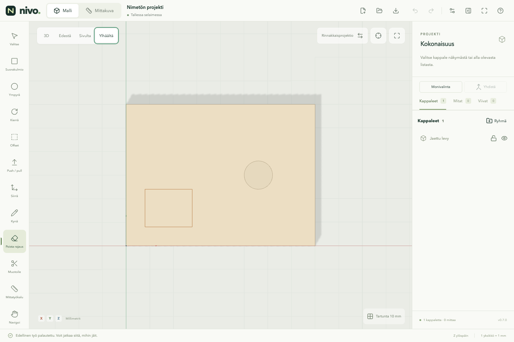

Selaimeen tallentuu nykyisen mallin lisäksi enintään **20 Peru/Palauta-askelta
yhteensä, 8 MiB:n budjetissa**. Suuret mallit lyhentävät säilyvää historiaa.
Vaurioitunut tai vanhaan malliin kuuluva historia ohitetaan; nykyinen malli avautuu.
Jos historia ei mahdu tallennukseen, nykyinen malli tallennetaan ja tilarivi kertoo
rajoituksesta. `.nivo`-tiedosto sisältää nykyisen mallin, ei selaimen historiaa.

## Mitat ja osavärit

Valitse yksi tai useita osia ja paina **Lisää kokonaismitat**. Toiminto lisää
puuttuvat X-, Y- ja Z-ulkomitat; samaa mittaa ei lisätä kahdesti. Mitat-listasta
voi poistaa yksittäisen mitan. 3D-näkymän asetuksissa voi näyttää kaikki lisätyt
mitat, vain valinnan mitat tai piilottaa mittamerkinnät. Suoraan katselusuunnan
suuntaista mittaa ei piirretä, koska sen pituus kuvassa on nolla. Piilotetun
osan mitat piiloutuvat mallinnusnäkymässä.

**Mittakuva** näyttää näkymään kuuluvat kaksi mittasuuntaa. Etukuvassa näkyvät
X/Z, sivukuvassa Y/Z ja yläkuvassa X/Y. Päällekkäiset mittaluvut sijoitetaan eri
riveille. Sovitus varaa myös mittaviivoille tilan, ja SVG käyttää valittua
fyysistä mittakaavaa. Kokonaismitat kuvaavat maailman akselien suuntaista
rajalaatikkoa; kahden pisteen dimensio mittaa myös vinon reunan todellisen
pituuden. Kulmamitat ovat jatkokehitystä.

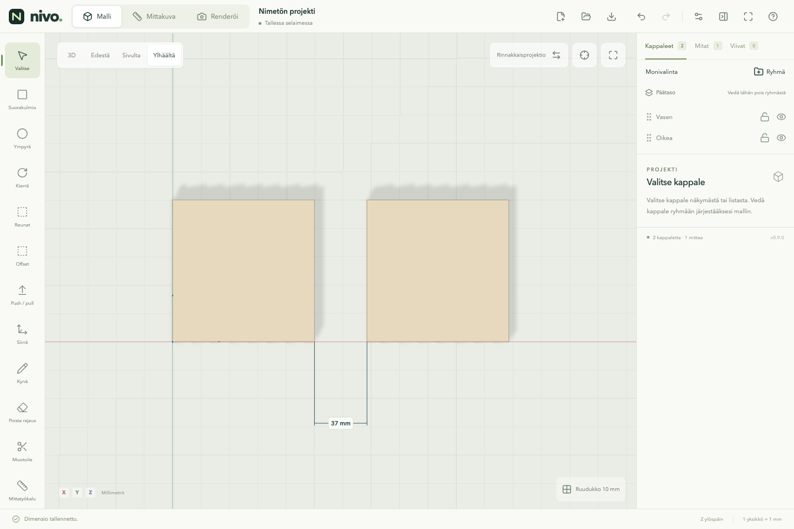

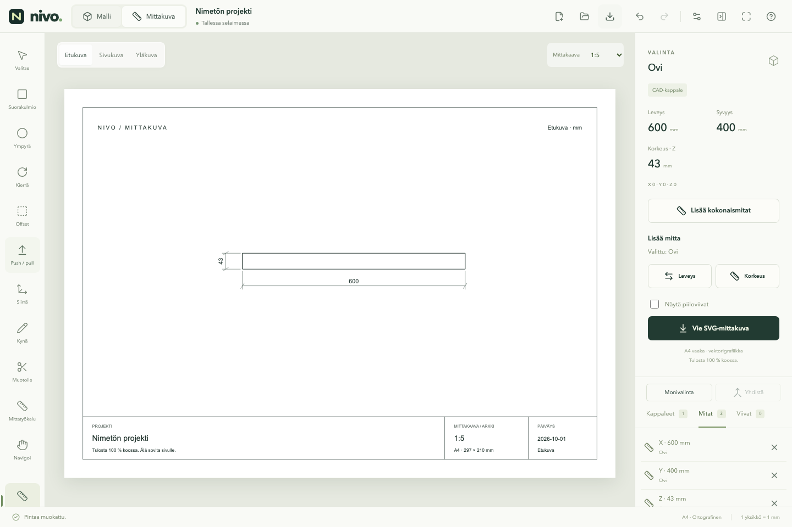

Valinnan **Väri** vaihtaa yhden tai kaikkien valittujen osien värin yhdellä
painalluksella. Oma väri hyväksytään värivalitsimen vieressä olevasta merkistä.
Muutos tallentuu projektiin ja peruuntuu yhtenä askeleena. Hold-lukittu osa säilyttää
oman värinsä ja materiaalinsa. Lukitus näkyy listan lukosta, hillitystä reunasta
ja valinnan Hold-merkinnästä; materiaalin muuttaminen edellyttää lukituksen vapauttamista.

## Piirtämisen perustyökalut

- **Pintaan piirtäminen:** ensimmäinen napsautus valitsee piirtotason;
  myös pysty- ja vinopinnat sekä Hold-kappaleet sopivat viitteiksi. Kulmassa
  käytetään kameraa kohti olevaa viereistä pintaa. Normaalitilan **Uusi osa**
  säilyttää esimerkiksi kahden kaapin yli piirretyn LED-nauhan kokonaisena.
  **Pinnan alue** on käytettävissä vasta avatun osan muokkaustilassa ja vaatii
  pintaan uuden rajauksen. Hold-kappaletta ei jaeta.
  Alueen paksuus **0** jakaa pinnan; E muokkaa valittua aluetta. **Leikkaa läpi**
  tekee läpireiän. Uudelle osalle E antaa oman paksuuden.
- **Ovi onttoon kaappiin:** valitse Suorakulmio, napsauta etukehyksen vasenta
  yläkulmaa, siirrä osoitin oikeaan alakulmaan ja napsauta. Normaalitilan
  piirto luo oven omaksi osaksi, ja kaappi säilyy ennallaan. Paina E ja anna
  esimerkiksi 18 mm paksuudeksi. Piirtotapa → Uusi osa sopii myös pienemmälle
  erilliselle ovelle tai levylle saman pinnan tasossa.
- **Ympyrä (C):** napsauta keskipistettä ja reunaa, vedä säde tai kirjoita halkaisija. Muoto-valikosta
  saa myös ellipsin kahdella halkaisijalla ja säännöllisen 3–64-sivuisen monikulmion.
  Kynällä voi tehdä muun tasomaisen suljetun ääriviivan. Ympyrät ja ellipsit ovat
  tarkkoja CAD-käyriä.
- **Muodon ominaisuudet:** anna nimi, mitat ja paksuus samassa valikossa.
  Pintaan liitetyn mallinnettavan muodon positiivinen paksuus lisää materiaalia,
  negatiivinen tekee syvennyksen. Muut muodot syntyvät itsenäisinä objekteina.
  **Rakentamisen apumuoto** näkyy sinisinä ääriviivoina ja tarjoaa tartunnat;
  se ei tule mittakuvaan. **Piirros** näkyy ääriviivoina myös mittakuvassa.
  **Nimetty osa** on itsenäinen osa; kopiot eivät ole linkitettyjä komponentteja.

- **Offset (O):** osoita vapaata tasopintaa ja paina O tai valitse työkalu ja
  vedä pinnasta. Hiiren liike säätää sisennystä, sininen ääriviiva näyttää tuloksen.
  Kirjoita halutessasi tarkka mitta: se säilyy hiiren liikkuessa. Klikkaus,
  vedon vapautus tai Enter hyväksyy. Esc peruu esikatselun. Kappale säilyy
  yhtenä objektina, jonka pintaan syntyy uusi muokattava alue. E:n **Toteutuva kokonaismitta**
  18 jättää kaappiin 18 mm takaseinän; **Leikkaa läpi**, vastapinnan ohi vetäminen tai
  toteutuva kokonaismitta 0 tekee aukon. Toimii myös ympyröillä ja vinoilla tasopinnoilla.
  Liian suuri tai erillisiksi alueiksi hajoava sisennys hylätään muuttamatta mallia.
- **Push / pull (E):** vapaan pinnan korostus seuraa kohdistinta jo valintatilassa. Paina ja vedä pintaa
  normaalinsa suunnassa tai valitse pinta, paina E ja kirjoita siirtymä. Positiivinen
  arvo vetää ulospäin, negatiivinen työntää sisään. Toimii laatikon kaikilla kuudella
  pinnalla, kynämuodoilla ja yhdistettyjen osien tasopinnoilla.
- **Push/pull tavoitemittaan:** osoita lähtöpintaa ja paina E (tai klikkaa sitä E-työkalulla), pidä **Shift pohjassa**
  ja osoita kulmaa, reunan tai kappaleen keskipistettä, reunaa, apuviivaa tai tasopintaa.
  Kulmat ovat etusijalla, sitten keskipisteet, reunat ja pinnat. Korostettu piste antaa
  tavoitetason lähtöpinnan normaalin suunnassa; sivuttainen etäisyys ei vaikuta mittaan.
  Klikkaus tai vedon vapautus hyväksyy. Myös Hold-osa käy viitteeksi.
  Lähtöpinta, sen reunapisteet, oman osan keskipiste ja liikkuva esikatselu eivät kelpaa
  tavoitteiksi. Tyhjä tila säilyttää edellisen mitan. Shiftin vapautus jatkaa siitä
  ilman hyppyä. **Poimi tavoitemitta** tarjoaa saman haun kosketuksella → kohde → Enter.
  Yhdensuuntaiset tasopinnat tulevat samalle tasolle; vinosta pinnasta poimitaan
  osoitetun pisteen taso. Lähtöpinta ei kallistu. Kirjoitettu mitta ohittaa tartunnan,
  Esc peruu. Kaarevan pinnan vapaata pintapoimintaa ei vielä käytetä.
- **Toteutuva kokonaismitta:** push/pull näyttää siirtymän ja toteutuvan kokonaismitan.
  652 mm osassa siirtymä `−150` jättää 502 mm. Paina Tab: sama luku muuttuu
  lopulliseksi mitaksi 150 mm, ja siirtymäksi lasketaan −502 mm. Shift+Tab
  vaihtaa takaisin. Kenttää napsauttamalla voit syöttää toteutuvan kokonaismitan suoraan.
  Suurempi mitta pidentää osaa; vastapinta säilyy paikallaan myös vastakkaisilta
  sivuilta muokattaessa. Etumerkitön siirtymä seuraa vedon suuntaa (ilman vetoa
  ulospäin), `+` ja `−` määräävät suunnan erikseen. Toteutuva kokonaismitta on
  vähintään nolla; nolla avaa rajatun alueen läpi. Koko osan poistava työntö hylätään.
  Vihreä mittaviiva kulkee ensimmäisestä vastapinnasta uuteen pintaan.
  Syvennyksessä voi näin jättää esimerkiksi 5 mm materiaalia. Vaihtelevan
  paksuuden osassa mitta koskee osoitettua kohtaa ja valitun pinnan normaalin suuntaa.
  Tyhjä tila tai erillinen solidi vastapinnan takana ei kasvata tätä mittaa.
- **Kynä:** aseta verteksit näkymän tasolle tai tartu mallin pisteisiin. X/Y/Z
  lukitsee akselin. Shift lukitsee aloitetun viivan suunnan: toisen pisteen
  napsautus projisoi sen lukitulle viivalle ja määrää pituuden. Esimerkiksi
  suorakulmion kolmannen sivun pituuden voi poimia ensimmäisestä pisteestä.
  Shiftin voi painaa jo ennen alkupistettä tai ensimmäistä liikettä: ensimmäinen
  piirtosuunta lukittuu. Lukitus päättyy Shiftin vapautukseen tai viivan seuraavaan
  vahvistettuun pisteeseen. X/Y/Z ohittaa tilapäisen suuntalukon ja pysyy valittuna.
  Vapauta Shift ja sulje muoto tarttumalla aloitusverteksiin. Myös pysty- ja
  vinotasot käyvät, kun kaikki suljettavan muodon pisteet ovat samalla tasolla.
  Numeroilla annetut X/Y/Z-siirtymät ovat suhteessa edelliseen pisteeseen;
  lukitussa suunnassa syötetään yksi pituus. Enter lisää tarkan pisteen tai sulkee muodon.
- **Mittatyökalu:** painike aktivoi viimeksi käytetyn tilan. Vieressä oleva nuoli
  avaa valinnan: Apuviiva, Vapaa mittaviiva tai Dimensio. Apuviiva alkaa kappaleen
  verteksistä, reunasta, toisesta apuviivasta tai apuviivojen 3D-risteyksestä.
  Risteykset tarttuvat myös piirtotyökaluissa. Reunasta tai apuviivasta vetäminen tekee reunan suuntaisen apuviivan
  halutulle etäisyydelle. Koko reuna korostuu ja tartuntapiste seuraa kohdistinta.
  Vedä kannen tai sivupinnan puolelle: siirto seuraa kyseistä pintaa.
  Siihen voi tarttua myös jatkeen kohdalta. Vapaa mittaviiva näyttää
  kahden pisteen etäisyyden. Reunan suuntaisen apuviivan mittateksti ja
  mittakenttä näyttävät lähtökohdan ja viivan välisen etäisyyden, eivät lähtöreunan
  pituutta. Mittaväli näkyy yhdysviivana. Vedä tai napsauta alku- ja loppupisteet.
- **Apuviivan suunta:** reunasta vedettäessä X/Y/Z lukitsee **siirtosuunnan**;
  viiva säilyttää reunan suunnan. Sama näppäin vapauttaa lukon. Verteksistä
  alkavan viivan X/Y/Z lukitsee viivan suunnan; oletuksena 45° ennakointi.
  R käynnistää hiirellä kierron 22,5° välein, Shift+R vapaan kierron. Kulman, pituuden tai reunaetäisyyden
  voi kirjoittaa. Valmiin viivan napsautus näkymässä tai Viivat-listassa vain
  valitsee sen. Pieni toimintovalikko tarjoaa Muokkaa-, Kierrä-, X-ray- ja
  Poista-toiminnot. Seuraava napsautus ei siirrä viivaa ilman Muokkaa-toimintoa.
  **Poista rajaus (U)** kumittaa myös korostetun apu- tai mittaviivan; Peru palauttaa sen.
- **Apuviivan näkyvyys:** vahvempi, hillityn sininen katkoviiva ja selkeä mittateksti peittyvät normaalisti kappaleen taakse.
  Viivat-listan x-ray näyttää valitun viivan kappaleiden läpi. Näkymän asetuksista
  saa x-rayn kaikille apuviivoille. Molemmat asetukset tallentuvat projektiin.
- **Mittaikkuna:** oletuksena oikeassa sivupaneelissa, mallin ulkopuolella.
  Vedä otsikosta haluamaasi paikkaan; paikka säilyy työkalujen välillä.
  Palautuspainike telakoi ikkunan takaisin oikeaan reunaan.
  Numero aloittaa ensimmäisestä kentästä, Tab vaihtaa
  kenttää, Enter hyväksyy. Hiiren vapautus hyväksyy vedon. Kirjoitetut mitat eivät
  muutu hiiren liikkeestä. Kenttää voi valita myös napsauttamalla.
- **Jatkuvat työkalut:** hyväksytty toiminto päättää vain nykyisen vedon.
  Aloita seuraava piirto, siirto, apuviiva tai pintamuokkaus samalla työkalulla.
  Siirrä-työkalu tarttuu valmisteltuun valintaan; ilman valintaa osan voi poimia suoraan vedolla.
  Esc peruu keskeneräisen luonnoksen, tyhjentää valinnan ja palauttaa valintatyökaluun.
- **Erilliset osat:** jokaisella objektilla on oma mesh. Monivalinta tai
  Shift/Ctrl/Cmd-napsautus valitsee useita osia. Yhdistä tekee niistä yhden
  CAD-kappaleen ja meshin; päällekkäiset tilavuudet yhdistyvät. Peru palauttaa
  erilliset osat. Yhdistäminen vaatii paksuuden.

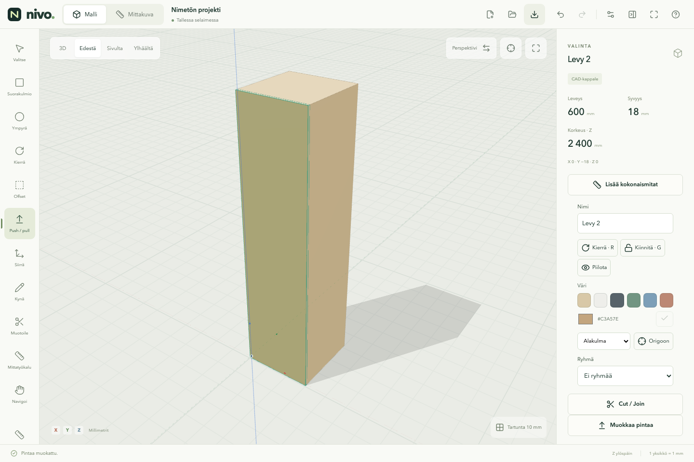

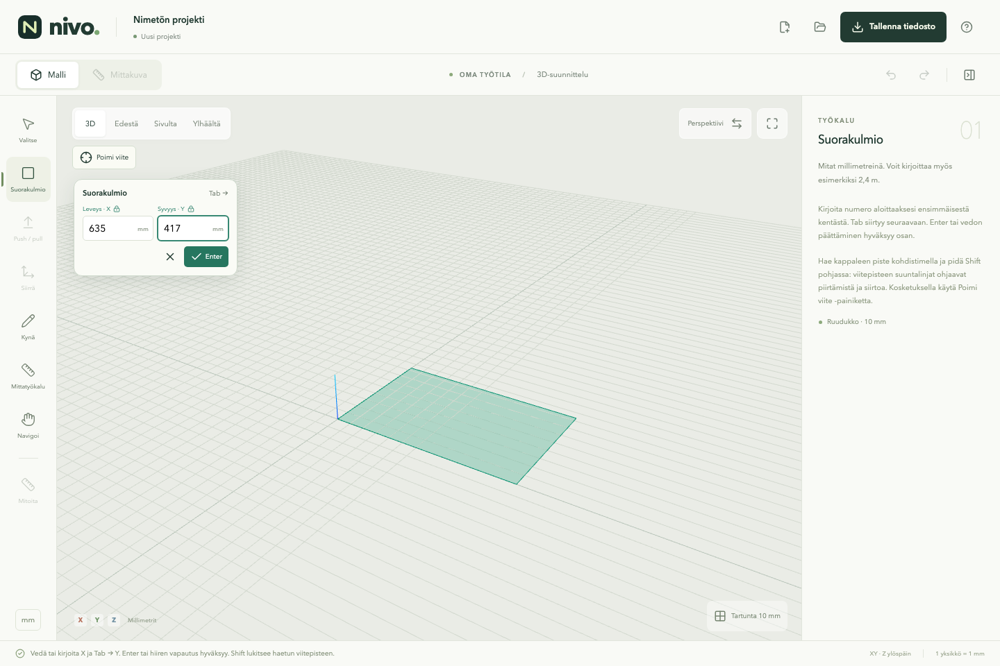

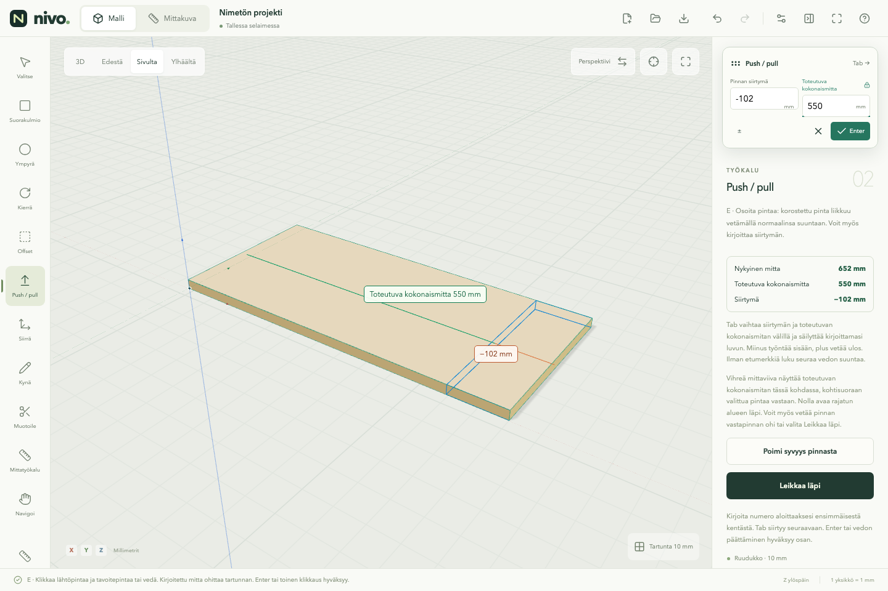

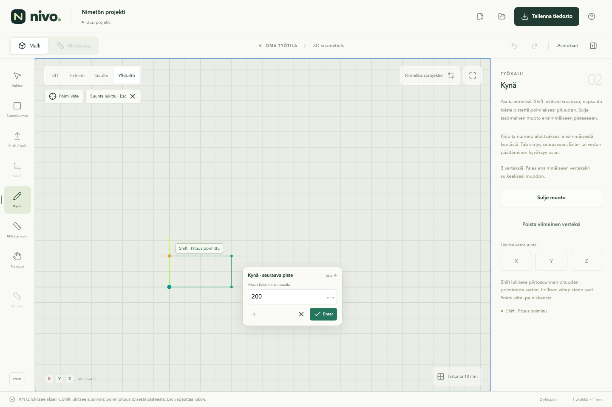

## Ohjaus

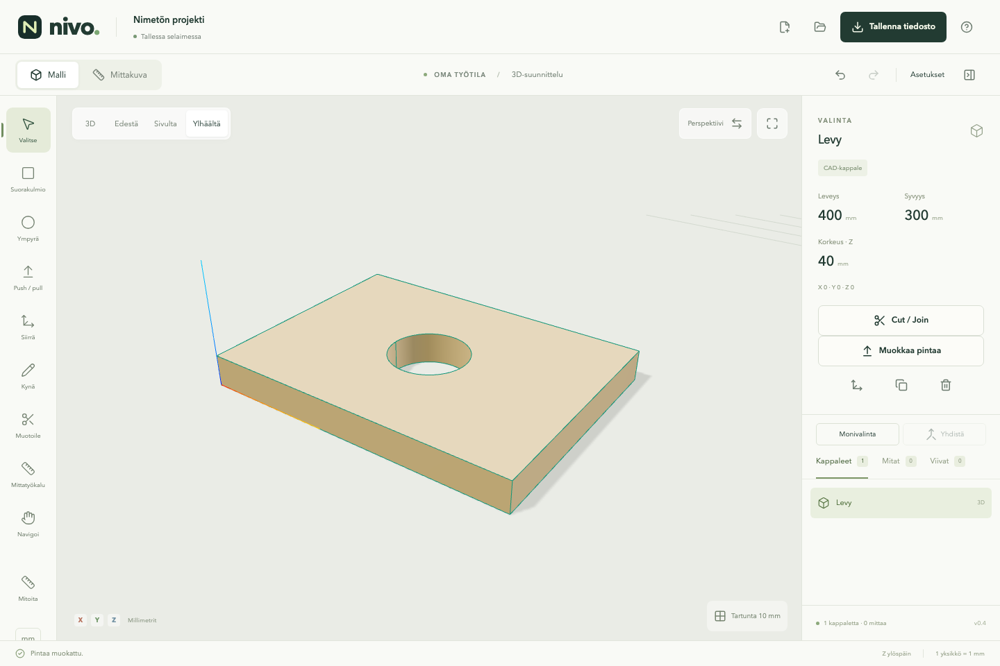

**Cut ja Join:** avaa **Muotoile (B)** tai muotovalikon Toiminto-kenttä.
Valitse ensin **Kohteet (Target bodies)** ja sitten **Työstökappaleet (Tool bodies)**
listasta tai näkymästä. Kumpikin joukko voi sisältää useita tilavuuskappaleita.
Sininen korostaa kohteet, punainen työstökappaleet. **Vaihda keskenään** kääntää
leikkauksen suunnan. **Säilytä työstökappaleet** on oletuksena päällä.

Cut vähentää kaikkien työstökappaleiden tilavuuden jokaisesta kohteesta. Join
yhdistää molemmat joukot yhdeksi osaksi; erilliset soliditkin sallitaan.
Undo palauttaa koko operaation, myös poistuneet lähteet. Ympyräpursotus sopii
lieriöreiän leikkuriksi, ellipsi soikeaan läpäisyyn ja kynämuoto vapaaseen ääriviivaan.
Paksuudettomat luonnokset eivät kelpaa. Jos leikkurit eivät osu kohteisiin,
sovellus ilmoittaa siitä ja säilyttää lähteet. Kokonaan leikattu kohde poistuu;
sen mitat jäävät rikkoutuneiksi viitteiksi, kunnes ne poistetaan tai toiminto perutaan.

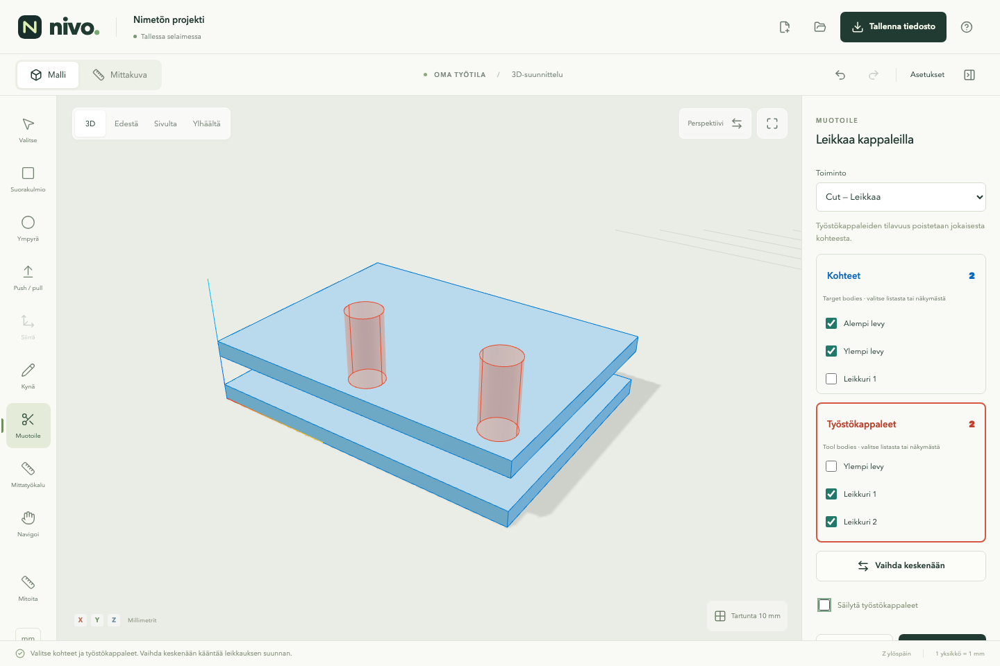

- Napautus valitsee. Työkalun yhden sormen veto hyväksytään sormen noustessa.
  Piirtämisessä **Poimi viite** ja pisteen napautus korvaavat Shiftillä poimimisen
  kosketusnäytöllä. Siirrossa kohde poimitaan suoraan vedon aikana.
- **Valitse (V) + Shift-klikkaus** lisää objektin valintaan tai poistaa sen siitä
  myös suoraan 3D-näkymässä. **M** siirtää kaikki valitut yhdessä ilman ryhmää.
  Shift huomioidaan jo hiiren painalluksesta, vaikka sen vapauttaisi ennen hiirtä.
  Valitse-tilassa Shift ei poimi viitepistettä. Muokkaustila rajaa edelleen
  valinnan avattuun osaan; Lopeta muokkaus palauttaa muiden osien valinnan.
- Kahden sormen ele panoroi ja zoomaa. **Navigoi**-tilassa yksi sormi kiertää.
- Hiiren oikea painike kiertää, keskipainike panoroi ja rulla zoomaa kohdistimeen.
  Navigoi-tilassa myös vasen painike kiertää.
- Kameran kierto poimii keskipisteen kohdistimen alta vedon alussa ja säilyttää
  sen vedon ajan. Pieni rengas näyttää pisteen. Sama toimii Navigoi-tilan
  yhden sormen vedolla. Piilotetut osat ja apuviivat eivät kaappaa pistettä.
- Tyhjästä tilasta aloitettu kierto käyttää muokattavan osan tai valinnan
  keskipistettä; ilman valintaa nykyistä näkymäkeskusta. Valittu osa tai ryhmä
  säilyy zoomin syvyysviitteenä. Muokkaustilassa viite säilyy osassa myös
  valinnan tyhjentyessä.
  Valitseminen ei hyppäytä näkymää; **Sovita näkymään** keskittää valinnan erikseen.
  Kohdistin määrää zoomin suunnan sekä perspektiivissä että rinnakkaisprojektiossa.
  Kosketuszoomauksessa käytetään sormien keskipistettä.
- V = valitse, S = suorakulmio, R = kierrä (apuviivaa muokattaessa viivan kierto),
  O = Offset, E = push/pull, G = kiinnitä/vapauta, M = siirrä, K = kynä,
  C = ympyrä/muut muodot, B = Muotoile (Cut/Join), T = mittatyökalu, H = navigoi.
  X/Y/Z lukitsevat siirron, kynän tai apuviivan akselin. Enter hyväksyy.
  Sama X/Y/Z vapauttaa akselilukon. Esc päättää työkalun myös lukon ollessa päällä.
  Ctrl/Cmd+Z peruu, Ctrl/Cmd+Shift+Z palauttaa.
- Keskeiset toiminnot löytyvät painikkeista ilman näppäimistöä.

## Työtilan ja kappaleiden hallinta

- **Kierrä (R):** valitse yksi tai useampi kappale. Keskipiste ja origo ovat
  pikavalintoja; **Poimi kiertopiste** hyväksyy pisteen ja **Poimi kiertoakseli reunasta**
  suoran reunan. Vedä värirengasta tai kirjoita tarkka kulma. X/Y/Z valitsee akselin,
  Veto tarttuu 5° välein, vahvemmin pääsuuntiin. Shift vapauttaa tartunnan. Enter tai hiiren vapautus hyväksyy.
- **Origoon:** kohdista valinnan yhteinen alakulma tai keskipiste origoon yhdellä
  painikkeella. Kappaleiden keskinäiset sijainnit säilyvät. Näkymän ristikkopainike
  keskittää kameran origoon liikuttamatta mallia.
- **Kiinnitä (G) / Hold:** estää osan muokkaamisen, poistamisen ja materiaalimuutokset,
  myös linkitetyn kopion kautta. Oma materiaali säilyy näkyvissä. Lukitus pitää
  vapauttaa ennen muokkausta; tuplaklikkaus ei ohita Holdia. Piilotus ja lukituksen
  vapautus ovat käytettävissä. Ryhmän Hold suojaa myös sen alaryhmiä ja osia.
- **Kappalelista:** valitse napsauttamalla, nimeä kaksoisnapsauttamalla tai
  Nimi-kentästä, piilota silmästä ja kiinnitä lukosta. **Ryhmä** kokoaa valitut osat.
  Ryhmät toimivat myös sisäkkäin; niitä voi nimetä ja raahata kuten kappaleita.
  Ryhmän purkaminen asetuksista säilyttää kappaleet.
- **Asetukset:** Hillitty/Korostettu vaihtaa akselien voimakkuuden; nimitekstit
  saa erikseen näkyviin. Mukautuva ruudukko jatkuu kauas. Näyttöruudukon tiheys
  muuttuu zoomauksen mukana, ja ruudukkotartunnan askeleen voi säätää 0,1–10 000 mm:iin.

## Tarkistukset

```sh
npm test
npx playwright install chromium
npm run test:e2e
npm run build
NIVO_PREVIEW=1 npm run test:e2e
# GitHub Pagesin /nivo/-polun tuotantotarkistus:
NIVO_BASE_PATH=/nivo/ npm run build
NIVO_BASE_PATH=/nivo/ NIVO_PREVIEW=1 npm run test:e2e
npm run format:check
```

Geometriatestit käyttävät oikeaa WASM-ydintä. Selaintestit kattavat työpöytäkoon
ja Chromiumin kosketusemuloinnin. Fyysistä iPadia/Safaria ei ole vielä testattu.
[Testiraportti](docs/validation.md) kuvaa tarkistukset ja rajat.

## V0.10:n työnkulut

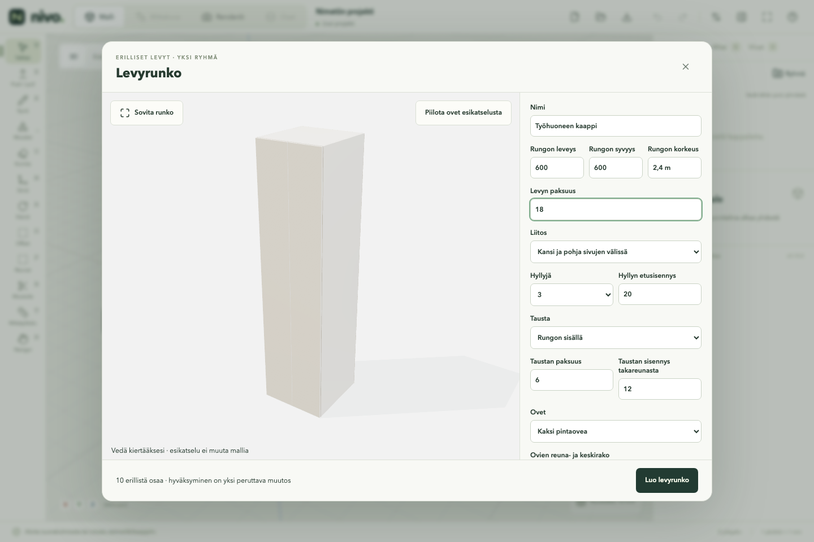

- **Muodot** avaa suorakulmion, ympyrän, ellipsin ja monikulmion. Valitse työkalu,
  napsauta alkupiste ja napsauta loppupiste tai vedä muoto. Työkalun valinta ei
  piirrä oletuskokoista muotoa. Numerosyöttö ja pikanäppäimet säilyvät.
- **Valitse (V)**: vedä laatikko mistä tahansa näkymän kohdasta. Kokonaan laatikon
  sisään jäävät osat valitaan. Shift lisää laatikon osat aiempaan valintaan;
  Shift-klikkaus lisää tai poistaa yksittäisen osan. M siirtää valinnan.
- **Mittakuva**: valitse kohde, näkymä ja Lisää kokonaismitat tai Lisää mitta.
  Kahden pisteen mitta poimitaan suoraan piirroksesta ja sijoitetaan kolmannella
  napsautuksella. Mitan suunnaksi voi valita vaaka-, pysty- tai pistevälimitan.
  Itse lisättyä mittaviivaa voi siirtää vetämällä; Esc peruu ja Peru palauttaa. Vie PDF tai SVG. Arkin asetuksissa automaattinen/manuaalinen
  mittakaava ja piiloviivat. Tulosta 100 % koossa.
- **Renderöi**: Materiaali ja Kuva jakavat asetukset. Materiaali → Osa valonlähteenä
  muuttaa osan LED-pinnaksi tai suunnatuksi spotiksi. Samat säädöt ovat mallissa.
  LED valaisee ympäristöä myös nopeassa esikatselussa; tarkentuva kuva huomioi varjot.
  Kuva-välilehden Tarkentuva laskee lisää näytteitä paikallaan pysyvään kuvaan;
  laskennan voi tauottaa. Kuvakulman/materiaalin muutos aloittaa kertymän alusta.
  Esikatselun Kevyt/Täysi ja näytetavoite säätelevät kuormaa. Tavoitteen saavuttaminen
  pysäyttää laskennan; näkymän muuttaminen käynnistää sen uudelleen.
  **Kuvan laskenta → Tarkka → Laske tarkka kuva** ottaa tilannekuvan nykyisestä
  mallista, materiaaleista ja kamerasta. Valitse 800/1 600/2 400 px ja 8–1 024 näytettä.
  Voit palata malliin kuvan valmistuessa. Tilakortista näet etenemisen, keskeytät
  tai lataat valmiin PNG:n. Työ ei säily sivun päivityksen tai sulkemisen yli.
  Nopea esikatselu tallentuu heti. Materiaali → Studion valaistus: suunta, valo- ja
  ympäristövoimakkuus sekä lattian näkyvyys.
- **Osat**: automaattinen osaluettelo ja numeroitu räjäytyskuva. Valitse kokoonpano,
  säädä räjäytystä, vie CSV/PNG. Yksi mallinnettu kiinteä kappale on yksi osa.
  Räjäytys siirtää osien keskipisteitä suoraan kokoonpanon keskipisteestä ulospäin.
  Keskellä oleva osa pysyy paikallaan, kun ympäröivät osat erkanevat. Malli ei muutu.
- **Osat → Leikkauslista**: valitse kokoonpano, levykoko tai omat mitat, sahausura
  ja reunavara. Päivitä asettelu kokeilee kuutta suorien sahausten sijoittelua:
  ensisijaisesti vähemmän levyjä, sitten suurempia yhtenäisiä jäännöspaloja.
  Eri materiaalit, värit ja paksuudet saavat omat levynsä. Numerot vastaavat
  saman kokoonpanon räjäytyskuvaa. Klikkaa osaa kuvassa tai listassa säätääksesi
  syysuuntaa, aihiomittoja, levymateriaalin nimeä tai mukanaoloa.
  Syyt kulkevat levyn pituussuuntaan; osan pituus tai leveys voidaan lukita siihen.
  Puu- ja harjatut presetit sekä omat kuvat käyttävät oletuksena pituussuuntaa;
  suunta on tarkistettava eikä sitä päätellä tekstuurin sijoittelusta.
  Suorakulmaiset osat tunnistetaan tarkoista CAD-pisteistä myös kierrettyinä.
  Kaarevat, reiälliset ja ontot osat tarvitsevat käsin vahvistetun suorakulmaisen
  aihion. Muuttunut geometria mitätöi käsin annetun aihion vahvistuksen.
  Liian suuret ja puuttuvamittaiset osat näkyvät tarkistettavina myös viennissä.
  **Tulosta leikkauslista / Tallenna PDF** sisältävät levykuvat ja numeroidun
  osalistan; CSV sisältää myös levynumerot. Asetukset tallentuvat projektiin ja
  ovat peruttavissa. Reunalistoja ja koneistusvaroja ei päätellä automaattisesti.
  Asettelu on ehdotus, ei takuu matemaattisesti pienimmästä hukasta. CNC on backlogissa.
- **Muodot → Levyrunko**: anna leveys, syvyys, korkeus ja levypaksuus. Valitse
  kannen/pohjan liitos sivuihin, taustan sijainti ja paksuus sekä hyllyjen määrä.
  Voit lisätä yksi- tai parioven rakoineen. Esikatselu näyttää tuloksen ennen hyväksyntää.
  Hyväksyminen luo nimetyn ryhmän ja erilliset muokattavat levykomponentit yhdellä
  Peru-askeleella. Valittu osa antaa aloitusmitat ja sijainnin; erillinen
  Korvaa lähtöosa -valinta korvaa sen levyillä. Hold suojaa korvaamiselta.
  Ovet tulevat rungon eteen ja lisäävät kokonaissyvyyttä levypaksuuden verran.
  Liitoksia, helaporauksia, sahausvaroja ja materiaalisuuntaa ei päätellä.

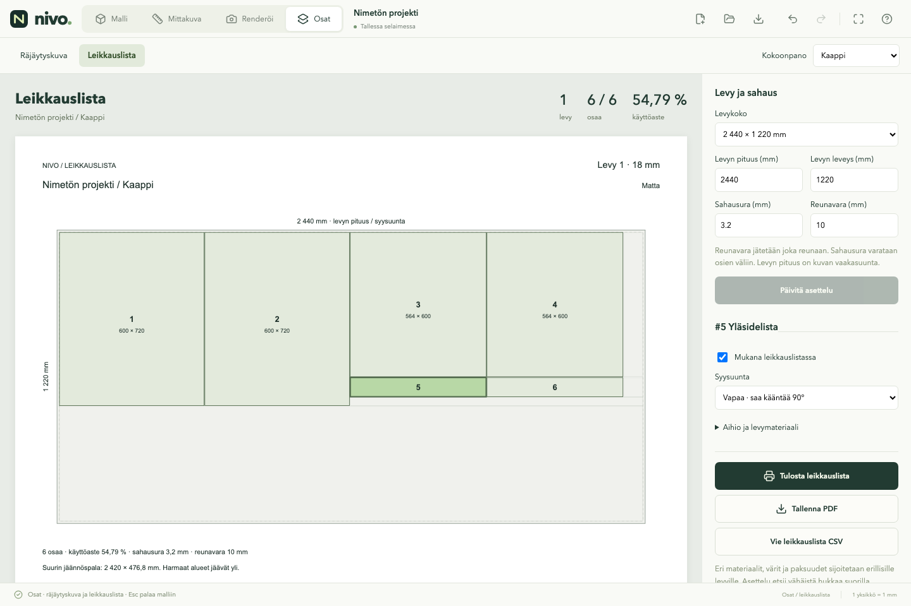

## Rajaus ja jatko

Tasopintojen mallinnus, ryhmät, kokoonpanot, linkitetyt komponentit, pohjakuvan
kalibrointi ja näkymäleikkaukset ovat käytössä. Kaarevalle pinnalle piirtäminen,
kaarevan sivupinnan push/pull, yleinen parametrinen piirrehistoria ja
luonnosten rajoiteratkaisin ovat jatkokehitystä.

Apuviivojen tavallinen tartunta käyttää piirtotasoa; haettu viitepiste voidaan
projisoida lukitulle suunnalle. Reunan tartunta tukee suoria CAD-reunoja.
Geometriamuutoksessa säilyvät CAD-verteksit säilyttävät viitteensä; poistuneet
kohteet näytetään rikkoutuneina. Topologiakohteiden yleinen nimeäminen,
mesh-tuonti, layerit, tallennetut kamerat sekä STEP-, STL- ja GLB-vienti
ovat jatkotyötä.

Mittakuvien seuraava kokonaisuus on useiden näkymien ja leikkausten
asettelu samalle arkille. CNC-työstöradat, konekohtaiset ohjeet ja vapaamuotoinen
nesting eivät sisälly nykyiseen suorakulmaisten aihioiden leikkauslistaan.
**Käytettävyys ja perustyökalujen luotettavuus ohjaavat kehitysjärjestystä.**

- [Alkuperäinen määrittely](docs/requirements.fi.md)
- [Arkkitehtuuri ja päätökset](docs/architecture.md)
- [Projektiformaatti v8](docs/project-format.md)
- [Toteutusvaiheet](docs/roadmap.md)

## Lisenssi

Nivon oma koodi: [MIT](LICENSE). Replicad ja Three.js: MIT.
OpenCascade.js/WASM: LGPL-2.1; OCCT sisältää oman lisenssipoikkeuksensa.
[Kirjastojen lisenssit ja lähdelinkit](public/licenses/NOTICE.txt) ovat mukana
myös tuotantopaketissa.
