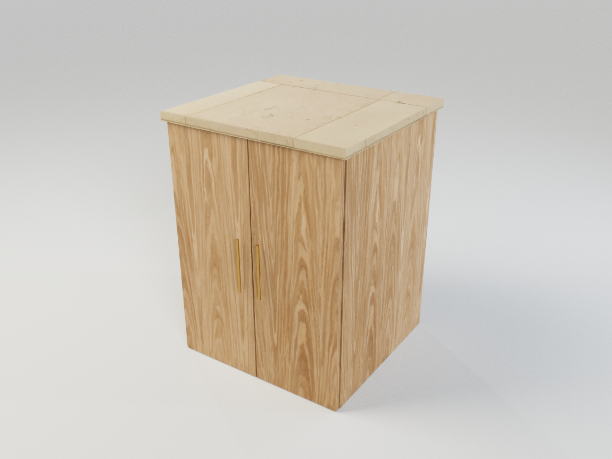

# Renderöinnin yöpassi 8.10.2026

Tavoite: ensimmäinen kuva ilman ylimääräistä odottamista, materiaalien ja kameran
päivitys ilman geometrian uudelleenrakennusta sekä aidot, yksityiskohtaiset pinnat.

## Toteutus ja tarkistus

- [x] Erota laitteiston ja ohjelmistopiirron mittaukset. M1 Pro / Chromium: sama
      WebGL-kohtaus ensimmäinen näyte noin 2,7 s; headless-ohjelmistopiirto noin 50 s.
      WebGPU-koe ei parantanut tätä vertailua eikä sitä oteta tuotantoon tässä passissa.
- [x] Lataa yhdeksän CC0-pintaa ja studio-HDRI paikallisiksi resursseiksi.
- [x] Materiaalimuutoksille oma päivitysreitti; säilytä meshit ja tracing-BVH.
- [x] Valotus ei nollaa näytteitä. Valaistuspäivitys ei rakenna geometriaa uudelleen.
- [x] Valmistele varjostin ennakkoon vain asynkronista kääntämistä tukevilla ajureilla.
- [x] Lisää pois kytkettävä, reunat huomioiva kohinan pehmennys.
- [x] Selvitä fyysisellä GPU:lla ilmenevä musta tekstuuripinta.
- [x] Mittaa valmis käynnistys, kamera, valotus ja materiaalinvaihto.
- [x] Tarkista kiilto, puunsyyt, seinäpinnat, lasi, peili ja epäsuora LED-valaistus.
- [x] Testaa selain, tuotantopolku ja materiaalien säilyminen.

## Korjatut syyt

Mustuminen johtui renderöintikirjaston pintalakan Fresnel-laskennasta. Negatiivisen
luvun GLSL `pow(x, 2)` tuotti Metalilla määrittelemättömän arvon ja mustan pikselin.
Sama lasku tehdään nyt kertolaskuna. Materiaalin lakkaa tai heijastuksia ei poisteta
virheen peittämiseksi. Sekä yksi kaappi että 296 mäntyosaa läpäisivät GPU-testin.

Materiaalinvaihto päivittää pinnat saman geometrian sisällä. Valotuksen ja kohinan
pehmennyksen muutokset piirtävät jo lasketut näytteet uudelleen. Kameran paluu
Nopea-tilasta päivittää myös ennakkoon valmistellun renderin kameran. Latautuva
PBR-kuva käyttää neutraalia välipintaa; kuvan valmistuminen vapauttaa pienen
välitekstuurin GPU-muistin ja lataa oikean koon rikkomatta jaetun lähteen laskuria.

Lopullisen tuotantobundlen M1 Pro / Chromium -kokeessa ennakkoon valmistellun
PBR-esikatselun 8 näytettä valmistuivat **259 ms:ssa** ja materiaalinvaihto
**499 ms:ssa**. Scene- ja BVH-rakennusten määrä säilyi yhdessä. Nämä ovat yhden
testikohtauksen havaintoja, eivät lupaus kaikkien mallien nopeudesta. Kylmän
käynnistyksen 2,7 s ja ohjelmistopiirron noin 50 s mitattiin erillisellä
diagnostiikkakohtauksella, eivät samalla valmiiksi valmistellulla esikatselulla.

Tarkentuvan kuvan laajat studiovalopinnat pehmentävät varjoja ja tekevät
heijastuksista luonnollisempia. Sammutetut valot eivät kuluta valonäytteitä.
Alla sovelluksen oma PNG-vienti, täysi tarkkuus ja 1 024 näytettä. Tammiviilu,
marmorilaatta ja messinkivetimet; ei jälkikäsittelyä sovelluksen ulkopuolella.

## Käyttö

- Materiaali → **Aidot pinnat**: valitse uusi PBR-pinta.
- Materiaalin oma pintakäsittely käyttää karheuskarttaa. **Matta** tai oma kiilto
  korvaa sen käyttäjän valinnalla; valikko kertoo, milloin kiilto tulee kartasta.
- Pintarakenne: käytä valmista normal-karttaa tai vaihda korkeuskarttaan ja säädä
  kohokuvion syvyys millimetreinä. Tekstuurin siirto, kierto ja koko toimivat kuten ennen.
- Renderöi → Kuva → **Tarkentuva**, **Täysi** ja tarvittaessa suurempi näytemäärä.
  Kohinan pehmennyksen voi kytkeä pois vertailua varten. Erillinen kuvanlaskenta
  säilyttää saman HDRI:n ja materiaalit, vaikka palaisi mallintamaan.

## Rajat ja jatko

Kartat ovat 1K-kuvia, jotka ladataan vain tarvittaville materiaaleille.
Yhdeksän materiaalin ja HDRI:n kokonaiskoko on noin 18 Mt. Korkeuskartta vaikuttaa
pintanormaaliin, ei CAD-geometrian siluettiin. Pehmennys on reunat huomioiva
kuvasuodatin, ei hermoverkkopohjainen kohinanpoisto.

Kapea valoaukko tarvitsee edelleen enemmän näytteitä kuin avoin studiokuva.
Valkoisen kotelon, tumman kotelon ja suljetun LED-kotelon regressiokoe läpäistiin:
valo heijastuu pinnoista eikä vuoda suljetun levyn läpi. Valon voimakkuus on yhä
suhteellinen, ei kalibroitu lumenarvo. Nopea-tila ei laske epäsuoraa valaistusta.
Fyysinen Safari/iPad ja suurten sisätilojen laaja suorituskykyvertailu jäävät
jatkotestaukseen. WebGPU-siirtymä on erillinen, validoitava kokonaisuus.

## Materiaalien alkuperä

Poly Havenin yhdeksän pintaa: mänty, tammi, pähkinä, sileä kipsipinta, karkea
rappaus, raaka betoni, liipattu betoni, marmori ja valkoinen seinälaatta.
Jokaisesta mukana 1K-väri, OpenGL-normal, karheus ja korkeus. Pintojen mittakaava
perustuu lähteen millimetrimittoihin. Normalia ja korkeudesta johdettua normalia
ei yhdistetä päällekkäin. Uudet presetit säilyttävät vanhojen projektien ulkonäön.

Studio Small 09 (Sergej Majboroda) antaa saman HDR-ympäristövalon nopealle ja
tarkentuvalle kuvalle. Valokuvat ja kartat ovat paikallisia: sovellus ei kutsu
Poly Havenin API:a käytön aikana. Lähteet, tekijät ja alkuperäiset MD5-summat
ovat `public/materials/sources.json`-tiedostossa.

[Poly Havenin CC0-lisenssi](https://polyhaven.com/license) sallii kaupallisen
käytön ja aineistojen jakamisen sovelluksen mukana. Sovelluksen MIT-lisenssi ei
muuta näiden aineistojen CC0-alkuperää.
