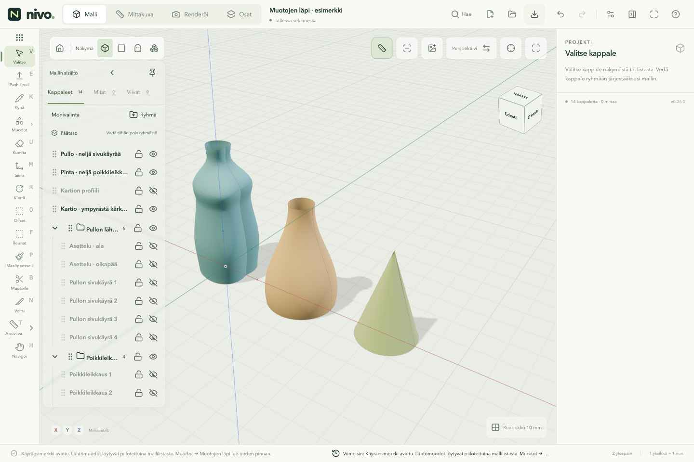

# Muotojen läpi — 0.26.0

Työkalu löytyy **Muodot → Muotojen läpi**. Tulos on tarkka CAD-pinta tai
umpiosa, josta näkymän mesh muodostetaan. Pintaa ei hyväksytä, jos ydin ei saa
siitä kelvollista geometriaa. Esikatselua voi kiertää ennen hyväksymistä.

## Käyrän piirtäminen

Valitse **Muodot → Bézier-käyrä**. Napsauta pisteet, joiden kautta haluat
käyrän kulkevan. Kaksi pistettä antaa suoran, lisäpisteet taivuttavat sitä.
**Enter** viimeistelee, **Backspace** poistaa viimeisen pisteen. Paluu
alkupisteeseen sulkee käyrän. Täytettävän suljetun muodon pitää olla tasomainen.

**Shift** säilyttää osoittamasi suunnan ja poimii pituuden toisesta pisteestä tai
reunasta. **X/Y/Z** lukitsee akselin. Kirjoitettu positiivinen pituus seuraa
osoitettua etenemissuuntaa kuten tavallisessa kynässä.

Oikealla voi valita myös aiemman **Ohjauspisteillä · tarkka** -tavan: alku,
kaksi ohjauspistettä, loppu. Seuraava osuus tarvitsee kolme uutta pistettä.

Valitun käyrän **Käyrä ja tartuntapisteet** -osiossa voi lisätä haluamansa
prosenttikohdan tai valita 4, 8 tai 16 jaon. Piste ei katkaise tai muuta käyrää.
Ympyrän oletuspisteet ovat neljä kehän neljännespistettä. Prosentit tarkoittavat
käyrän parametria; ne eivät tällä versiolla ole tarkkoja kaaripituusmittoja.
**Muokkaa käyrän pisteitä** avaa piirretyn Bézierin X/Y/Z-kentät.

Viivojen päätepisteet ja lisäpisteet ovat yhteisiä tartuntakohteita kynälle,
muodoille, mittaamiselle ja siirtämiselle. Itse kaaren poiminta käyttää 0,01 mm
taipumatoleranssilla muodostettua viivajonoa; pisteasemat lasketaan CAD-käyrältä.
Tartuntapisteet eivät ole ruudukkoon pyöristettyjä.

## Pullo neljästä sivukäyrästä

1. Piirrä kaksi ympyrää ja valitse **Mittaus/rakennusviiva**. Näin niihin ei
   synny täyttöpintaa. Siirrä toinen haluttuun korkeuteen M:llä ja Z-lukolla.
2. Piirrä Bézier alemmasta kehän pisteestä ylemmän ympyrän vastaavaan pisteeseen.
   Lisää välipisteillä pullon kyljen haluttu muoto. Sivunäkymä helpottaa tätä.
3. Tee muut sivut, esimerkiksi kopioimalla ensimmäinen ja kiertämällä
   pystyakselin ympäri 90°, 180° ja 270°. Käyrät voivat olla myös erilaiset.
4. Avaa **Muotojen läpi**, valitse **Sivukäyrät** ja poimi vain neljä sivukäyrää
   ympäri kulkevassa järjestyksessä. Ympyrät jäävät asetteluavuksi.
5. Valitse **Sulje sivut ympäri**. **Pehmeä siirtymä** pyöristää käyrien välisen
   pinnan; ilman sitä syntyy suoraan yhdistäviä pintakaistaleita.
6. Tarkista esikatselu. **Sulje päädyt · umpiosa** sulkee molemmat tasomaiset
   päädyt. **Luo pinta** hyväksyy. Lähtömuodot säilyvät mallilistassa.

Kaksi sivukäyrää muodostaa avoimen pintakaistaleen. Samoin voi yhdistää suoran
kynäviivan ja kaarevan profiilin esimerkiksi kaltevaksi tai kaartuvaksi pinnaksi.

## Poikkileikkaukset ja kartio

Valitse **Poikkileikkaukset** ja poimi ympyrät, suorakulmiot tai muut suljetut
profiilit alhaalta ylös. Muodot voivat olla eri kokoisia. Pinnan voi sulkea
umpiosaksi. Myös avoimien viivojen väliin voi tehdä avoimen pinnan, mutta avoimia
ja suljettuja profiileja ei sekoiteta samaan poikkileikkausketjuun.

**Päätä kärkeen · kartio** toimii jo yhdellä suljetulla tasoprofiililla.
Anna kärjen etäisyys viimeisestä profiilista. Suunta on sen tason normaali;
miinus vaihtaa puolta. Yhdestä ympyrästä tulee kartio, kahdesta erikokoisesta
ympyrästä ilman kärkeä katkaistu kartio.

## Työn säilyminen ja prototyypin rajat

Esikatselu ei lisää historiaa tai muuta lähtömuotoja. **Esc** sulkee sen.
Hyväksyntä, mahdollinen lähtömuotojen piilotus ja uusi pinta kumoutuvat yhdellä
**Peru**-toiminnolla. Myös lukittua lähtömuotoa voi käyttää viitteenä, koska sitä
ei muokata. Sen pisteitä ei voi muuttaa vapauttamatta lukitusta.

- Enintään 24 profiilia; helpossa Bézierissä 2–100 pistettä.
- Yksi profiili on yksi yhtenäinen viiva tai reiätön tasopinta. Päätykannet
  tarvitsevat tasomaiset, suljettavissa olevat reunat.
- Lähtömuodon muutos ei vielä päivitä jo hyväksyttyä pintaa. Luo uusi pinta
  muokatuista lähtömuodoista. Parametrinen riippuvuus on backlogissa.
- Sivukäyrät ja poikkileikkaukset ovat vaihtoehtoisia rakennustapoja.
  Yhteinen ohjauskäyräverkko ja saumojen G1/G2-jatkuvuuden säätö ovat jatkotyötä.
- Pintakuorella ei vielä ole erillistä seinämäpaksuusasetusta.

Tyhjän projektin **Käyräesimerkki · pullo ja kartio** avaa esimerkin.
Sen lähtömuodot ovat mallilistassa piilotettuina, joten esimerkin pinnat voi
rakentaa uudelleen itse. Tiedosto: [muotojen-lapi.nivo](../public/examples/muotojen-lapi.nivo).

