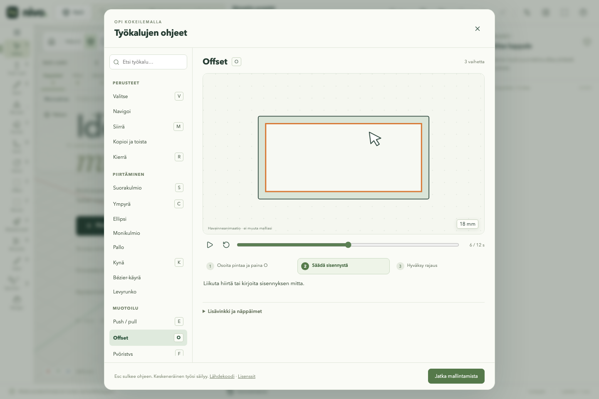

# Työkalujen selkeytys ja havainneohjeet — v0.30.0

Työkalun oikeassa paneelissa on **Näytä esimerkki**. Se avaa juuri käytössä
olevan työkalun ja toimintatavan ohjeen. Myös yläpalkin **Käyttöohje** avaa
saman kirjaston. Haku löytää ohjeet myös ilman ääkkösiä.

Kirjastossa on 33 kolmivaiheista, 12 sekunnin havainneanimaatiota. Kohdistin,
tartuntapisteet, liike ja tulos näkyvät pelkistettynä piirroksena. Kyseessä ovat
interaktiiviset animaatiot, eivät ruutunauhoitukset tai ladattavat MP4-videot.
Esimerkin voi pysäyttää, kelata, aloittaa uudelleen tai katsoa vaihe kerrallaan.
Yksi lyhyt teksti kertoo nykyisen vaiheen; lisävinkit avautuvat erikseen.

| Kokonaisuus              | Ohjeet                                                                                        |
| ------------------------ | --------------------------------------------------------------------------------------------- |
| Perusteet                | Valitse, Navigoi, Siirrä, Kopioi ja toista, Kierrä, Skaalaa                                   |
| Piirtäminen              | Suorakulmio, Ympyrä, Ellipsi, Monikulmio, Pallo, Kynä, Bézier-käyrä, Levyrunko                |
| Muotoilu                 | Push/pull, Offset, Pyöristys, Viiste, Kumita, Cut, Join, Veitsi, Muotojen läpi, Leikkaa aukko |
| Mittaaminen ja merkinnät | Apuviiva, Vapaa mittaviiva, Dimensio, Pinta-ala, Huomautus                                    |
| Pinnat                   | Maalipensseli, Tekstuurin asettelu                                                            |
| Näkymät                  | Poikkileikkaus, Pohjakuva, Tallenna näkymä                                                    |

Esc tai **Jatka mallintamista** sulkee ohjeen. Ohje ei vaihda työkalua, hyväksy
muotoa tai muuta projektia. Keskeneräisen piirroksen mitat säilyvät. Ohjekirjaston
ollessa auki mallinnuksen näppäinoikotiet eivät vaikuta taustalla. Jos ohjetta ei
saada ladattua, mallinnus pysyy käytettävissä ja virheikkunan voi sulkea.

[Kapea näyttö](images/tool-guide-mobile.png).

## Auditissa löytyneet epäselvyydet ja korjaukset

| Havainto                                                                                        | Muutos                                                                                                                                                  |
| ----------------------------------------------------------------------------------------------- | ------------------------------------------------------------------------------------------------------------------------------------------------------- |
| Sama ohje toistui otsikon alla, paneelin tekstissä ja alapalkissa.                              | Paneeli näyttää seuraavan askeleen. Yksityiskohtaiset ohjeet siirtyvät esimerkkiin. Alapalkki säilyttää lyhyen palautteen myös piilotetulle paneelille. |
| Kynä tarjosi muodon sulkemista ja viivan päättämistä ennen ensimmäistä pistettä.                | Nämä painikkeet ilmestyvät vasta aloitetulle viivalle.                                                                                                  |
| Pallolle näytettiin paksuuskenttä, vaikka paksuus ei kuvaa palloa.                              | Kenttä poistuu pallolta; halkaisija säilyy.                                                                                                             |
| Piirtotapa-valikossa oli tavallisessa työskentelyssä vain yksi käyttökelpoinen vaihtoehto.      | Valikko näkyy osan muokkauksessa, jossa uusi osa / pinnan alue on todellinen valinta.                                                                   |
| Piirtotyökalun Toiminto-valikko vaihtoi toiseen työkaluun ja näytti aina oletuksena Uusi muoto. | Päällekkäinen valikko poistuu piirrosta; Cut/Join pysyy Muotoile-työkalussa ja valitun osan muotoilutoiminnoissa.                                       |
| Valinnan päätoiminnot olivat eri puolilla materiaali- ja linkitysosioita.                       | Siirrä / Kopioi / Poista sekä Muokkaa osaa / Kierrä / Kiinnitä näkyvät kahdella yhtenäisellä rivillä ensin.                                             |
| Kiertopisteen koordinaatit ja vapaan siirron valinta kuormittivat jokaista käyttökertaa.        | Avattavat Kiertopisteen koordinaatit ja Siirtotapa. Kiertopisteen poiminta ja kopiointi säilyvät suoraan näkyvissä.                                     |
| Tekstuurin satunnaisvaihtelu oli aina auki, myös yksittäistä kuviota aseteltaessa.              | Vaihtelu avataan tarvittaessa; siirto, kierto ja koko säilyvät suoraan käytettävinä.                                                                    |
| Cut/Join luetteli kaikki osat kahdesti.                                                         | Aktiivinen kohde-/työstöryhmä näyttää koko listan, toinen vain jo valitut osat.                                                                         |
| Vanha ohjeikkuna oli pitkä tekstilista ja sisälsi vanhentuneen linkitystä koskevan rajauksen.   | Haettava, työkaluittain jaettu havainneohje korvaa listan.                                                                                              |

Mittaviivan kierron aloituksessa korjattiin lisäksi kohdistusvirhe: aiemmin
tallennuspainikkeeseen jäänyt näppäimistökohdistus saattoi tehdä Enteristä uuden
tallennuksen kierron hyväksymisen sijaan. R, Shift+R ja kiertopainikkeet siirtävät
nyt kohdistuksen mallinnusnäkymään. Muiden painikkeiden Enter-käyttö säilyy.

Virheilmoitukset, Hold, linkitetyn muokkauksen vaikutus muihin kopioihin,
numerosyöttö, hyväksyntä/peruminen sekä materiaalien valikoima säilyvät.
CAD-laskentaa, tiedostomuotoa tai tartuntasääntöjä ei muutettu tässä passissa.

## Vertailu ja toteutuksen rajat

Sama tyhjä projekti ja 1440 × 960 näkymä: kynän aloituspaneeli 109 → 28 sanaa,
apuviiva 72 → 15, reunatyökalu 74 → 34, veitsi 74 → 38 ja Cut/Join 52 → 26.
Mittaus on DOM-tekstin vertailu: se sisältää myös suljettujen natiivien
valintalistojen vaihtoehtotekstit, joten se ei ole pikselitilan mitta tai kaikkien
paneelien visuaalisen kevenemisen prosenttilupaus. Maalipensselin pitkä
materiaalivalikoima säilyy, vaikka ohjetekstiä vähennettiin.

Vertailun voi toistaa komennolla
`node scripts/audit-tool-panels.mjs http://127.0.0.1:4173/nivo/`.
Tulokset ovat [vertailutiedostossa](benchmarks/v030-ui-panels.json).

Ohjeiden animaatio- ja käyttöliittymäkoodi ladataan vasta avattaessa. Yksi näkyvä
animaatio päivittyy noin 30 kertaa sekunnissa omassa komponentissaan; mallin
geometriaa tai projektihistoriaa ei käsitellä. Animaatio päättyy 12 sekuntiin,
ja sulkeminen lopettaa päivitykset. Piilotettu välilehti pysäyttää toiston.
Vähennetyn liikkeen asetuksella automaattinen toisto ei käynnisty; käsin voi toistaa.
Kapea näyttö käyttää työkaluluettelon tilalla valikkoa, ja näppäimistön kohdistus
pysyy ohjeikkunassa.

Ensikäyttökortti ei avaudu automaattisesti. Ohje pyydetään itse, jotta työskentely
ei keskeydy. Erilliset pitkät projektiesimerkit, ladattavat videonauhoitukset ja
renderöintiputken täydellinen koulutus jäävät tämän työkalupassin ulkopuolelle.
Säännöllinen paneelien ja työnkulkujen selkeyttäminen jatkuu backlogissa.
