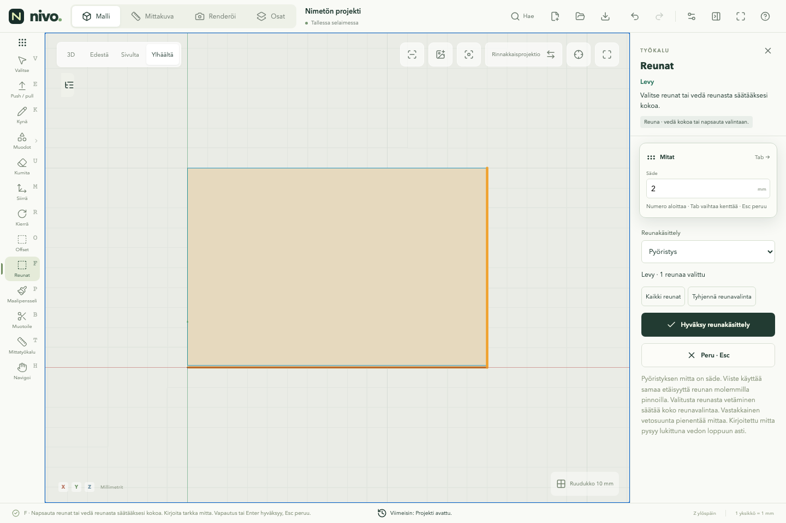
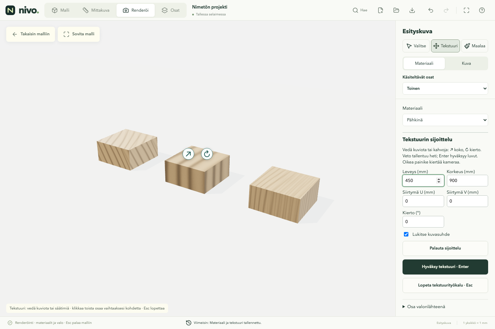
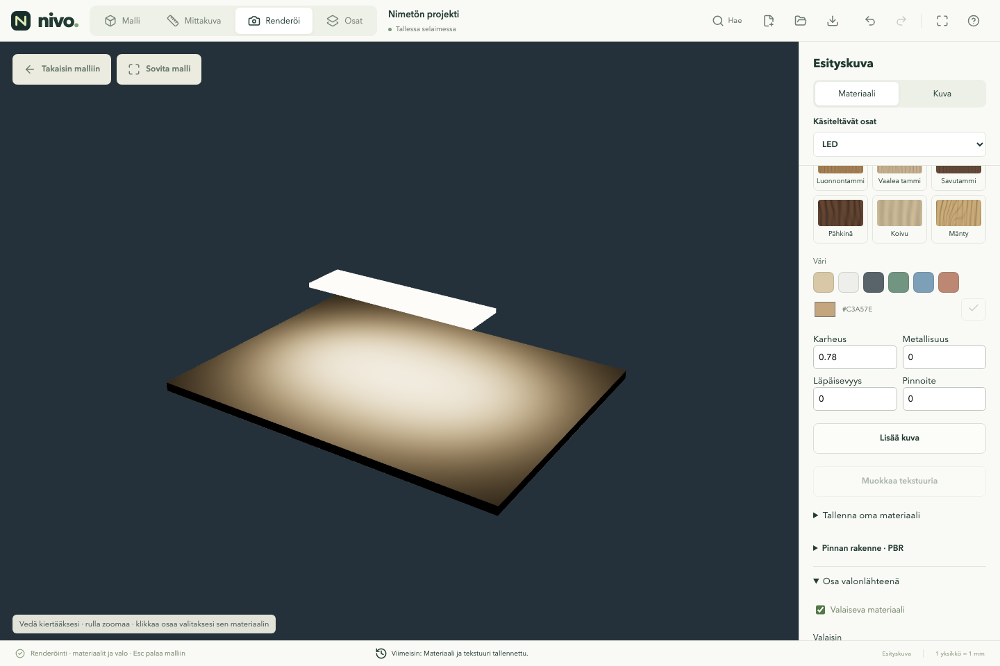
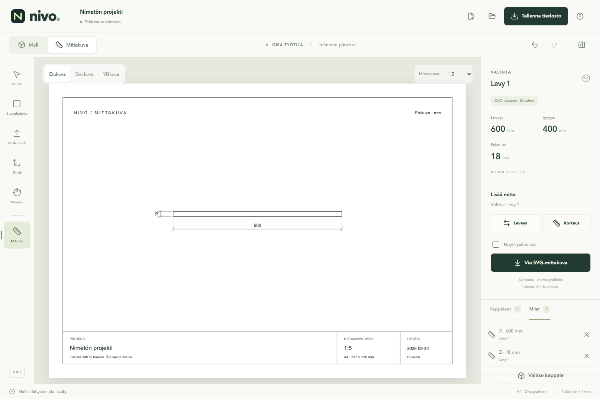

# Validointi — 8.10.2026

Ympäristö: Apple M1 Pro, 16 Gt, macOS 26.2 arm64, Node 24.14.0.
Playwright 1.63.0 / Chromium 153.0.8010.12. Tablettiprofiili on
Chromiumin iPad Pro 11 -kosketusemulointi, ei fyysinen iPad tai Safari.

## V0.24.2 — apuviivojen näkyvyyshaku pyöristetyissä kaapeissa

**318 yksikkö-/CAD-testiä hyväksytty (61 tiedostoa)**. TypeScript,
lisenssiluettelo ja `/nivo/`-tuotantobuild hyväksytty.

Uudet yksikkötestit vertaavat kiihdytettyä näkyvyyttä vanhaan täsmälliseen
sädehakuun kaarevalla, siirretyllä ja eri suunnissa skaalatulla geometrialla.
Mukana ovat pintaan osuva piste, ghost/wireframe, piilotettu osa, rakentamisviiva,
poikkileikkauksen poistama ensimmäinen osuma, seuraava säilytetty pinta,
CAD-kolmioindeksien säilyminen sekä muuttuneen/vapautetun geometrian välimuisti.

Tuotantobuildista **30 hyväksyttyä selaintapausta** desktopilla ja tablettiprofiilissa:
kaarevan kappaleen peitto ja hakupuun säilyminen kamerakierrossa, ghost/solid,
yksittäinen ja yleinen x-ray tallennuksineen, tarkat mittapisteet, poikkileikkaukset
ja kuvanviennit. Kahden muun `snap-annotations.spec.ts`-tapauksen molemmat profiilit
epäonnistuivat. Samat risteysvihjeen ja fillet-korostuksen pikselikokeen virheet
toistettiin myös julkaistussa 0.24.1-versiossa ennen korjausta; ne kirjattiin backlogiin.

Käyttäjän **alkuperäisen tiedoston** kamerakierto toistettiin paikallisesti koneen
asennetulla Chrome 154:llä. Mediaani 50,2 → 8,3 ms, p95 108,1 → 9,7 ms.
Materiaali- ja apuviivavertailu eristi syyn; ennen/jälkeen-kuvakaappaukset olivat
identtiset. Tarkka malli pysyy paikallisena. [Mittaus ja rajat](performance.md).

## V0.24.1 — kamerakierto ja siirtotyökalun tartuntakuormitus

**313 yksikkö-/CAD-testiä hyväksytty (60 tiedostoa)**. TypeScript, lisenssiluettelo
ja `/nivo/`-tuotantobuild hyväksytty. Kehitysversiossa **54 selaintapausta hyväksytty**
desktopilla ja Chromiumin tablettiprofiilissa; kaksi vain kosketukselle tarkoitettua
tapausta ohitettiin desktopilla. Mukana ovat kohdistimeen zoomaus, pinnan ympäri
kierto, panorointi, kosketuskierto ja nipistys, siirron suunnallinen mitta, kopioinnin
toisto ja Peru, valintaruudut sekä pintojen risteystartunta muokkaustilassa ja sen ulkopuolella.

Tuotantobuildissa hyväksyttiin uusi kameraregressio sekä 12 kaapin / 95 osan
mustan tammiviilun suorituskykykoe. Regressio varmistaa, että siirtokorostus
poistuu oikean/keskimmäisen napin kameravedon ajaksi, palautuu sen jälkeen,
eikä osan tallennettu sijainti tai geometria muutu. Tekstuurien lataukset
tarkistettiin ennen mittausta. Korjauksella kameravedossa oli nolla GPU-tekstuurilatausta;
ennen korjausta julkaistussa versiossa samassa kokeessa oli 16.
[Mittauksen rajat ja raakadata](performance.md).

Alkuperäistä käyttäjän 15–30 FPS:n tilannetta **ei toistettu**, eikä sen kaikkia
syitä ole vahvistettu. Käyttäjän tarkka projekti ja selain-/laitetiedot puuttuvat.
Ensimmäisen yksikkötestiajon patinatesti ylitti 5 s:n aikarajan samanaikaisen
selainsarjan aikana; erikseen ajettu koko 313 testin sarja läpäisi ilman muutosta.

## V0.24.0 — metallit, harjaus ja puunsyyn suunta

**313 yksikkö-/CAD-testiä hyväksytty (60 tiedostoa)**. TypeScript, lisenssiluettelo
ja `/nivo/`-tuotantobuild hyväksytty. **26 tuotantoversion selaintapausta hyväksytty**
desktopilla ja Chromiumin tablettiprofiilissa. Kaksi tarkentuvan renderin tapausta
ajettiin vain desktopilla; niiden tablettivastineet ohitettiin tarkoituksella.

- 13 metallipresetiä: neljän aiemman lisäksi kupari, hapettunut kupari, musta kromi
  ja kuusi anodisoitua alumiinia. Kokoelma yhteensä 105 materiaalia / 28 PBR-pintaa.
- Kromin sininen uudelleenmaalaus tarkistetaan tallennuksesta ja kuvan pikseleistä.
  Testi paljasti aiemman täysin mustan metallin mallinnusnäkymässä. Syy oli puuttuva
  heijastusympäristö; nyt metallit jakavat yhden laiskasti luotavan studioympäristön.
- Messingin harjaus, sininen sävy ja silkinhimmeä pintakäsittely säilyvät maalatessa.
  Kuviointi ei muuta metallisuutta, väriä tai käyttäjän kiiltoasetusta.
- Patinan maski kytkee vihreän hapettuman karheaan epämetalliseen pintaan ja
  kuparikohdat sileämpään metallipintaan. Värin vaihto säilyttää maskit ja kuvion.
  Kaikki metallit tarkistettu myös fyysisen M1 Pro / Metal -GPU:n tarkentuvassa
  renderissä; tarkistuskohtaus ei tuottanut GPU-virheitä.
- Saarni ja valkotammi maalataan erikseen X- ja Y-pitkille levyille. Tallentunut
  kulma, valmis kuva ja myöhempi sävyn vaihto tarkistettu. Yksikkötestit kattavat
  myös pystysuuntaiset osat ja osan oman kierretyn koordinaatiston.
- Renderin yhteinen materiaalivalinta suuntaa eri pituiset levyt osakohtaisesti.
  Jo asetetun kuvion suuntaus säilyttää siirtymän; Peru palauttaa lähtökulman.
  Vapaa tekstuurin kierto, siirto, skaalaus ja linkitettyjen kopioiden hajonta
  tarkistettu uudelleen. Käsin annetun nollakulman palautus säilyy mahdollisena.
- Kolmen uuden pähkinäpinnan kaikki neljä karttaa vastaavat Poly Havenin
  tarkistussummia. Alkuperäiset kuvat säilyvät; amerikkalainen ja eurooppalainen
  pähkinä nimetään lähteen mukaan. Koko materiaalihakemisto on noin 54 Mt.

Uudet metallisävyt ja proseduraalinen patina ovat visuaalisia malleja, eivät
valmistajan mittaustietoon perustuvia pinnoitteita. Auringon lisäsäädöt,
esityskuvan terävyyden säätö ja kiinnikevalikko ovat backlogissa.

## V0.23.0 — pintakokoelma ja maalipensselin sävytys

**309 yksikkö-/CAD-testiä hyväksytty (59 tiedostoa)**. TypeScript, lisenssiluettelo
ja `/nivo/`-tuotantobuild hyväksytty. Kokoelmassa on 25 PBR-pintaa ja 12 maalisävyä;
kaikkiaan 93 materiaalipresetiä. Jokaisen PBR-pinnan neljän paikallisen 1K-kartan
MD5-summa vastaa Poly Havenin lähdetietoja. Koko materiaalihakemisto HDRI mukaan
lukien on noin 49 Mt; kuvat ladataan vasta käytössä. Kokoelman puuvalikko ei lataa
kivi- ja tekstiilipintojen esikatselukuvia samalla kertaa.

Käyttäjän P → tekstuuri → väri → sama osa uudelleen -ketju tarkistettiin tallennetusta
väristä ja osan kuvan pikseleistä. Alkuperäinen kertolaskusävytys tallensi uuden värin,
mutta sininen kerrottuna lakatun männyn oranssinruskealla kuvalla jäi lähes mustaksi.
Uusi värisävyn vaihto käyttää tekstuurin lineaarista valoisuutta, säilyttää kuvion
ja kertoo sen valitulla värillä. Normaali- ja karheuskarttoja ei muuteta. Valkoinen
palauttaa alkuperäisen värikuvan. Kuultava sävy ja vanhojen projektien puuttuva
sävytysasetus säilyttävät aiemman kertolaskun.

Tuotantobundlesta hyväksyttiin **11 selaintapausta** desktopilla ja Chromiumin
tablettiprofiilissa. Tarkentuvan renderin erillinen pikselikoe ajettiin vain
desktopilla, ja sen tablettivastine ohitettiin tarkoituksella:

- Proseduraalinen ja PBR-mänty maalataan uudelleen siniseksi P-työkalulla.
  Sekä projektin väri että osan pikselit muuttuvat; Peru palauttaa edellisen värin.
- Molempien puutekstuurien suora sävyn esikatselu, Esc, hyväksyntä ja linkitetyt kopiot.
  Sävyn perumisen pikselivertailu kohdistuu osiin, ei päälle piirrettyjen säätimien hover-tilaan.
- Tarkentuva renderi vaihtaa alkuperäinen → sininen → alkuperäinen → sininen.
  Jokainen väri tarkistetaan valmistuneesta kuvasta ja materiaalin GPU-päivityksestä;
  scene-/BVH-rakennusten määrä ei kasva. Esikatselu toimii ennen hyväksyntää.
- Kokoelman suodatus, haku, puu, pellava, maali, kiillon valinta sekä tallennettu resepti.

Kehitysversiossa tarkistettiin lisäksi kaikkien 93 materiaalin yhteinen näkymä sekä
kaikkien 25 PBR-pinnan karttojen lataus, normal-/korkeuskartta ja PNG-vienti.
Materiaalitarkistuksessa havaittiin myös aiempi laajan valo-/materiaalikohtauksen
16 tekstuuriyksikön varoitus; sitä ei pidä tulkita rajattoman materiaalimäärän
suorituskykytakuuksi. Varsinaiset uudet sävytyskokeet eivät tuottaneet GPU-virheitä.
Fyysistä iPadia tai Safaria ei testattu. Sävytetty erillinen lakkakerros on backlogissa,
ei tämän version ominaisuus.

## V0.22.1 — offsetatun piirustuspinnan kehän säilyminen

**306 yksikkö-/CAD-testiä hyväksytty (59 tiedostoa)**. TypeScript ja `/nivo/`-build
hyväksytty. Alkuperäinen virhe toistettiin: 1000 × 1000 mm paksuudeton neliö,
250 mm offset ja sisäpinnan 400 mm pursotus jättivät vain 500 × 500 mm keskiosan.
Pintakappaleen pursotus korvasi koko kappaleen valitusta pinnasta tehdyllä prismalla.

Korjaus säilyttää muut pinnat ja käsittelee tilavuuden sekä paksuudettomat alueet
erikseen. Tilavuus lasketaan suljetuista osista; jäljelle jäävän kehän alkupaksuus
on nolla, vaikka samaan kappaleeseen kuuluu nyt myös nostettu keskiosa.

Yhdeksän uutta CAD-tapausta tarkistavat ulkomitat, pinta-alan ja tilavuuden,
keskiosan jatkopursotuksen ja madaltamisen, kehän pursotuksen molempiin suuntiin,
vinon siirretyn piirustustason, ympyrän kehän sekä kehän jakamisen ja rajauksen
kumittamisen. Mukana on vertailu alun perin 18 mm paksuun levyyn sekä
projektitiedoston tallennus ja uudelleenlukeminen.

Kaikki kahdeksan kohdennettua offset-/pursotusselaintestiä hyväksyttiin desktopilla
ja Chromiumin tablettiprofiilissa. Uusi koe tekee käyttäjän O 250 → E 400
-ketjun, tarttuu säilyneeseen kehään ja pursottaa sitä 100 mm, tarkistaa
Peru/Palauta-toiminnot sekä lataa projektin uudelleen. Lopputuloksen kuva
tarkistettiin: tasainen 250 mm kehä ympäröi nostettua keskiosaa. Sama uusi koe
hyväksyttiin molemmilla profiileilla myös julkaistavasta `/nivo/`-tuotantobundlesta.

## V0.22.0 — PBR-pinnat, nopea päivitys ja renderin viimeistely

**297 yksikkö-/CAD-testiä hyväksytty (58 tiedostoa)**. TypeScript, `/nivo/`-build
ja lisenssiluettelo tarkistettu. Uusi aineistotesti tarkistaa kaikkien yhdeksän
materiaalin neljä karttaa alkuperäisillä MD5-summilla sekä mittakaavan ja CC0-tiedot.
Sammutetut valot jätetään pois valonäytteiden valinnasta.

Fyysisellä M1 Pro / Metal -GPU:lla toistettiin musta lakkapinta. Syy oli GLSL:n
määrittelemätön negatiivisen luvun `pow(x, 2)`, joka palautti NaN-arvon Fresnel-
laskentaan. Kertolaskuksi korjattu kaava läpäisi männylle, pähkinälle ja 296 osalle
tehdyt kuvatestit. Ohjelmistopiirto ei paljastanut tätä alkuperäistä virhettä.

Kohdennetuissa tuotantobundlen selaintesteissä tarkistettiin:

- Tarkennuksen valmistuminen paikallaan, kevyt/täysi tarkkuus, tauko, keskeytynyt
  kameraveto ja paluu Nopea-tilasta. Paluukoe vertaa myös osan paikkaa kuvan
  pikseleistä: renderi ei hyppää takaisin vanhaan kameraan.
- PBR-materiaalinvaihto kesken tarkennuksen. Testi odottaa uutta GPU-materiaalilatausta
  ja valmista kuvaa; scene- ja BVH-rakennusten määrä säilyy yhdessä.
- Valotus sekä kohinan pehmennyksen kytkin muuttavat kuvaa säilyttäen näytteet.
  Matta tallentuu karheutena 1 ja lakkana 0; oma pintakäsittely palauttaa kartan.
- Kaikki yhdeksän pintaa latautuvat sovelluksen omasta `/nivo/materials/`-polusta.
  Vuorotellen normal- ja korkeuskarttaa käyttävä kohtaus viedään PNG:ksi, ja
  projektin asetukset säilyvät ilman paikallisten oletuskuvien upottamista tiedostoon.
- PBR-puun jatkuva siirto-/kiertotyökalu, maalaus, Peru/Palauta ja Hold.
  Puunsyyn suunta huomioi eri lähdekuvien U/V-suunnan myös hajonnassa ja leikkauslistassa.
- Renderin reaaliaikainen sävy, peruminen, linkitettyjen osien yhteinen värimuutos,
  peilin sisältävä taustatyö ja kuvan lataaminen malliin paluun jälkeen.
- LED:n peittäminen myös lasin läpi katsottaessa. Epäsuoran valon vertailu
  **1 024 näytteellä**: 50 → 100 lisää vastaanottavan lattian valoa, valkoisen
  kotelon vaihtaminen ruskeaksi vähentää sitä ja suljettu kotelo jää alle 1/255.
  Aiemman 256 näytteen pistevertailun kohina saattoi peittää kirkkauseron.

PBR- ja tekstuurityökalujen kolme tapausta hyväksyttiin myös Chromiumin
tablettiprofiilissa. PBR-käynnistys, kameran paluu, materiaalinvaihto ja vienti
hyväksyttiin lisäksi headless-ohjelmistopiirrolla. Fyysistä Safaria/iPadia ei testattu.

Laitteistokiihdytetty valmis PBR-esikatselu saavutti 8 näytettä noin **0,25–0,50 s**
ja materiaalinvaihto noin **0,43–0,50 s** paikallisissa tuotantotesteissä.
Ennakkoon valmisteltu shader ja paikalliset resurssit vaikuttavat lukuun; se ei
ole kylmän selaimen tai suuren työmaamallin yleinen suorituskykylupaus.
Erillinen kylmä WebGL-diagnostiikka tuotti ensimmäisen näytteen noin 2,7 s:ssa
M1 Prolla. Headless-ohjelmistopiirron PBR-esikatselun käynnistys oli **50,2 s**.
Näitä kahta erilaista mittausta ei pidä esittää saman konepolun ennen/jälkeen-vertailuna.

Studio-HDRI, laajat studiovalopinnat, karheus- ja normal-kartat sekä pois kytkettävä
kuvasuodatin tarkistettiin myös täydellä tarkkuudella tammikaappiin, messinkivetimiin
ja marmorilaattatasoon. Korkeuskartta muuttaa pintanormaalia, ei CAD-geometriaa.
Kohinan pehmennys ei vastaa hermoverkkodenoiseria; hämärä sisätila tarvitsee yhä
enemmän näytteitä. Valon voimakkuus ei vielä ole lumenarvo. Vanhojen projektien
materiaalipresetit säilyvät; uusi studiovalaistus muuttaa esityskuvan valoa.

## V0.21.5 — tarkennuksen elinkaari ja valaistuksen vertailu

**293 yksikkö-/CAD-testiä hyväksytty (56 tiedostoa)**. TypeScript ja `/nivo/`-build
hyväksytty. Asennettua renderöintikirjastoa käyttävä shader-testi varmistaa nyt
myös, ettei ensimmäinen näyte käynnistä erillisiä tarpeettomia sumu- ja
syväterävyysversioiden valmisteluja kohtauksen alustuksen jälkeen.

Neljän tuotantobundlen selaintapauksen ajo hyväksytty desktopilla:

- Tarkennus valmistuu paikallaan ilman kameraliikettä. Nopea kuva ja tarkentuva
  kuva eroavat myös pikseleiltään. Täysi-laatu vaihtaa jo valmistuneen esikatselun
  laskentapuskurin vastaamaan canvasin pikselikokoa. Valmiin kuvan peittävyys on 1.
- Kameran vedon keskeyttäminen ikkunan blur-tapahtumalla vapauttaa tarkennuksen
  odotuksen. Tavallisen vedon aikana näytemäärä pysyy nollassa. Tarkentuva-painike
  jatkaa myös käyttäjän tauottamaa laskentaa.
- Tekstuurisävy päivittyy ennen hyväksymistä ja tarkentuu uudelleen. Kameraliike
  ei lisää materiaalien GPU-latauksia; sovelluksen jälkeiset moduulihaut estetty.
- Erillisen kuvatyön keskeyttäminen vapauttaa esikatselun. Kameran sovittaminen
  aloittaa valmistuneen tarkennuksen uudelleen.

LED-koe sisältyy ajoon: 256 näytettä, ympäristö ja studiovalot pois, 50 mm aukko
peitetyn valaisimen vieressä. Lattian pikselialue vaalenee kertoimen vaihtuessa
50 → 100 ja tummenee valokotelon seinien muuttuessa valkoisista ruskeiksi.
Kokonaan suljettu kotelo jää alle 1/255: valo ei vuoda levyjen läpi.
Koe ei kalibroi lumeneita tai käyttäjän saunan materiaaleja. Kapea valoaukko
on edelleen kohinainen 256 näytteellä.

Erillisessä 320 × 240 px GPU-diagnostiikassa näytteen paino vastaa 1/n:ää,
värien sekoitus on käytössä ja satunnaisnäytteet vaihtuvat. Lattian lineaaristen
pikseliarvojen hajonta pieneni yhdessä ajossa 32 näytteen 1,00:sta 256 näytteen
0,60:een; kuva kertyy, mutta tällä vaikealla valaistuksella hitaasti.
Ensimmäiset näytteet viivästyivät testiselaimessa noin 49–52 sekuntia. Kolmen
asetuskytkimen yhdistäminen yhdeksi shader-alustukseksi ei tässä ympäristössä
lyhentänyt viivettä mitattavasti. Sitä ei pidä raportoida osoitettuna
käynnistysajan nopeutuksena. KHR_parallel_shader_compile ei ollut käytettävissä.

Kehityspalvelimen yksi LED-koe keskeytettiin lähdekoodin kuumapäivityksen jälkeen;
varsinainen vertailu ajettiin muuttumattomasta tuotantobundlesta.

Lopullisen shader-alustuksen jälkeen **3/3 selaintapausta hyväksytty**:
esikatselun koko käynnistys-/tarkkuus-/tauko-/blur-polku, kuvatyön keskeytys ja
kameran palautuminen sekä taustalla valmistuva 800 px PNG myös uuden mallin
avaamisen jälkeen. Tämä pass sisältää yhteensä **5 erillistä selaintapausta**
sekä kohdennetut uusinta-ajot. Näitä GPU-kokeita ei toistettu tabletilla eikä
fyysisessä Safarissa/iPadissa.

## V0.21.4 — piirron aloitus ja renderin korjaukset

**293 yksikkö-/CAD-testiä hyväksytty (56 tiedostoa)**. Mukana peilin tahkojen
valinta myös kierretyssä kappaleessa ja projektin uudelleenluvussa, himmeä tausta,
vanhan kiiltävän materiaalin nollakiilto, 56 materiaalipresetiä, 100 × 200 mm
laatan fyysinen koko sekä suorakulmaisen LED:n tunnistus kaukana origosta.
Renderin yksityiseen shaderiin kytkeytyvä sovitin tarkistetaan asennettua
three-gpu-pathtracer 0.0.26:ta vasten; riippuvuuspäivitys vaatii tämän tarkistuksen.

**88 selaintapausta hyväksytty desktopilla ja tablettiemuloinnissa**:
piirron aloitus, kynän mittasyöttö ja suunta, mittaviivan akselit ja Shift-viite,
pinta-/apuviivatartunta, jatkuva mittaus, kierto ja päätepisteiden muokkaus,
materiaalikatalogi, peilin puolet, pintakäsittely sekä LED:n varjo myös lasin läpi.
Uudet aloituskokeet käyttävät tavallista viistoa perspektiiviä: 137/213 mm:n
osoitus näyttää ja tallentaa 140/210/0 mm ruudukon mukaan. X/Y/Z-lukituksen jälkeen
48 mm hyväksytään miinussuuntaan ilman välissä tapahtuvaa hiiren liikettä.

Ensimmäisessä laajassa ajossa löytyi kuution näppäimistövirhe: Enter hyväksyi
keskeneräisen piirron ja esti painikkeen aktivoitumisen. Korjauksen jälkeen kynä
jatkaa myös kun alkutaso käännetään reunalta katsottavaksi. Yksi tabletin testi
osoitti kuution peittämää näytön kohtaa; testin vastakulma siirrettiin saman
apuviivatason esteettömään kohtaan ja CAD:n valmistumista odotetaan ennen vientiä.
Korjatut tapaukset hyväksyttiin uudelleen molemmilla profiileilla.

**Kolme renderin lisätapausta hyväksytty desktopilla**:

- Tarkennus valmistuu kahdeksaan näytteeseen; kameravedon aikana näytteitä ei
  lasketa ja materiaalien GPU-latausten määrä pysyy ennallaan. Liikkeen jälkeen
  tarkennus jatkuu ja uusi tekstuurisävy näkyy hyväksymistä odottamatta. Myöhemmät
  JavaScript-haut on testissä estetty, joten käynnistys käyttää sovelluksen mukana
  ladattua renderöintikoodia.
- Peitetty suorakulmainen LED 50 mm valoaukon vieressä valaisee vastaanottavaa
  lattiapintaa heijastusten kautta 64 näytteellä. Studion ja ympäristön tehot ovat
  nollassa. Nopean kuvan näytealue jää alle 3/255, tarkentuva ylittää sen vähintään
  8/255. Kun aukko suljetaan ja valaisin jää kokonaan suljettuun koteloon,
  tarkentuvan näytealue jää alle 1/255. Valo ei vuoda suljettujen levyjen läpi.
- Yksipuolisen peilin sisältävä taustarenderi jatkuu mallityötilassa myös uuden
  projektin avaamisen jälkeen ja tuottaa oikean 800 px PNG-kuvan.

**Rajaukset:** valon voimakkuus on suhteellinen. Koe ei kalibroi lumeneita eikä
osoita käyttäjän saunan lopullista kirkkautta. Kapea valoaukko on edelleen
voimakkaasti kohinainen 64 näytteellä; syvemmällä valokotelossa oleva LED jäi
ensimmäisessä kokeessa hyvin himmeäksi. Kohinanpoisto, epäsuoran valon tehokkaampi
näytteistys ja fysikaalisten yksiköiden kalibrointi ovat backlogissa. Nopea-tila
ei laske epäsuoraa valaistusta. Peilin malliheijastukset vaativat Tarkentuva-tilan.

## V0.21.3 — horisontin säilyttävä orbit, maali ja renderin korjaukset

**288 yksikkö-/CAD-testiä hyväksytty (54 tiedostoa)**. TypeScript, `/nivo/`-build,
muotoilu ja riippuvuuksien lisenssiluettelo tarkistettu. Aiemmat bundlekoon ja
OpenCascade-moduulin browser-external-ilmoitukset säilyvät.

Kameran regressio toistettiin v0.21.2:ssa: kaarevat hiirenvedot kallistivat
kameran oikean suunnan Z-komponentin arvoon 0,229, vaikka sen pitää pysyä nollassa.
Korjauksen **23 kamera-/kuutiotapausta hyväksytty** desktopilla ja
tablettiemuloinnissa; kolme kosketustapausta ohitettu desktopilla. Mukana ovat
toistuvat kaarevat vedot ja hiiren nostaminen, perspektiivi ja ylänäkymä,
molemmat pystyvetosuunnat navalta, kohdistinpivot, zoom, panorointi ja kosketus.
Yksikkötesti vertaa samanaikaista pysty- ja vaakakiertoa alkuperäisen Z-up
OrbitControlsin tulokseen sadan peräkkäisen askeleen ajan.

**6 materiaali-/pintakäsittelytapausta hyväksytty** molemmilla profiileilla.
Kaikki 54 materiaalia renderöityvät ilman selainvirheitä. Maali korvaa puun
tekstuurin, sävy ja kiilto säilyvät renderissä, Peru/Palauta palauttavat materiaalin
ja uusi sävy näkyy ennen hyväksymistä. Geometria säilyy.

Tarkentuva renderi käynnistyy ja tarkentaa elävän väriesikatselun kahdeksaan
näytteeseen myös silloin, kun sovelluksen käynnistyksen jälkeiset JavaScript-haut
estetään. Tuore julkinen v0.21.2-välilehti toimi tutkimushetkellä; käyttäjän
täsmällistä moduulivirhettä ei toistettu. Korjaus poistaa myöhemmän moduulihaun,
joka voi jäädä vanhaan välilehteen Pages-julkaisun jälkeen.

Nopean LED-valaistuksen vuoto toistettiin: peitetyn ja peittämättömän pinnan
mitattu kirkkaus oli sama, 102,72. Varjostetut esikatselun valonäytteet korvaavat
varjottomat aluevalot. Esikatselun paikalliset varjovalot jakavat kahdeksan valon
budjetin, jotta materiaali- ja ympäristötekstuureille jää tilaa. Tarkentuva
renderi käyttää todellista valaisevaa geometriaa; esikatselusta rajatut spotit
palautuvat laskentaan. Esikatselun valaistus on edelleen likiarvo.

**7 renderöintitapausta hyväksytty**: LED-varjon pikselivertailu peittävän levyn
kanssa ja ilman, myös lasin läpi, molemmilla profiileilla; LED:n valaistus,
spotin asetukset ja tarkentuminen; taustalla valmistuva todellinen PNG myös
mallin vaihtuessa; estettyjen moduulihakujen väriesikatselukoe desktopilla.
Jälkimmäinen ohitetaan tabletilla. Yhteensä tämän version **36 soveltuvaa
selaintapausta hyväksytty**. Valon peittyminen tarkistettu lopullisella
esikatselun yhteisellä varjovalobudjetilla.

## V0.21.2 — näkymäpalkki, vapaa orbit ja Shift-korostus

**287 yksikkö-/CAD-testiä hyväksytty (54 tiedostoa)**. TypeScript, production build
polulle `/nivo/`, muotoilu ja lisenssiluettelo tarkistettu. Buildissa samat aiemmat
bundlekoon ja OpenCascade-moduulin browser-external-ilmoitukset.

54 selaintapauksen ajossa 48 hyväksyttiin, kolme kosketustapausta ohitettiin
desktopilla ja kolmesta löytyi testin ajoitusvirhe: kameratilaa luettiin ennen
tuonnin sovituksen tai Yleisnäkymä-komennon valmistumista. Jälki osoitti lukemisen
vanhasta kamerasta; testit odottavat nyt todellista kameran muutosta. Viimeinen
kuuden tapauksen ajo hyväksyi kaikki, yhteensä **51 soveltuvaa selaintapausta
hyväksytty desktopilla ja tablettiemuloinnissa**.

Kattavuus: `camera`, `view-cube`, `selection-hover`, `display-modes` ja
`pushpull-anchors-v011`. Ylänäkymän toistuva orbit ylittää aiemmat lukkiutumiskohdat;
kuutio säilyttää zoomin, Yleisnäkymä sovittaa mallin ja säilyttää valinnan sekä
näyttötilan. Kohdistinzoomaus, pinnan ympärillä orbitointi, panorointi ja
kosketuksen orbit/pinch testattu. Shift korostaa osan tai suljetun kokoonpanon
ilman hiiren liikettä, monivalinta säilyy eikä geometria rakennu uudestaan.
Push/pullin Shift poimii kulmat, keskipisteet, reunat ja apuviivat kaikista kolmesta
pääsuunnasta, myös Ghost-osasta ja heti E-pikanäppäimen jälkeen.

Oikean Valinta-paneelin siivous ja usean pinnan yhteinen push/pull ovat backlogissa,
eivät tämän version toteutuksia.

## V0.21.1 — reaaliaikainen sävy ja kopioiden numerointi

**285 yksikkö-/CAD-testiä hyväksytty (54 tiedostoa)**. **8 selaintapausta hyväksytty**
(4 desktop, 4 tablettiemulointi): `color-preview` ja `surface-finish`.
Kuvavertailu varmistaa esikatselun ennen hyväksymistä sekä Esc-palautuksen.
Tallennus säilyttää alkuperäisen värin esikatselun aikana; hyväksyminen ja yksi
Peru muuttavat molemmat linkitetyt kappaleet. Geometrian rakennuslaskuri pysyy
samana koko säätämisen ja perumisen ajan. Pintakäsittely ja maalaaminen tarkistettu.
Kopioiden yksikkötestit kattavat vanhat nimiketjut, olemassa olevat numerot,
pitkät nimet, ryhmähierarkian toiston ja kopion kopioinnin projektin lataamisen jälkeen.
Tarkentuvan renderöinnin selaintesti varmisti lisäksi uuden sävyn tarkentumisen
kahdeksaan näytteeseen ennen hyväksymistä. Ryhmän uniikiksi tekeminen ja kokoonpanon
kopiointi hyväksyttiin uusilla numeroiduilla nimillä. Vanhan 15 osan ryhmätestin
oletus itsenäisistä kopioista päivitettiin v0.21:n mukaiseen oletuslinkitykseen.
Lopullisen `/nivo/`-julkaisupolun **6 tapausta hyväksytty**: sävyn esikatselu
mallissa ja renderissä sekä 15 osan ryhmäkopiointi, desktopilla ja tabletilla.

## V0.21.0 — tartunta, kynä, kamera, materiaalit ja linkitetyt kopiot

**280 yksikkö-/CAD-testiä hyväksytty (52 tiedostoa)**. TypeScript ja
production build hyväksytty. Suuri pääbundle ja OpenCascade-moduulin
browser-external-ilmoitus ovat aiemmat tunnetut build-varoitukset.

Viimeinen kynän tuotantobuildin tarkistus hyväksyi **44 selaintapausta
(22 desktop, 22 tablettiemulointi)**: `pen-length`, `pen-split-lock` ja
`pen-guide-crossing`. Paikallinen kehityspalvelin vastaa portissa 5173.

Linkityksen ja mittaviivojen 24 tapauksen tuotantoajosta 21 hyväksyttiin heti.
Ryhmän toistokopion fixture valitsi vanhan oletuksen mukaisesti osan nimirivin:
nykyinen listavalinta avaa kokoonpanon ja valitsee kyseisen osan. Testi valitsee
nyt nimenomaisesti ryhmän. Tabletilla löytyi oikea sijoitteluvirhe: rivittyvän
näkymäpalkin alle jäi mallilistan avauspainike. Paneelit seuraavat nyt palkin
mitattua korkeutta. Korjattu viimeinen 16 tapauksen kierros hyväksyi **15 tapausta**;
yksi pelkästään kosketukselle tarkoitettu tapaus ohitettiin desktopilla.
Lopullinen `/nivo/`-julkaisupolku hyväksyi lisäksi kaikki **8** näkyvyys- ja
linkitystapausta. Muotoilu ja riippuvuuksien lisenssiluettelo tarkistettu.

Mukana ovat kaikkien tallennettujen mittojen ja apuviivojen yhteinen piilotus,
piilotettujen viitteiden ohitus, palautus ja selainpäivitys. Tavallinen malliosa
kopioituu linkitettynä, push/pull päivittyy molempiin ja Peru palauttaa molemmat.
Ryhmän uniikiksi tekeminen säilyttää sisäiset linkit. Pikaleikkaus ja pinnanjako
testataan sekä oletusarvoisesti yhteisinä että erikseen valittuina paikallisina
muutoksina. Tekstuurin asettelu ei irrota yhteistä väriä tai kiiltoa.
CAD-koe tarkistaa veitsen palojen geometrian ja linkit myös kierretyssä kopiossa
sekä Holdin estämän atomisen operaation.

Uudet geometriakokeet laskevat todellisten tasopintojen risteyksen nostetun
lattian ja seinän välillä. Välimuisti käyttää geometrian identiteettiä: 18,625 mm:n
nosto korvaa vanhan sauman. Oviaukko katkaisee risteysviivan eikä anna tartuntaa
tyhjään aukkoon. Erilliset ja samantasoiset pinnat eivät synnytä kuvitteellisia
risteysviivoja. Kaarevien pintojen analyyttiset risteyskäyrät ovat jatkotyötä.

Kynän yksikkökokeet kattavat ±X/Y/Z-etenemän, syötetyn pituuden etumerkin,
vinojen suuntien säilymisen ja kevyen 5° akselihakuisuuden. Mittaviivan ja reunan
risteys tarkistetaan aidosti 3D:ssä: syvyyseroa tai vapaan viivan jatketta ei
hyväksytä. Valinnaisen tekstuurivaihtelun koe käsittelee 100 linkitettyä paneelia,
jättää valitsemattoman kopion ennalleen, säilyttää geometrian ja PBR-ominaisuudet,
pitää arvot tiedostomuodon rajoissa ja tarkistaa puun syysuunnan myös kierretyssä
kappaleessa. Hold estää muokkauksen.

Selaimessa tarkistetaan erikseen yhteinen risteyshaku K/S/C/T-työkaluilla
muokkaustilassa ja sen ulkopuolella, 950 mm:n apuviivan mukainen pinnanjako,
Shift-viite ja suunnan vapautuminen, kynän lukittumisen reunatapaus sekä
kirjoittamisen suunta ja Tab. Peräkkäiset 92 / 15 / 19 mm:n viivat testataan
näytöllä oikealle, ylös ja vasemmalle sekä takanäkymässä että vapaan kamerakierron
jälkeen. Enter palauttaa kohdistuksen piirtoon ja lopuksi ketju tallentuu
geometriaksi. Tyhjät X/Y/Z-kentät vastaavat nollaa; nollasiirtymä ei luo
päällekkäistä pistettä. Shift toimii heti seuraavan viivan aikana.
Näyttötilakokeet varmistavat Ghostin läpivalinnan
ja silti tarkan tartunnan, tasavärin pikselivärin, esitystilan tallennuksen ja
sen ettei näyttötilan vaihto rakenna geometriaa uudelleen.

Materiaalikokeet varmistavat sävyn ja kiillon, P-työkalun jatkuvan tekstuurin
siirron/kierron/skaalauksen, renderin vastaavat kahvat ja kameran käytön niiden
rinnalla. Valinnan vaihtelu, yksittäinen veto, Peru/Palauta ja sivun päivitys
säilyttävät oikean tilan. Kamerakokeet kattavat ylänäkymän orbitin, kuution
hiiri-/kosketuskierron ja zoomauksen säilymisen suunnanvaihdossa.

Vanhoissa selaintesteissä osa koordinaattilaskennasta oletti näkymäpainikkeen
sovittavan koko mallin. Fixture valitsee nyt Sovita näkymään erikseen. Piiloutuva
mallilista avataan ennen listarivin valintaa; tämä estää testin napsautuksen
osumisen työkalupalkkiin. Nämä muutokset vastaavat ohjelman tarkoitettua toimintaa.

## V0.20 — mittaviivat, Bézier, pallo ja veitsi

**258 yksikkö-/CAD-testiä hyväksytty (48 tiedostoa)**. TypeScript,
tuotantobuild ja riippuvuuksien lisenssiluettelo hyväksytty.

Uudet testit kattavat mittaviivojen päällekkäisyyden 3D-toleranssin,
vastakkaiset suunnat, vanhojen osuuksien yhdistämisen, täsmälleen samat viivat,
viitteiden säilymisen ja duplikaatin aiheuttamattoman historiatapahtuman.
Valintaruutu testataan viivoille, jatkeille, risteämiselle, poikkileikkaustasolle
ja kameran taakse jääville kohteille. Viivavalinnan historia säilyy tallennettaessa.

CAD-testit tarkistavat pallon tarkan tilavuuden ja projektin edestakaisen
serialisoinnin, Bézier-käyrän pinnanjaon ja suljetun pinnan, veitsen suoran,
taitetun ja suljetun leikkauksen sekä perspektiiviprojektion. Analyyttinen
Bézier-veitsi tekee yhden sileän kaarevan seinämän kummallekin palalle.
Tilavuuden summa säilyy CAD-integroinnin suhteellisella toleranssilla 1e-7.
Mittaviitteet säilyvät leikkauksessa ja seuraavat myös pienemmän palan siirtoa.
296 etäistä osaa ohitetaan suoran veitsen kevyessä esitarkistuksessa.

Selaimessa **100 eri tapausta hyväksytty (50 desktop, 50 tabletti)**.
Laajan 94 tapauksen kierroksen kaksi tablettivirhettä johtuivat sivun
päivittämisestä ennen Palauta-toiminnon laskennan valmistumista. Tallennustila
näyttää nyt keskeneräisen laskennan ja testit odottavat valmista tallennusta.
Korjattu lopullinen 26 tapauksen kierros meni kokonaan läpi ja sisälsi lisäksi
suljetun Bézier-muodon sekä perspektiiviveitsen ja kameranvaihdon peruutuksen.
Lisäksi lopullinen `/nivo/`-julkaisupolku hyväksyi 18 työkalutapausta.
Käynnissä olevan veitsilaskennan Esc-keskeytys sekä sileä kaarileikkaus
varmistettiin vielä neljällä testillä. Keskeytys ei muuta mallia tai historiaa.

Mukana olivat vanhan 48 osan siirtovalinnan suojaus, Shift-monivalinta,
valintaruutu muissa työkaluissa, kynän välitön pinnanjako perspektiivissä,
Hold, ovipiirros onttoon kaappiin, jatkuva mittaaminen, Shift-viitteet,
22,5° hiirikierto, yhteiset päätepisteet, duplikaattiviivat, sekavalinnan
poisto, kumoaminen, uudelleenteko ja selainpäivitys.

```sh
npm test
npm run build
npm run licenses
NIVO_PREVIEW=1 npx playwright test tests/modeling-night.spec.ts tests/guide-selection.spec.ts tests/measure-merge.spec.ts tests/selection.spec.ts tests/pen-split-lock.spec.ts tests/click-draw.spec.ts tests/measure-reference.spec.ts
```

Rajat: tabletti on Chromium-emulaatio. Vapaakäsiveitsi käyttää suorista osuuksista
koostuvaa reittiä; Bézier-leikkaus on analyyttinen. Valmiin käyrän ohjauspisteiden
jälkimuokkaus ja orgaaninen subdivision eivät sisälly tähän versioon.

## V0.19.2 — mittatyökalun jatkuva käyttö ja päätepisteiden muokkaus

**231 yksikkö-/CAD-testiä hyväksytty (45 tiedostoa)**. Uudet mallikokeet
varmistavat, että yhteisen pisteen kumman tahansa viivanpäätä voi siirtää
muuttamatta naapuriviivaa, vastakkainen pää säilyy ja geometriaan kiinnitetty
pää seuraa edelleen kohdettaan. Nollapituiset ja puuttuvat viivat hylätään.
TypeScript ja tuotantobuild hyväksytty.

Selainkokeet kattavat mittaustilan muistamisen, valikon sulkemisen ilman
luonnoksen menetystä, valikon kaikki neljä työkalupalkin sijaintia, Shiftin
painamisen ennen alkupistettä ja kesken viivan, 3D-viitteen tarkan projektion,
X/Y/Z-akselit ja kirjoitetun mitan etusijan. Jatkuva mittaaminen päättyy
Enterillä tai Escillä. Kierto testataan XY-, XZ- ja YZ-tasoissa.

Päätepisteen siirto testataan sekä Valitse- että mittaustilasta. Jaetun pisteen
valikko valitsee vain yhden viivan; muut säilyvät muuttumattomina. Esc peruu
luonnoksen, Peru/Palauta palauttaa siirron tai poiston, ja selainpäivitys säilyttää
hyväksytyn tuloksen. Mittaviivan jatkaminen ei luo pysyviä linkkejä viivojen välille.

Tablettiajossa löytyi reunatapaus: aivan kahden pinnan rajaan osunut säde valitsi
kameralle lähes sivuttain olevan pinnan. Mittatyökalun hiirisäde ei leikannut
sen piirtotasoa, joten piirtäminen pysähtyi. Aloituksen pintavalinta ohittaa nyt
lähes sivuttain näkyvän osumapinnan ja käyttää näkyvää naapuripintaa. Tarkka
kohdepiste poimitaan ennen piirtotasoleikkausta: myös vanhan pystytasoisen
mittaviivan päätä voi siirtää ylänäkymässä tarkkaan 3D-kohteeseen.

Lopullinen tuotantobuild hyväksyi **50 selaintapausta (25 desktop, 25 tabletti)**.
Mukana ovat myös aiemmat reunaan, keskipisteeseen ja verteksiin tarttumiset,
apuviivan siirto ja lähdeviitteen seuranta, x-ray, tarkka perspektiivimittaus,
pisteiden näkyvyys sekä kahden pisteen dimension sijoitus ja siirto.

```sh
npm test
npm run build
NIVO_PREVIEW=1 npx playwright test tests/measure-reference.spec.ts tests/measure-targets.spec.ts tests/snap-annotations.spec.ts tests/direct-tools.spec.ts tests/interactions.spec.ts tests/overnight.spec.ts --grep 'measure|guide|two-point dimensions|double-click picks|shared endpoints|endpoint can|mouse rotation|saved vertical'
```

## V0.19.1 — pisteiden näkyvyys ja mittauksen tartunnat

**227 yksikkö-/CAD-testiä hyväksytty (44 tiedostoa)**. TypeScript ja tuotantobuild
hyväksytty. Uudet mallikokeet tarkistavat 13, 38, 48, 66, 92, 98, 123, 148, 173
ja 198 mm:n tarkat mittaviivan päätepisteet 10 mm:n ruudukosta riippumatta.
Vapaiden mittaviivojen todelliset risteykset tarttuvat; kuvitteelliset jatkeet eivät.

Selainkokeet tarkistavat mittaviivan pään etusijan läheiseen mallin kulmaan,
17 px:n päässä olevan kohdistimen tartunnan, mittaamisen viivojen risteykseen,
kynäviivan tarkan aloituksen ja valmiin viivan pisteen tartunnan. Perspektiivissä
mitataan 98 × 48 × 13 mm:n kappaleen kaikki kolme mittaa 10 mm:n ruudukolla.
Kuvatarkistukset laskevat päätepisteen vaalean kehän pikselit ennen zoomausta
ja sen jälkeen sekä Fillet-reunan oranssit pikselit.

Regressiotarkistuksessa löydettiin ja korjattiin myös kaksi reunatapausta:
suurempi tartunta-alue poimi viereisen, ohuen levyn eri reunalla olevan keskipisteen;
ja välittömästi reunaan tarttumisen jälkeen kirjoitettu apuviivan etäisyys jäi
nollaksi, koska siirtymävektorilla ei vielä ollut suuntaa. Ensimmäinen tarkistus
suojaa täsmällisesti osoitettua reunaa. Toinen käyttää valittua akselia tai
piirtotason kohtisuoraa suuntaa, kun hiiri ei ole vielä liikkunut reunasta.

Shift-push/pullin kulma-, keskipiste-, reuna- ja keskipistetavoitteet tarkistettiin
kolmesta pääsuunnasta. Kynän välitön pinnanjako, Shift-suuntalukko, Hold,
apuviivojen ketjutus ja siirrettävään osaan kiinnitettyjen apuviivojen ohitus
läpäisivät regressioajon. Muutokset ovat paikallisessa versiossa 0.19.1.

Lopullinen tuotantobuild hyväksyi **35 selaintapausta (17 desktop, 18 tabletti)**.
Yksi vain kosketukselle tarkoitettu tapaus ohitettiin desktopilla. Mukana ovat
suorat ja kaarevat Fillet-reunat, hyväksyntä, Peru/Palauta, monivalinta, Hold,
pointercancel/blur, kahden sormen peruminen sekä kaikki uudet piste- ja mittakokeet.
Muotoilutarkistus hyväksytty, paikallinen palvelin vastaa osoitteessa 127.0.0.1:5173.

```sh
npm test
npm run build
npm run format:check
NIVO_PREVIEW=1 npx playwright test tests/snap-annotations.spec.ts tests/measure-targets.spec.ts tests/guide-surface-start.spec.ts tests/edge-detail.spec.ts --grep-invert 'all-edge|reopening|reopen|repeated|four|three|invalid|oversized' --output=/private/tmp/nivo-snap-v0191-final
```



## V0.19 — jaetut tekstuurit ja pintatyökalut

**216 yksikkö-/CAD-testiä hyväksytty (44 tiedostoa)**. TypeScript,
tuotantobuild, muotoilu ja riippuvuuksien lisenssitarkistus hyväksytty.

Mustan tarkentuvan kuvan selvityksessä löytyi toistettava muistiongelma:
296 mäntyosaa tuotti 888 Source-tunnistetta samalle kolmelle kuvalle.
Kirjastotesti epäonnistui ennen korjausta (888 odotetun 3:n sijaan) ja
läpäisi korjauksen jälkeen. Tekstuurien omat oliot ja siirtymät pysyvät erillisinä.
Tarkentuvan kuvan taulukko käyttää nyt 3 MiB vanhan laskennallisen 3 552 MiB:n
sijaan. Luvut kuvaavat RGBA8-kuvataulukkoa, eivät koko GPU:n muistia.

296 osan tuotantokoe tarkistaa kolme 512 × 512 -kerrosta, 8 valmistunutta
näytettä ja vähintään 3 000 lämpimänväristä pintapikseliä PNG:stä. Pienen mallin
mänty/pähkinä/mänty-vaihto kesken tarkennuksen sekä kameran kierto läpäisivät
kuvantarkistuksen. Simuloitu kahden kerroksen laiteraja näyttää selityksen ja
palauttaa näkyvän nopean esikatselun. Alkuperäistä käyttäjän projektia ja sen
selain/näytönohjain-yhdistelmää ei ollut käytettävissä.

Laaja lopputarkistus hyväksyi **10/10 desktopin tuotantoselaintapausta**:
kuvasta johdettu reliefi ja DirectX/OpenGL-normalit, LED/spotit, tekstuurin
esikatselu/peruminen/hyväksyntä, skaalaus- ja kiertokahvat, värikuvan säilyminen
esikatselussa ja tausta-PNG:ssä, kopion sijoittelun riippumattomuus, jäädytetty
renderitilannekuva projektin vaihtuessa, laskennan keskeytys, jatkuvat pintatyökalut
sekä materiaalin/valon tallennus ja Hold. Työkalutesti käyttää kahta muokattavaa
osaa ja yhtä lukittua: peräkkäiset vedot, Enter, Peru/Palauta, kohteen vaihto,
Esc sekä betonin maalaaminen vain klikattuun osaan. Siveltimen valinta ei vielä
muuta mallia. Vanhan kahvatestin odotus päivitettiin: Esc säilyttää tallennetun
hiirivedon, vaikka se peruu keskeneräisen numerosyötön.

Tiivistetyn paneelin lopputarkistus hyväksyi **6/6 tapausta**: samat kolme
tekstuurityönkulkua desktopilla ja tablettiemuloinnissa. Uusi työkaluvarmennus
vaatii kiertokentän näkyvän näkymässä ennen paneelin vierittämistä. Yhteensä
passissa hyväksyttiin 17 eri tuotantoselaintapausta (14 desktop, 3 tabletti)
sekä yksi materiaalikirjaston lähdemoduuleja tarkistava kehityspalvelintesti.



Katalogikokeessa kaikki 53 materiaalia renderöityvät yhdessä ilman GPU-virheitä.
Uudet pinnat ovat proseduraalisia kuvioita ja niistä johdettuja normal-/karheuskarttoja,
eivät valokuvattuja PBR-skannauksia. Laattasauma on pintakuvio.

```sh
npm test
npm run build
npm run format:check
npm run licenses
npx playwright test tests/texture-sources.spec.ts --project=desktop --output=/private/tmp/nivo-texture-sources-final
NIVO_PREVIEW=1 npx playwright test tests/pine-trace.spec.ts --project=desktop --output=/private/tmp/nivo-pine-shared
NIVO_PREVIEW=1 npx playwright test tests/render-tools.spec.ts tests/overnight.spec.ts tests/precision.spec.ts tests/material-light-v018.spec.ts tests/pbr-v011.spec.ts tests/render-job.spec.ts tests/render.spec.ts --grep 'texture|rectangular color|LED presets|render materials|finite render|render cancellation' --project=desktop --output=/private/tmp/nivo-v019-render-final
NIVO_PREVIEW=1 npx playwright test tests/render-tools.spec.ts tests/overnight.spec.ts --grep 'texture' --output=/private/tmp/nivo-v019-tools-final
```

Julkaisu: edellinen versio **0.18.0 / 45217dd** vietiin GitHub Pagesiin.
Workflow 37338268348 valmistui onnistuneesti ja julkisen sivun JavaScriptistä
varmennettiin v0.18.0. Tämän passin 0.19.0 pysyy paikallisena julkaisuna.

## V0.18 — PBR-pinnat ja valaistuksen työnkulku

**213 yksikkö-/CAD-testiä hyväksytty (43 tiedostoa)**. TypeScript, tuotantobuild
ja muotoilu hyväksytty. Mukana epäneliön kuvan
fyysiset normal-gradientit, nollasyvyys, yksivärinen/yhden pikselin kartta,
kartan reunojen kierto, värikuvan kuvasuhde, DirectX-asetuksen tallennus,
vanhan bumpin voimakkuus, reliefin säilyminen reaaliaikaisessa skaalauksessa,
kierretyn spotin paikallinen lähtöpiste ja esikatselun LED-apuvalojen poistaminen
renderitilannekuvasta. Tyhjä viivageometria ei muodosta äärettömiä valokoordinaatteja.

Selaimessa testataan kuvan 256 × 64 tuonti, 300 × 75 mm oletussijoittelu,
0,35 mm reliefi, Peru/Palauta, oma normal-kartta ja OpenGL/DirectX-vaihdon
vaikutus kuvan pikseleihin. Molemmat normal-työnkulut lasketaan myös
path tracerilla; generoidussa kuvassa vaaditaan vähintään 500 värillistä
pintapikseliä. LED-testissä studion ja ympäristön valot ovat nollassa:
viereisen levyn 5 × 5 pikselin alueen kirkkauden on noustava vähintään 20/255.
Spotti säädetään mallissa ja sen asetukset tarkistetaan projektitiedostosta.

Tuotantopakettia vasten hyväksyttiin yhteensä **22 eri selaintapausta**
(desktop + tablettiemulointi). Laaja renderöinti-/PBR-ajo: 12 hyväksyttyä ja
2 uuden testin kohdistusvirhettä. Korjatut kokeet sekä katalogi, tekstuurikahvat,
sijoittelun hyväksyminen/peruminen, kopion riippumattomuus ja Hold:
**14/14 hyväksyttyä**. Ajot sisältävät päällekkäisiä LED- ja Hold-kokeita.
Kehitysvaiheen testikorjaukset koskivat Palauta-painikkeen nimeä ja piilotetun
mallipaneelin erottamista renderipaneelista. Värillinen tekstuuri varmennettiin
myös taustalla lasketusta PNG-tiedostosta. Kaikki 40 presettiä renderöitiin yhdessä.
Viivageometrian viimeinen suojatarkistus varmennettiin erillisellä yksikkökokeella.

```sh
npm test
npm run build
npm run format:check
NIVO_PREVIEW=1 npx playwright test tests/material-light-v018.spec.ts tests/pbr-v011.spec.ts tests/render.spec.ts tests/material-import-v011.spec.ts --output=/private/tmp/nivo-render-v018-suite
NIVO_PREVIEW=1 npx playwright test tests/material-light-v018.spec.ts tests/material-catalog.spec.ts tests/precision.spec.ts tests/overnight.spec.ts tests/render.spec.ts --grep 'rectangular color|LED presets|all 40|an imported texture|texture editor|texture handles|render materials' --output=/private/tmp/nivo-render-v018-final
```



Rajaukset: värikuvasta johdettu rakenne on vaaleusarvio, ei mitattu PBR-skannaus.
Nopea LED-esikatselu käyttää kahdeksan voimakkaimman osan kahden laajan pinnan
approksimaatiota ilman peittymisvarjoja. Path tracer käyttää kaikkia todellisia
emissiivisiä pintoja; pienillä näytemäärillä niiden valaistus on edelleen kohinainen.
Kaarevien pintojen UV-saumat, HDRI/IES-tuonti ja kohinanpoisto ovat backlogissa.
Tablettitulos koskee Chromium-kosketusemulointia, ei fyysistä Safaria.

## V0.17.1 — kynän pinnanjako, Shift ja Hold

**201 yksikkö-/CAD-testiä hyväksytty (41 tiedostoa)**. TypeScript,
tuotantobuild ja muotoilu hyväksytty. Hold-tarkistus kattaa geometrian,
sijainnin, nimen, ryhmän, materiaalin ja poiston sekä linkityksen kautta tulevan
materiaalimuutoksen. Piilotus ja erillinen lukituksen vapautus ovat sallittuja;
Peru/Palauta ja projektin avaus käyttävät edelleen omia palautuspolkujaan.

Uusi 6 × 4 m lattian selainkoe toisti myös perspektiivivirheen: alkureuna
valitsi lattian ohuen sivupinnan. Kynän ensimmäisen viivan toinen piste rajaa
nyt valinnan molemmat pisteet sisältävään pintaan. Reunojen keskipisteiden väli
jakautui heti toisen pisteen napsautuksessa sekä yläkuvassa että perspektiivissä,
12 000 / 8 000 mm koordinaateissa. Kaksi eri aluepintaa, muuttumaton osamäärä,
tarkat rajat ja yksi Peru/Palauta-askel varmennettiin.

Kynän, komponenttien ja leikkaushistorian tuotantoajo: **29 hyväksyttyä,
1 tarkoituksellinen desktop-ohitus**. Shift toimii ennen ensimmäistä liikettä,
viitepisteen pituus projisoituu lukitulle suunnalle ja lukitus päättyy pisteen
vahvistukseen. Myös kosketuksen viitepoiminta ja suljetun komponentin erillinen
Jaa pinta -toiminto säilyvät.

Holdin ja Shiftin lisäajo: **17 hyväksyttyä, 1 epäonnistunut testin odotus**.
Testi painoi Esc ennen CAD-kumoamisen valmistumista ja jäi Kynä-tilaan.
Kumoamisen odotus ja Valitse-työkalun tietoinen valinta korjattiin; myös tämä
desktop-tapaus hyväksyttiin erillisessä lopullisessa tuotantoajossa.
Varmennettu Holdin periytyminen, materiaalien lukitus renderissä, tavallinen
linkitetty muokkaus, vinon suunnan Shift-lukko ja X-akselin tietoinen vaihto.
Holdin pinnan väri tarkistettiin pikselitasolla samaksi ennen/jälkeen lukituksen;
valinnan lukitusmerkintä tarkistettiin myös kuvasta. Tuplaklikkaus ei avaa
Hold-osaa muokattavaksi, mutta vapautuksen jälkeen kynän pinnanjako toimii.

```sh
npm test
npm run build
NIVO_PREVIEW=1 npx playwright test tests/pen-split-lock.spec.ts tests/sketch-surface-history.spec.ts tests/paths-groups-opening.spec.ts --output=/private/tmp/nivo-pen-split-v2
NIVO_PREVIEW=1 npx playwright test tests/pen-split-lock.spec.ts tests/render.spec.ts tests/groups.spec.ts tests/assembly-context.spec.ts tests/qol-v013.spec.ts tests/offset.spec.ts tests/edge-detail.spec.ts tests/click-draw.spec.ts --grep 'Shift can|Hold preserves|render materials|nested group rename|linked editing|assembly copies|held faces|inherited Hold|new-part drawing uses a held' --output=/private/tmp/nivo-pen-hold-final
NIVO_PREVIEW=1 npx playwright test tests/pen-split-lock.spec.ts --grep 'Hold preserves' --project=desktop --output=/private/tmp/nivo-pen-hold-desktop-fixed
```

## V0.17 — kokonaismitat, mitta-arkit ja muokkauskonteksti

**199 yksikkö-/CAD-testiä hyväksytty (40 tiedostoa).** TypeScript,
tuotantobuild, muotoilu ja lisenssitarkistus hyväksytty. Uusi projektiformaatti
v8 säilyttää vanhojen projektien ja tallennetun historian migraatiot.

Uudet mallikokeet kattavat ryhmän ja osajoukon kokonaismitat osien vaihtaessa
järjestystä, jäsenmuutokset, alaryhmät, ryhmäkopion viitteet, 90° kierron sekä
puuttuvat viitteet. Arkkikokeet tarkistavat yhteisen mittakaavan, todelliset
mittaluvut, mahtumisen, kohderajauksen ja tallennettujen määritelmien rajat.

Tuotantokoosteen laaja selainajo: **95 hyväksytty, 2 tarkoituksellista
desktop-ohitusta, 3 epäonnistunutta**. Mukana mittakuvat, poikkileikkaukset,
ryhmät, 1 000 osan virtuaalilista, pintapiirrokset, leikkaushistoria sekä
perspektiivin pikselitarkistus. Kaksi epäonnistumista johtui uuden testin
jäämisestä mallilistan Mitat-välilehdelle; testi korjattiin avaamaan Kappaleet.
Molemmat ryhmäarkin tapaukset hyväksyttiin korjauksen jälkeen tuotantokoosteella.

Kolmas epäonnistuminen paljasti todellisen kosketusvirheen: liukuva listarivi
vaihtoi painalluksen kohteen paneeliksi sormen painamisen ja nostamisen välillä.
Avauskahva erotettiin liukuvasta paneelista, kosketuksen nosto ei käynnistä
hiiren poistumisajastinta ja kosketusnäytöllä lista avautuu ilman liukuanimaatiota.
Korjauksen lopullinen tuotantoajo: **11 hyväksytty, 1 tarkoituksellinen
desktop-ohitus**. Mukana listan toistuva avaaminen, kokoonpanon ja osan
muokkauspolku, linkitys/uniikki/Peru, listan siirrot ja kosketuskahva sekä
työkalupalkin sijoittaminen. Alkuperäinen kosketustapaus hyväksyttiin lisäksi
kolmella peräkkäisellä toistolla. Laajaa 100 tapauksen ajoa ei ajettu kokonaan
uudelleen tämän viimeisen listakorjauksen jälkeen.

Uudet työnkulut varmennettu desktopilla ja tabletilla:

- Ryhmän 500 mm kokonaismitta säilyy oikeana äärimmäisten osien vaihtaessa
  paikkoja. Sama arvo näkyy 3D:ssä, SVG:ssä, Peru/Palauta-toiminnossa ja avauksessa.
- Kolme suuntakuvaa ja viivoitettu poikkileikkaus samalla tallennetulla arkilla;
  yhteinen 1:20 mittakaava SVG:ssä ja 297 × 210 mm PDF-sivu.
- Nimeäminen, tallennus, uudelleenavaus, arkin poisto ja Peru. Ryhmäarkki
  seuraa osien siirtoa ja poistoa, mutta nimetyn osavalinnan puuttuva osa estää viennin.
- Levyrunko syntyy kokoonpanoksi. Mallissa valitaan koko kokoonpano, Valitse-tilan
  listariviltä yksittäinen osa ja muokkaustilan hierarkiapolku säilyy näkyvissä.
- Linkityksen vaikutus näkyy ennen pintamuokkausta; tee uniikki ja Peru
  säilyttävät muiden kopioiden geometrian. Tavallinen linkitetty E-muokkaus
  päivittyy molempiin kopioihin.

Arkin ja muokkaustilan asettelut tarkistettiin myös kuvista. Suuren mallin
erilliset ajot mittojen kanssa ja ilman ovat [suorituskykyraportissa](performance.md).

Keskeiset toistokomennot (selainajot peräkkäin):

```sh
npm test
npm run build
NIVO_PREVIEW=1 npx playwright test tests/drawing-sheets.spec.ts tests/overall-dimensions.spec.ts tests/assembly-context.spec.ts tests/cabinet.spec.ts tests/drawing-edit.spec.ts tests/dimensions-color.spec.ts tests/workspace-views.spec.ts tests/object-tree.spec.ts tests/groups.spec.ts tests/edit-context.spec.ts tests/sketch-surface-history.spec.ts tests/surface-overlays.spec.ts tests/paths-groups-opening.spec.ts --output=/private/tmp/nivo-v017-production
NIVO_PREVIEW=1 npx playwright test tests/assembly-context.spec.ts tests/qol-v013.spec.ts tests/object-tree.spec.ts --grep 'browser opener|part rows|linked editing|browser retracts|drag selected parts|touch grip' --output=/private/tmp/nivo-v017-touch-fixed
NIVO_PREVIEW=1 npx playwright test tests/assembly-context.spec.ts --project=tablet --grep 'part rows' --repeat-each=3 --output=/private/tmp/nivo-v017-touch-repeat
```

Fyysistä iPadia, Safaria tai käyttäjän omaa suurta mallia ei testattu.

## Yöpassi 5.10 — pintapiirrosten korjaukset

**192 yksikkö-/CAD-testiä hyväksytty (38 tiedostoa), TypeScript ja tuotantobuild hyväksytty.**
Uudet kokeet kattavat erillisen viivan pinnanjaon, kierretyn tukipinnan,
puoliksi reunan ylittävän ympyrän taskun ja läpileikkauksen, historian
muodon/kohteiden palautuksen sekä CAD-tason valintaprioriteetin.

Kohdennettu lopullinen selainajo: **17 hyväksytty**, yksi pelkälle kosketukselle
tarkoitettu tapaus jätetty desktopilla väliin. Mukana desktop ja Chromiumin
tablettiprofiili; erillinen kosketustesti käyttää tap-eleitä ja näkyviä
viite-/akselipainikkeita ilman näppäimistöä. Varmennettu myös Enterillä
hyväksytty muoto, leikkauksen peruutetun esikatselun jatkaminen, poistetun
leikkurimuodon palautus sivun päivityksen jälkeen, kohderajaus ja Peru/Palauta.

Perspektiivin kuvista paljastui lisäksi logaritmisen syvyyspuskurin ohittama
polygonOffset. Korjaus varmennettiin uudella **2/2 hyväksytyllä pikselikokeella**:
ympyrä, ellipsi, polygoni ja kynäpinta näkyvät kokonaan vinolla tasolla
rakennuksen koordinaateissa; 0,25 mm pinnan edessä oleva ohut osa peittää
luonnoksen edelleen. CAD-koordinaatit säilyvät muuttumattomina.
Lisäksi **2/2 linkityksen selainkoetta hyväksytty**: paikallisen pinnanjaon
vaikutus näytetään ennen linkin irrotusta, peruutus säilyttää mallin ja muutos
jättää muut kopiot ennalleen sekä palautuu yhdellä Peru-askeleella.

Aiemman laajemman ajon 18 muuta tapausta hyväksyttiin. Kaksi testiä sai
tulostiedostojen törmäysvirheen kahden rinnakkaisen Playwright-ajon käyttäessä
samaa tuloshakemistoa; molemmat läpäisivät erilliseen hakemistoon tehdyn
lopullisen ajon. Uuden historiatestin Palauta-painikkeen nimi korjattiin
käyttöliittymää vastaavaksi. Selainajoja ei jatkossa ajeta samaan tuloshakemistoon
samanaikaisesti. Fyysistä iPadia/Safaria ei ole varmennettu.

## V0.16 — tartunta, toisto, kynäviiva ja aukko

**188 yksikkö-/CAD-testiä hyväksytty (38 tiedostoa).** Uudet kokeet kattavat
apuviivan todellisen tason, linkitetyn ryhmän toiston ja atomiset rajavirheet,
osumavalinnan kolmio- ja kameraleikkaukset, avoimet viivat sekä 5°/Shift-kierron.
CAD-kokeissa avoin viiva jakaa myös kierretyn pinnan, tilavuus säilyy,
alue on pursotettavissa ja tallennettu jakoviiva kumitettavissa. Pika-aukko
leikkaa useita kerroksia, vinoja ympyrämuotoja ja suljettuja polygoneja sekä voi poistaa
kokonaan peitetyn osan.

Laajassa 136 tapauksen selainajossa hyväksyttiin 131, yksi kosketustapaus
jätettiin tarkoituksella desktopilla väliin ja neljä ryhmätestiä pysähtyi
piilotetun mallilistan napsauttamiseen. Mallilistan avaus korjattiin testeihin;
kaikki kuusi ryhmäkoetta hyväksyttiin jatkoajossa. Uudet kynä-, aukko-,
ryhmävalikko- ja kiertotapaukset sekä aiemmat suljettujen pinta-alueiden kokeet
varmennettiin desktopilla ja tabletilla. Historiaa ja uudelleenavausta
koskevissa testeissä odotetaan nyt hyväksytyn mallin ja selaintallennuksen
valmistumista ennen latausta.

Viimeisessä 18 tapauksen kohdennetussa ajossa 16 hyväksyttiin; kaksi vanhaa
työtilatestiä päivitti selaimen ennen tallennuksen valmistumista. Näiden
odotuksen korjauksen jälkeinen erillinen ajo: **2/2 hyväksytty**. Version aikana
varmennettiin yhteensä **159 erillistä suoritettua selainkoetta**; laajaa ajoa
ei ajettu kokonaan uudelleen kaikkien myöhempien lisäysten jälkeen.

Keskeiset uudet selainvarmennukset:

- Z=0…−100 mm lattian reunat tavallisessa ja läheisessä perspektiivissä;
  myös tapaus, jossa pitkä reuna jatkuu kameran taakse.
- Apuviivalta alkava suorakulmio ilman tukipintaa sekä vanhan XY-merkityn
  mutta nostetun apuviivan 800 mm + 1 000 mm ketjutus seinällä.
- Numeroiden kohdistuminen vedon akseliin ja etumerkkiin, X/Y/Z-vaihto
  sekä kirjoitetun plusmerkin tietoinen suunnanvaihto.
- Ryhmän kopiosarja, linkitys, tarkka väli, jatkaminen viimeisestä kopiosta
  ja sarjan palauttaminen yhdellä Peru-askeleella.
- Sininen sisältävä ja oranssi osuva valintaruutu Valitse- ja Siirrä-työkaluissa,
  Shift-lisäys ja muuttumaton geometria.
- Kynäviivalla jaettu lattia, yhden alueen push/pull ja kumitus uudelleenavauksen
  jälkeen; erillisen avoimen viivan valinta, siirto ja kumitus.
- Poista ryhmä säilyttää sisällön; tyhjän ryhmän valinta Siirrä-työkalusta,
  Delete ja palautus; monivalinnan Siirrä ryhmään ja paluu päätasolle.
- Aukon todelliset kohteet ja korostus, seinäkerrokset, Hold, paikallisen
  komponentin irrotus linkistä, kohteen poisjättö, piirretyn muodon säilytys
  ja koko leikkauksen palautus.
- Rotaation 5°-askel, vahvempi pääsuunta, Shiftin vapaa kulma ja tarkka numerokierto.

Kolme alkuperäistä tartuntavirhettä toistettiin erillisessä testiselaimessa
julkaistulla v0.15:llä: apuviivalta aloitus, ketjutettu taso ja kameran taakse
jatkuva reuna. Korjattu paikallinen versio läpäisi vastaavat tapaukset.
Suuren mallin muuttumaton siirtonopeus on [suorituskykyraportissa](performance.md).
Aukon sivupaneeli, toisto ja valintaruudun värit tarkistettiin myös kuvina.
Viimeisen Esc-peruutuksen suojauksen jälkeen aukon neljä desktop-/tablettikoetta
hyväksyttiin vielä uudesta tuotantopaketista.
Fyysinen tabletti, Safari ja käyttäjän omat suuret projektit eivät sisälly tähän varmennukseen.

## V0.15 — yhtenäinen työkalupaneeli, toimintohaku ja kohdevalitsin

**176 yksikkö-/CAD-testiä hyväksytty (35 tiedostoa).** Uudet hakukokeet
varmistavat suomenkielisen kirjainkoon ja ääkkösten käsittelyn, kaikkien
hakusanojen täsmäämisen, nimiosumien järjestyksen sekä estettyjen toimintojen
syyt. Haku tarjoaa vain ohjelman oikeita toimintoja. TypeScript, tuotantobuild,
muotoilu ja lisenssitarkistus hyväksytty.

Selainkokeissa varmennettu **174 erillistä desktop-/tablettitapausta** laajalla
ja korjausten jälkeisellä kohdennetulla kierroksella. Laajassa 174 tapauksen
ajossa 165 hyväksyttiin, seitsemän epäonnistui ja kaksi kosketukselle tarkoitettua
koetta ohitettiin desktopilla. Korjaukset koskivat mallilistan avaamista ja
näkyvän mittalistan kohdistamista testeissä sekä kohdevalitsimen alkuperäistä
näppäimistökohdistusta. Korjausten jälkeinen 42 tapauksen kierros:
**40 hyväksytty, kaksi tarkoituksellista ohitusta**; mukana kaksi uutta
dialogin aikaisen siirron tapausta. Viimeisen osoitineleen siivousmuutoksen
jälkeen nämä kaksi tapausta hyväksyttiin vielä uudella tuotantopaketilla.

Uusi työnkulku on tarkistettu seuraavasti:

- Yksi ensisijainen mittalomake, uuden osan ja muokattavan osan erottaminen,
  hyväksymisen jälkeinen työkalun säilyminen sekä Esc-peruutus ilman geometrian
  tai valinnan menettämistä.
- Toimintohaku, eston selitys, näppäimistöohjaus ja haun sulkeminen kesken
  esikatselun. Ctrl+K ei kytke siirron kopiota päälle. Haun aikana vapautettu
  siirtoveto ei hyväksy taustalla olevaa toimintoa.
- Päällekkäisten osien valinta oikean napsautuksen valikosta ja erillisestä
  pisteen poiminnasta; peittyvän osan korostus ennen valintaa, piilotettujen
  osien suodatus, kokoonpanon yhteinen korostus ja muokkaustilan rajaus.
- Kosketuksella ensin esikatselu ja sitten erillinen vahvistus. Valitsimen
  avaaminen ei hyväksy keskeneräistä piirrosta. Valitseminen Cut-työkalusta
  päättää työkalun ja valitsee osan muuttamatta leikkauskohteita.

Regressiot kattavat muun muassa 48 osan siirtovalinnan ja historian,
ruudukkotarkkuuden, Shift-push/pullin, pintaluonnokset, Offsetin,
reunadetaljit, mitoituksen, materiaalit, linkitetyt kopiot ja ryhmät.
Työpöytä- ja tablettiasettelut tarkistettu myös kuvina. Lopullisen paikallisen
tuotantoversion erillinen avaus tarkistaa haun, kohdevalitsimen,
osaluettelon ja levyrungon luonti-ikkunan ilman selainvirheitä.

Suuren mallin erillinen mittaus on [suorituskykyraportissa](performance.md).
Fyysinen tabletti, Safari ja käyttäjän oma suuri työmaamalli eivät sisälly
tämän kierroksen varmennukseen.

## V0.14.1 — varma siirtovalinta, toimintohistoria ja pintaluonnokset

**174 yksikkö-/CAD-testiä hyväksytty (34 tiedostoa).** Uudet kokeet tarkistavat
toimintoon yhdistyvän 48 osan valinnan, 100 merkinnän ja 2 MiB:n rajat,
valintakontekstin säilymisen Peru/Palauta-haaroissa ja selaimen historiassa
sekä väärän projektin tai rikkoutuneen lokin ohituksen.

Poimintakokeessa samassa tasossa oleva tasomuoto voittaa tukikappaleen ja
uudempi muoto vanhemman riippumatta näyttöobjektien lisäysjärjestyksestä.
0,001 mm edempänä oleva oikea pinta voittaa edelleen; näkymän leikkaus
suodattaa osumat ennen etusijan soveltamista. TypeScript, tuotantobuild,
muotoilu ja lisenssitarkistus hyväksytty.

**74/74 tuotantopaketin selainkoetta hyväksytty** desktop- ja
tablettiprofiileilla (5,7 min). Uudet työnkulut varmistavat:

- 48 osan laatikkovalinnan M-työkalussa, viereisen osan väärän siirron eston,
  Shift-lisäyksen/-poiston sekä koko valinnan korostuksen ja siirron yhdellä vedolla;
- kokoonpanon suoran siirtämisen ilman erillistä valintaklikkausta;
- tyhjästä alkavan valintalaatikon pensselissä, kumituksessa, kierrossa,
  Offsetissä, reunatyökalussa ja apuviivatyökalussa muuttamatta geometriaa;
- toimintoon liittyvän valinnan palauttamisen, Peru-toiminnon ja lokin
  säilymisen päivityksessä ilman yksittäisten Shift-klikkausten kertymistä;
- muodon piirtämisen vaakapinnalle Z = 18,125 mm ja pystypinnalle Y = 7,125 mm,
  uuden muodon valinnan ja E-paksunnoksen alkuperäistä osaa muuttamatta;
- yhteisestä kulmasta tarttumisen tasomuotoon, päällekkäisten tasomuotojen
  vakaan järjestyksen sekä etualan osan normaalin peittävyyden.

Regressiot kattavat rakennusmuotojen ääriviivavalinnan, Offset-ontelot ja
läpiviennit, onton kaapin sisäpinnan, kynän tarkat ankkurit, ruudukon,
Ctrl-kopioinnin ja Shift-push/pullin kolmella suunnalla. Toimintohistorian
työpöytä-/tablettiasettelu ja pintamuotojen näkyvyys tarkistettu kuvina.

1 184 osan siirtomittaus: 16,7 / 17,0 ms (mediaani / p95), 16 piirtokutsua;
valinta ei rakenna uutta GPU-geometriaa. Kopiointi 2 368 osaan, tarkka siirto,
Peru, tiedostovienti ja uudelleenavaus varmennettu. [Mittaus](performance.md).

## V0.14 — työmaamallit, poikkileikkaukset ja pohjakuvat

**169 yksikkö-/CAD-testiä hyväksytty (33 tiedostoa).** Aidon OpenCascaden
leikkauskokeet varmistavat 18 mm onton kaapin todellisen leikkausalan ja
keskiaukon, pyöreän läpiviennin kaaret, käännetyn ja vinon tason, alkuperäiseen
pintaan osuvan tason, rakennuksen oviaukon sekä pyöristetyn kalusteosan.
SVG:n pinta-ala ja mitat tarkistetaan CAD-mittoja vasten. Rikkoutunut mittaviite
estää viennin; geometrian tai leikkaustason muutosta ei piiloteta.

Muut kokeet kattavat CAD-workerin delta-päivityksen ja nopean muutos/Peru-jonon,
toistuvan pyöristetyn osan tarkan siirron ja ankkurien omistajuuden,
10 000 osan avaruushaun, leikkauksen mukaisen laatikkovalinnan, kuvan
kalibroinnin eri tasoilla, projektimuunnokset sekä jaetun historian ja
muistibudjettien toiminnan. TypeScript, tuotantobuild ja lisenssitarkistus hyväksytty.

Lopullisen tuotantopaketin **46/46 desktop- ja tablettiregressiota hyväksytty**
(3,4 min). Aiempi kohdennettu kierros varmisti myös virtuaalilistan raahauksen,
kameran ja tekstuurityönkulut molemmilla profiileilla. Kokeet varmistavat:

- nimetyn leikkauksen tallennuksen, akselin/mittasyötön, aidon 600 mm
  CAD-mitan, PDF-/SVG-latauksen, sivun päivityksen ja koko mallin palautuksen;
- leikkaustason vedon sekä Esc-peruutuksen, pinnasta poiminnan, suunnan
  vaihdon ja pois leikatun osan valintatartunnan poistumisen;
- pohjakuvan kaksi pistettä + 2 000 mm -kalibroinnin, lukituksen,
  julkisivutasolle sijoittamisen, 1 000 × 400 mm osan piirtämisen kuvan
  Y = 123 mm tasolle sekä kuvan säilymisen päivityksessä;
- eristämisen ja ennestään piilotetun osan näkyvyystilan säilymisen;
- 1 000 osan virtuaalilistan, raahauksen ryhmään/päätasolle ja Peru-toiminnon;
- 296 → 592 → 1 184 osan ryhmäkopiot, hierarkian, historian, tiedostoviennin
  ja uudelleenavauksen sekä siirron vähäisen piirtokutsumäärän.

Regressioissa mukana kameran kohdistinzoom/orbit, tarkat off-grid-ankkurit,
Shift-push/pull, apuviivat, tekstuurit, linkitetyt kopiot, Hold ja kokoonpanot.
[Suorituskykyraportti](performance.md) erottaa laitteistokiihdytetyt
296 / 1 184 / 5 000 / 10 000 osan mittaukset, monimuotoisen kalustemallin ja
leikkaustason käsittelyn. Testiympäristö käyttää omia malleja ja selainprofiileja.

Rajat: yksi aktiivinen leikkaustaso, PNG/JPEG/WebP-pohjakuvat,
rasteriviivoihin ei automaattista tartuntaa. Leikkaustäyttö ei ole muokattava
CAD-face. Tablettiemulointi ei varmista fyysisen iPadin GPU-/muistikapasiteettia;
Safari/WebKit ja käyttäjän oikea työmaamalli ovat seuraavan mittauskierroksen asioita.

## V0.13-korjaukset: työtilan viivat ja suuren valinnan kopiointi

**154 yksikkö-/CAD-testiä hyväksytty (27 tiedostoa).** Uudet kokeet varmistavat
akselien näkyvän osuuden perspektiivi-/ortokameroilla, 72 kulmalla ja neljällä
korkeudella sekä origon ulkopuolelle panoroidun näkymän. Näkyvät akselit
rajataan kameran tilavuuteen ennen paksun viivan projisointia GPU:lla;
lähi-/kaukorajan ylittävät miljoonien millimetrien päätepisteet poistuvat.
Ruudukon molemmat suunnat häivytetään yhdessä kuvapisteen koon perusteella.

Erillisessä WebGL-selainvarmennuksessa 72 kamerakulmaa toistettiin ennen ja
jälkeen korjauksen. Vanhoilla akseleilla X/Y-viiva katosi useista kulmista;
korjattuna viiva säilyi. Täsmälleen samalle ruutusuoralle projisoituvat akselit
voivat luonnollisesti peittää toisensa. Matalan horisontin kuvat tarkistettu;
ei shader- tai selainvirheitä. Hillitty oletustyyli säilyy.

Projektiraja 1 000 → 10 000 osaa; virheviestit erottelevat osamäärän,
koordinaatin ja puuttuvan ryhmäviitteen. Desktopin selainregressio varmisti
**296 → 592 → 1 184** osan ryhmäkopioinnin aidolla CAD-workerilla sekä
Peru/Palauta-toiminnot, tiedostoviennin ja selaimen päivityksen. Alkuperäisten
osien tiedot ja ryhmähierarkia säilyivät. Yksikkökoe tarkistaa myös rajan ylityksen.
[1 184 osan suorituskykymittaus](performance.md) tehty erikseen tuotantopaketilla.
Akselien oletustyyli, valinnaiset tekstit, asetusten säilyminen ja kauas zoomattu
ruudukko läpäisivät myös olemassa olevan selainkokeen molemmilla profiileilla.

## V0.13.0 — mallin hallinta ja suorituskyky

**146 yksikkö-/CAD-testiä hyväksytty (25 tiedostoa).** Uudet kokeet kattavat
komponentin linkitetyn kopion, itsenäisen siirron/kierron, yhteisen ja paikallisen
materiaalin, Hold-kopion suojauksen, ristiriitaisen geometriapäivityksen eston,
linkin irrotuksen, sisäkkäisen kokoonpanon valinnan, hierarkian kopioinnin ja
atomisen monipoiston. OpenCascade-kokeet varmistavat negatiivisen puolen
push/pullin 90° kierrettyyn kopioon, muokkauksen kierretyltä osalta takaisin
suoraan osaan sekä onton kaapin kopion mielivaltaisessa 37° kierrossa.

Uusien työnkulkujen **12/12 tuotantopaketin selainkoetta hyväksytty** (1,5 min):
mallilistan lasipinta/piilotus/nasta, suora nimeäminen, työkalupalkin painike- ja
raahaussiirto sekä sijainnin muistaminen; kokoonpanon avaaminen/sulkeminen,
monipoisto ja Peru; linkitys, pensselin jaettu/paikallinen materiaali ja uniikki
osa; oikean napsautuksen valikko vs. orbit-veto ja siirtoakselin näyttö;
komponentin kopiointi, push/pull, sivun päivitys, historian palautus ja saman
projektitiedoston avaaminen; 15 osan kokoonpanon hierarkia, linkitetyt kopiot,
siirto, Hold ja näkyvyys. Molemmat profiilit: desktop ja Chromium-tablettiemulointi.

Kohdennetut regressiot kattavat myös Shift-/laatikkovalinnan, tarkan siirron ja
Ctrl-kopioinnin, 10/25 mm ruudukon, off-grid-pinnan kynän/suorakulmion, onton
kaapin sisäpinnan, Offset-läpileikkauksen, apuviivan kumituksen sekä ryhmän
kopioinnin ja mallilistan raahauksen. Kameran diagnostiikkatietoa odotetaan
animaatioruudun valmistumiseen asti; valinnan ja geometrian tarkkuus säilyy.

[296 osan suorituskykymittaus](performance.md) vertaa samaa v0.12/v0.13-mallia
samalla ohjelmistorenderöivällä Chromiumilla. Työpöytä- ja tablettiasettelut
on tarkistettu myös kuvina. Fyysinen iPad ja Safari jäävät erilliseen testaukseen.

## V0.12.0 — räjäytyskuva ja leikkauslista

**139 yksikkö-/CAD-testiä hyväksytty (23 tiedostoa).** Kuuden osan kaapin
sivut/kansi/pohja ja kaksi takaosan sidelistaa liikkuvat radiaalisesti oikeisiin
suuntiin; keskitetty hylly pysyy paikallaan, osajärjestys ei vaikuta ja nolla
palauttaa tarkan lähtöesityksen muuttamatta mallia.

Leikkauskokeet kattavat sahausuran ja reunavarat, tarkan reunaan sopimisen,
syysuunnan molemmat lukitukset, materiaalien/paksuuksien erottelun, 80 osan
sijoittelun päällekkäisyydet ja osien säilymisen, toistettavuuden, alaryhmät,
aihiomittojen vanhenemisen sekä asetusten kopioitumisen ryhmän mukana.
Todellinen OpenCascade varmistaa 18 × 563,125 × 2400,375 mm osan mitat kahden
mielivaltaisen kierron jälkeen ja hylkää onton kaapin sekä pyöristetyn osan
automaattisen suorakulmion tunnistuksesta. SVG/CSV-merkistön suojaus ja
monisivuinen osalista testataan erikseen.

Tuotantopaketin selainkokeissa kuuden osan kaappi rajataan alaryhmineen,
numerot vastaavat räjäytyskuvaa, 2440 × 1220 mm levy tallentuu päivityksen yli,
malli säilyy samana ja PDF-/CSV-vienti onnistuvat. Tulostus-CSS piilottaa
sovelluksen työkalut; Chromiumin tulostama PDF sisältää saman määrän
A4-vaakasivuja kuin erillinen vektori-PDF. PDF:n ensimmäinen sivu on tarkistettu
myös kuvana. Käsin annettu ympyräosan aihio, syysuunnan vuoksi liian suuri osa,
virheellinen reunavara, poisjättö ja Peru varmennetaan molemmilla profiileilla.

Laajempi kohdennettu ajo: 8 hyväksyttyä ja kaksi korjattavaa poisjätön
valintaruudun vastekoetta. Valintaruutu ja syysuunta päivittävät nyt välittömästi
paikallisen esityksensä ja palautuvat tallennusvirheessä. Lopullisen paketin
**4/4 leikkauslistan työnkulkua hyväksytty (48 s)** työpöytä- ja tablettiprofiilissa.
Aiemmat kuusi levyrungon, Perun, CSV:n ja räjäytyksen regressiokoetta läpäisivät
laajemman ajon. Tyypitys, tuotantopaketti, lisenssit ja muotoilu tarkistettu.

Rajaus: suorakulmaiset aihiot, kuuden deterministisen guillotine-asettelun vertailu;
ei globaalia optimointitakuuta, automaattisia reunalistoja/koneistusvähennyksiä,
vapaamuotoista nestingiä tai CNC-ratoja. Syysuunta valitaan leikkauslistassa;
tekstuurin UV-asennosta ei päätellä valmistuksen syitä. Tablettikoe on Chromiumin
kosketusemulointi; fyysinen iPad, Safari ja fyysinen tulostin eivät sisälly kokeeseen.

## V0.11.0 — tartuntojen tarkkuus, ruudukko ja materiaalit

**128 yksikkö-/CAD-testiä hyväksytty (21 tiedostoa).** Uudet kokeet kattavat
kameran mukaan valittavan todellisen CAD-pinnan (myös 18 mm levyn sivupinnan),
liikeakselin valinnan ja vapaan mitan ruudukon. Push/pullin pisteen taso
varmennetaan kaikissa kuudessa akselisuunnassa ja vinolla normaalilla; oman
liikkuvan tason piste hylätään mutta toisen osan samantasoinen piste hyväksytään.
Materiaalikokeet varmentavat 40 presetin tunnisteet, kaikkien PBR-kanavien
kuvaviitteet sekä tekstuurin sijoituksen säilymisen tracerin matriisin uudelleenlaskennassa.

Tuotantopaketti rakennettiin `/nivo/`-pohjapolulle. Työpöydän laaja ajo ja
kohdennetut uusinnat kattoivat uudet tarkkuus- ja materiaalikäytöt sekä aiemmat
työnkulut. Vanhoista siirtokokeista tehtiin eksplisiittisesti vapaan XYZ-siirron
kokeita; ruudukon odotuksia ja materiaalipaneelin valitsimia päivitettiin.

Koko tablettiajo: **139 hyväksytty, 1 rajattu pois, 1 liian tiukka numeerinen
vertailu (38,7 min)**. Pois rajattu CAD-workerin kehitystilakoe katetaan erikseen
yksikkö-/CAD-ajossa. 60 mm:n suorakulmion syvyys oli liukulukulaskennan jälkeen
59,99999999999997 mm; vertailulle sallitaan 0,00000000005 mm poikkeama.
Koordinaatteja ei pyöristetty takaisin näyttötarkkuuteen.

Lopullisella tuotantopaketilla **10/10 hyväksytty (1,4 min)** kummankin
selainprofiilin yhteisessä uusinnassa: kolme katselusuuntaa kulma-/keski-/reunatartunnoille,
ruudukosta poikkeavan tavoitemitan säilyminen Shiftin vapautuksessa,
suora osoitus → E → Shift sekä suorakulmion aloituksen odottaminen ja valmis geometria.
TypeScript, tuotantopaketointi, lisenssi- ja muotoilutarkistus hyväksytty.

Tarkkuuden selaintyönkulut käyttävät myös ruudukosta poikkeavia CAD-koordinaatteja
(3,125 / 6,375 / 4,625 mm), ontoksi muokatun kaapin sisäpintoja, 25 mm ruudukkoa
sekä erikseen kirjoitettua 72 mm mittaa. Siirto pitää muut akselit muuttumattomina;
Ctrl:n vapautus säilyttää kopion ja toinen painallus poistaa kopioinnin.
Shift-push/pullin kulma-, keskipiste-, reuna- ja kappalekeskipistetartunnat
varmennetaan ylä-, etu- ja sivunäkymässä. Kosketuksen tavoitepoiminta ja
apuviiva antavat tarkan 72,625 mm lopputuloksen 10 mm ruudukon läpi.
Oman liikkuvan pinnan kulman kohdalle projisoitu takakulma ei kelpaa viitteeksi.
Suora osoitus → E → Shift ei tarvitse ylimääräistä lähtöpinnan klikkausta.
Vinon pinnan vapaa raycast-poiminta sallii selaimen osoitinkoordinaateista
johtuvan 0,0005 mm muunnostoleranssin; tarkat CAD-ankkurit tarkistetaan tiukemmin.

Renderin kuvakokeissa punavihreän tuontitekstuurin värit säilyvät sekä
kahdeksan näytteen esikatselussa että taustalla lasketussa PNG:ssä. Tammen,
melamiinin ja koivuvanerin vaihto käynnissä olevassa tarkennuksessa tuottaa
värillisen kuvion ilman GPU-virheitä. Esikatselu käyttää yhtä koko kuvan
kattavaa ruutua. Malli-näkymässä materiaalin, emission ja häviöttömien
PBR-karttojen muokkaus tallentuu ja palautuu; viivästynyt kuvan tuonti ei
palauta välissä siirrettyä osaa vanhaan paikkaan.

Käyttäjän mustan tekstuurin tarkkaa alkuperäistapausta ei saatu toistettua:
yksinkertainen tuontikuva toimi myös vertailtavassa aiemmassa toteutuksessa.
Korjattu todellinen tekstuurimuunnoksen nollautuminen ja kuvien latauksen
odotus; onnistuneet kuvakokeet eivät todista kaikkien kuvatiedostojen tai
laitteiden toimivuutta. Esiasetusten pintarakenteet ovat paikallisesti tuotettuja,
eivät valokuvapohjainen PBR-kirjasto. Fyysinen iPad ja Safari ovat edelleen
varmentamatta; tabletin selaintestit käyttävät Chromium-kosketusemulointia.

Kuvantarkistus: [Shiftillä poimittu tavoitemitta](images/nivo-pushpull-reference-v011.png)
ja [40 materiaalin luettelo](images/nivo-material-catalog-v011.png).

## V0.10.0 — laaja käytettävyys- ja esityskuvapassi

**123 yksikkö-/CAD-testiä hyväksytty (21 tiedostoa).** Uudet laskentakokeet
varmentavat levyrungon levyjaon, taustan ja ovien rajat, osien erillisyyden,
ryhmään lisäämisen ja Hold-suojan; osaluettelon CSV-viennin ja esityssiirtymät;
laatikkovalinnan kamerarajat; mittaviivan sijoituksen sekä renderöintityön
itsenäiset geometria-, materiaali- ja tekstuurikopiot. Vanha CAD-kattavuus
säilyy mukana.

Tuotantotarkistus tehdään samalla `/nivo/`-pohjapolulla kuin GitHub Pages:
`npm run build -- --base=/nivo/` ja
`NIVO_BASE_PATH=/nivo/ NIVO_PREVIEW=1 npx playwright test`.

**240 erillistä selaintapausta varmennettu** työpöydän ja tabletin
Chromium-profiileissa. Koko 248 tapauksen tuotantoajo: 236 hyväksytty,
8 rajattu pois ja 4 testiohjauksen epäonnistumista (55,5 min). Kuusi pois
rajattua tapausta vaatii kosketusprofiilin ja kaksi kehitystilan worker-kokeen.

Neljä epäonnistumista olivat kaksi samaa vanhaa koetta kummassakin profiilissa:
PNG-koe ei avannut uutta Kuva-välilehteä, ja pikanäppäinkoe kirjoitti C:n yhä
aktiiviseen mittakenttään. Testit päivitettiin uuteen käyttöön. Lopullisella
paketilla ajettu **8/8 hyväksytty uusinta (1,9 min)** varmisti nämä sekä
levyrungon luomisen, perumisen, uudelleenavauksen ja ryhmävalinnan suojauksen.
Ryhmän ensimmäistä jäsentä ei tarjota yksittäisenä korvattavana lähtöosana.
TypeScript, tuotantopaketointi, muotoilutarkistus ja diff-tarkistus hyväksytty.

Uudet työnkulut kattavat työkalupalkin tiiviyden ja muotovalikon,
suorakulmion alkupisteen odottamisen, laatikkovalinnan ja Shift-lisäyksen,
mittakuvan CAD-poiminnat, mitan vedon ja kosketussijoituksen sekä oikean
vektori-PDF:n. Osaluettelo, numeroitu räjäytyskuva ja CSV eivät muuta mallia.
Levyrunko luo nimetyt oikeat osat yhtenä peruttavana muutoksena. Lähtöosan
korvaaminen palautuu myös uudelleenavauksen jälkeen.

Renderöintikokeissa valmis PNG luetaan ja sen mitat sekä kuvasisällön vaihtelu
tarkistetaan. Taustatyö jatkuu Malli-työtilassa, vaikka nykyinen projekti
vaihdetaan tyhjäksi; valmis kuva käyttää alkuperäistä tilannekuvaa.
Keskeytys vapauttaa työn. Esikatselu saavuttaa näytetavoitteen ja käynnistyy
uudelleen kameran muuttuessa. Emissio, spotit ja studion asetukset tallentuvat.

Kuvantarkistus: `nivo-cabinet-builder.png`, `nivo-drawing-workspace.png` ja
`nivo-parts.png` kansiossa `docs/images`.

Rajat: tabletin kokeet ovat Chromium-kosketusemulointia. Fyysistä iPadia ja
Safaria ei ole varmennettu. Path tracing käyttää WebGL2:ta ilman kohinanpoistoa;
kuvatyö tarvitsee avoimen välilehden. Osaluettelon X/Y/Z ovat maailman ulkomittoja,
eivät automaattisesti valmistuksen sahausmittoja.

## Aiemmat varmennukset

V0.9.0: **108 yksikkö-/CAD-testiä hyväksytty**. Tarkka CAD varmentaa
kolmen kohtaavan reunan pyöristämisen 18 mm ovilevyllä, pitkällä sivulevyllä
ja ontolla rungolla sekä neljän reunan pyramidikärjen. Lähteen jatkomuokkaus,
säteen muutos, reunan poisto, käsittelyn poisto, siirto, kopio, mielivaltainen
kierto ja myöhemmän pintamuokkauksen säilyminen on tarkistettu.

Kahden pisteen dimensiot seuraavat osia, säilyvät kopioinnissa, osoittavat
puuttuvan viitteen ja rajaavat mittakuvaan sopimattoman 3D-mitan pois.
Sijoittelu huomioidaan arkin sovituksessa. Materiaalitestit varmentavat
paikallisen tekstuurikehyksen ja kiertoon nähden oikean siirtymämatriisin,
27 presetin luettelon, kuvaviitteiden validoinnin ja säädettävän ruudukon.
Historia tallentaa kuvan vain kerran ja migroi aiemman V5-historian.
Tekstuurin sama materiaalipiste säilyy myös kahden peräkkäisen mielivaltaisen
CAD-kierron jälkeen ja tallentuu projektitiedostoon.

Koko tuotantopaketin regressio: **212 hyväksytty, 8 rajattu pois, ei
epäonnistumisia (41,8 min)**. Ajo kattoi 220 tapausta työpöydän ja tabletin
Chromium-profiileissa. Kuusi vain kosketukselle tarkoitettua tapausta
rajattiin työpöydältä ja kaksi kehitystilaa tarvitsevaa worker-koetta
tuotantopaketin ajosta. CAD-ydintä testattiin erikseen yksikkö-/CAD-ajossa.

Uusien työnkulkujen kahdeksan tapausta hyväksyttiin molemmissa profiileissa:
reunakäsittelyn jatkaminen/uudelleenavaus/poisto; kahden pisteen mitan
sijoitus, veto ja SVG; tarkka kulmasta kulmaan siirto ruudukon ollessa päällä;
suoran reunan tartunta, akseliviite ja ruudukkoasetuksen tallennus; tekstuurin
veto, mittasyöttö, Esc ja yhden askeleen historia, kuvan tuonti ja uudelleenavaus;
koko- ja kiertokahvat sekä renderin pintaan sidottu orbit; valmis kaappiesimerkki
ja PNG; kaikkien 27 presetin yhtäaikainen renderöinti ilman GPU-virheitä.
Sisäpisteen sijoituksen testi sallii selaimen osoitinkoordinaattien
0,00005 mm:n muunnostoleranssin; reunaan nähden kohtisuora kosketus sekä
kulmapisteen lopputulos tarkistetaan tarkemmin.

Viimeistelyn **22 erillistä selaintapausta varmennettu** kohdistetun ajon ja
uusinnan avulla; viimeinen uusinta **10/10 hyväksytty (2,4 min)**. Lisäkokeet
varmentavat siirrettävään osaan sidotun apuviivan ohituksen ja ulkopuoliseen
apuviivaan tarttumisen, piilotetun mittalapun läpi valitsemisen, tuodun kuvan
kuvasuhteen palautuksen, negatiivisen siirtymän kirjoittamisen näppäin kerrallaan,
oman materiaalin tallennuksen/käytön sekä kuvatiedon jakavan kopion itsenäisen
tekstuurimuokkauksen ja uudelleenavauksen. Ruudukon askel hyväksytään Enterillä,
virheellinen arvo palautuu ja näkyvät ruudut käyttävät valitun askeleen monikertoja.
Ryhmä-Hold keskeyttää reunaluonnoksen ja estää muokkauksen; vapautuksen jälkeen
samaa tallennettua käsittelyä voi jatkaa. Uusinnassa korjattiin kahden testin
asetukset: Holdin vapautumisen odotus ja mitan oikean X-kulman tunniste.
Tuotantopaketointi, TypeScript ja muotoilutarkistus hyväksytty.

Kuvantarkistus: `nivo-finished-cabinet.png`, `nivo-material-catalog.png`,
`nivo-point-dimension.png`, `nivo-texture-edit.png` ja `nivo-move-snap.png`
kansiossa `docs/images`.
Puukuvioiden toistosauma korjattiin tarkistuksen perusteella. Nämä ovat
paikallisia proseduraalisia materiaaleja, eivät skannattuja PBR-aineistoja.

V0.8.5: **94 yksikkö-/CAD-testiä hyväksytty**. Uudet kameran poimintakokeet
varmentavat lähimmän näkyvän pinnan perspektiivissä ja ortografisessa
näkymässä, piilotetun ryhmän ja läpinäkyvän pinnan ohituksen sekä kaarevan
pinnan todellisen osumapisteen. Viivat eivät toimi pinnan korvikkeina.
TypeScript, tuotantopaketointi ja repon muotoilutarkistus hyväksytty.

Orbitin ja navigoinnin selainajo: **21/21 hyväksytty (2,4 min)** työpöytä-
ja tablettiprofiileissa; kolme vain kosketukselle tarkoitettua tapausta
rajattiin työpöydältä pois. Kohdistimen alla oleva piste säilyy kiertokeskuksena
myös muun osan muokkaustilassa, Hold-osalla sekä pyöristyksen CAD-esikatselussa.
Uusi veto poimii uuden keskuksen; tyhjästä aloitettu veto käyttää valinnan tai
muokkaustilan keskusta. Navigoi-tilan kosketus poimii pinnan, toinen sormi
vapauttaa keskuksen ja renkaan. Aiemmat zoomaus-, panorointi-, muokkaustilan
piirto- ja ruudukkokokeet hyväksytty. Kiertopisteen rengas tarkistettiin
työpöydän kuvakaappauksesta.

Shift-monivalinnan korjaus toistettiin ensin epäonnistuvalla selaintestillä:
Shiftin vapautus ennen hiirtä korvasi aiemman valinnan. Korjattu valinta
huomioi myös painalluksen alun. **14/14 tarkistusta hyväksytty (2,0 min)**:
vapaiden osien lisääminen/poistaminen valinnasta, Shift-klikkaus tyhjään,
koko valinnan M-veto ja yksi Peru, tavallinen valinnan vaihto, etu-/sivunäkymät
sekä muokkaustilan rajan säilyminen. Kynän Shift-suuntalukko ja haetun
viitepisteen käyttö sekä orbitin perspektiivikoe hyväksytty molemmissa
profiileissa. Yhteensä **33 erillistä selaintapausta** varmennettu.
Paikallinen kehityspalvelin vastasi HTTP 200 portissa 5173.

V0.8.4: **91 yksikkö-/CAD-testiä hyväksytty**. Kameran laskentakokeet
varmentavat näkyvän valinnan yhteisen keskuksen, muokkaustilan etusijan,
zoomin työskentelysyvyyden ja sivussa olevan kiertokeskuksen säilymisen sekä
perspektiivissä että ortografisessa näkymässä. TypeScript, tuotantopaketointi
ja repon muotoilutarkistus hyväksytty.

Kameran ja navigoinnin selainajo: **14/14 hyväksytty (1,7 min)** työpöytä-
ja tablettiprofiileissa; kaksi vain kosketukselle tarkoitettua tapausta rajattiin
työpöydältä pois. Rullazoomauksen lähennys ja loitonnus säilyttävät osoitetun
pisteen alle yhden CSS-pikselin tarkkuudella (selaimen wheel-tapahtuman
koordinaatit pyöristyvät pikseleiksi). Valinta ja muokkaustila säilyttävät
kameran sijainnin ja suunnan, ryhmä käyttää yhteistä keskusta, tyhjä klikkaus
säilyttää muokattavan osan keskuksen, kierto toimii myös kohdistinzoomauksen
jälkeen ja panorointi pysyy vapaana. Kahden sormen zoomaus pitää sormien
keskipisteen vakaana eikä sulje muokkaustilaa. Aiemmat muokkaustilan piirto-,
viitepiste-, kahden sormen keskeytys- ja kaukaisen ruudukon kokeet hyväksytty.
Paikallinen kehityspalvelin vastasi HTTP 200 portissa 5173.

V0.8.3: **87 yksikkö-/CAD-testiä hyväksytty**. Uusi koonvetolaskennan koe
varmentaa napsautuskynnyksen, vakaan suunnan, suunnanvaihdon ja pienentämisen
alkumitan alle, kameran mittakaavan sekä sallitut rajat. TypeScript ja
tuotantopaketointi hyväksytty.

Reunakäsittelyn selainajo: **17/17 hyväksytty (2,8 min)** työpöytä- ja
tablettiprofiileissa; pelkkä kosketuskoe rajattiin työpöydältä pois.
Suoran reunan säteen kasvattaminen ja pienentäminen, vapautushyväksyntä,
monivalinnan viiste, kirjoitetun 3,5 mm mitan lukitus, Enter + vapautuksen
kertahyväksyntä, Esc, virheellinen syöte/geometria ja palautuminen testattiin.
Nopeat mittamuutokset päätyivät uusimpaan CAD-esikatseluun. Kaareva
sylinterin reuna toimi perspektiivissä myös vapautettaessa ennen esikatselun
valmistumista. Periytyvä Hold esti vedon. Pointercancel, ikkunan blur ja
kosketuksen toinen sormi palauttivat edeltäneen valinnan ja mitan.
Numerotyönkulku, pysyvä undo/redo ja projektin uudelleenavaus säilyivät.
Työpöydän kuvakaappaukset tarkistettiin.

Yhteisten osoitintapahtumien regressioajo: **9/9 hyväksytty (1,6 min)**.
Offsetin hiirisäätö ja numerolukitus, koko objektin valinta ja Ctrl-kopio,
tabletin viitepiste ja kahden sormen navigointi sekä täysi mallinnus → historia →
mittakuva → vienti → palautus varmennettiin. Yhteensä **26 erillistä
selaintapausta** hyväksytty. Koko repon muotoilutarkistus hyväksytty.

V0.8.2: **85 yksikkö-/CAD-testiä hyväksytty**. Uudet ryhmittelykokeet
varmentavat, että monivalinnan järjestely muuttaa vain ryhmäviitteet:
3D-sijainnit, geometria, tunnisteet, mitat ja apuviivat säilyvät. Virheelliset
kohteet ja syklit hylätään, eikä samaan kohteeseen pudotus lisää historiaa.

Kappalelistan ja ominaisuuksien selainajo: **25/25 hyväksytty (4,9 min)**
työpöytä- ja tablettiprofiileissa. Yksi vain kosketukselle tarkoitettu tapaus
rajattiin työpöytäprofiilista pois. Monivalinnan ja yksittäisen osan veto,
Päätasolle palautus, suljettuun ryhmään pudotus, alaryhmän veto,
syklien esto, Esc ja listan ulkopuolelle pudotus, pitkän listan reunavieritys,
F2-nimeämisen peruutus, näppäimistövalinta vedon jälkeen ja valikkovaihtoehto
varmennettiin. Kosketuskoe käyttää Chromiumin touch-tapahtumia.

Peru/Palauta ja uudelleenavaus säilyttivät ryhmittelyn. Aiemmat 15 osan
kopiointi/siirto-, ryhmä-/Hold-/näkyvyys-, kierto-, väri-, mitta- ja
tiedostotyönkulut läpäisivät molemmat profiilit. Listan ja työkalun yhtäaikainen
näkyvyys sekä kuvakaappaukset tarkistettiin.

Viimeistelyn regressioajo: **12/12 hyväksytty (2,1 min)**. Työkalun avaaminen
vieritettyjen ominaisuuksien jälkeen tuo mittakentät heti näkyviin, ryhmän
asetuksista voi edelleen yhdistää valitut kappaleet ja Peru palauttaa osat.
Kynä → paksuus → kopio → yhdistäminen, osan muokkaustila, koko näytön tila,
390 px selainikkuna sekä mallinnus → historia → mittakuva → vienti → palautus
varmennettiin molemmilla profiileilla. Yhteensä **37 erillistä selaintapausta**
hyväksytty. TypeScript, tuotantopaketointi ja koko repon muotoilutarkistus hyväksytty.

V0.8.1: **83 yksikkö-/CAD-testiä hyväksytty** ja **20/20 selaintapausta
hyväksytty (5,4 min)** työpöytä- ja tablettiprofiileilla. Uudet kokeet
varmentavat reunasta aloitetun mittauksen loppupään reuna-, keskipiste- ja
nurkkakorostuksen sekä tarkan 283/323 mm tartunnan ruudukosta riippumatta.
Myös X-lukko ja vapaan mittaviivan tallentuva loppupään reuna-ankkuri tarkistettiin.

Rakennusviivasuorakulmio, ympyrä, ellipsi ja suljettu pystytason kynämuoto
säilyttivät alkuperäisen osan täsmälleen ennallaan myös muokkaustilassa.
Ääriviivan valinta, sisäpuolelta alla olevan osan valinta, tartuntapisteet,
Peru/Palauta ja uudelleenavaus varmennettiin. Tavalliseen pintamuokkaukseen
palaaminen tuotti edelleen oikean BRep-jaon. Regressiot kattavat apuviivojen
risteykset, lähtömitat, kumituksen, R/Shift-kierron, perspektiivin kaikki
siirtoakselit ja aiemmat muotoroolit. Kuvakaappaukset tarkistettiin.

V0.8.0:n koonti: **83 yksikkö- ja CAD-testiä hyväksytty**, TypeScript,
tuotantopaketointi ja koko repon muotoilutarkistus hyväksytty. Lisäkokeet
varmentavat läpireiän sisäreunan 2 mm viisteen ja pyöristyksen; osan nimi,
ryhmä ja puumateriaali säilyvät geometriamuutoksen läpi.

Renderöinnin ja päivitetyn kynämuodon kopiointi-/yhdistämistyönkulun
selaintarkistus: **6/6 hyväksytty** työpöytä- ja tablettiprofiileissa.
Materiaalit, väri, valo, valotus ja varjot tallentuivat ja palautuivat
uudelleenavauksessa. Undo/redo päivittää myös renderöintiä. Hold ja geometria
säilyivät, ja piilotetut sekä rakentamiseen tarkoitetut osat jäivät pois
esityskuvasta. Mallinnuksen pikanäppäimet eivät muuta projektia tässä tilassa.
Puu-, metalli-, lasi- ja maalipinnat renderöityivät ilman selainpoikkeuksia.
PNG-tiedoston tunniste, 1 600 px leveys ja interaktiivisen piirtoalueen koon
palautuminen tarkistettiin; myös vietty kuva ja molempien profiilien
kuvakaappaukset tarkastettiin silmämääräisesti.

V0.8.0:n lopullinen tuotantopaketin regressioajo: **32/32 hyväksytty (7,3 min)**,
16 työpöydällä ja 16 tablettiprofiilissa. Kattavuus: kompakti yläpalkki ja koko
näytön tila, kaikki uudet ryhmä- ja reunatyönkulut, muokkaustilan avaaminen ja
suojattu poistuminen, apuviivojen lähtömitat/risteykset/kumitus, ontto kaappi ja
läpileikkaus, perspektiivin reunatartunta ja akselilukot, työkalujen pysyvyys,
siirrettävä mittapaneeli sekä mallinnus → historia → mittakuva → tiedosto → palautus.
Yhdessä renderöinnin ja kopioinnin kohdistetun ajon kanssa viimeistelyssä
hyväksyttiin **38 selaintapausta**. Kaikki tarkistukset ajettiin ennen julkaisua.

Reunakäsittely: **81 yksikkö- ja CAD-testiä hyväksytty**, TypeScript ja
paketointi hyväksytty. Viisi uutta CAD-koetta varmentaa laatikon kaikki
reunat molemmilla operaatioilla, yhden viisteen tarkan poistetun tilavuuden,
sylinterin pyöristetyn kaarireunan ja tallennetun BRepin uuden käsittelyn,
sekä väärän koon, reunaviitteen, tasoluonnoksen ja Holdin hylkäämisen.
Työpöytä- ja tablettiprofiilin reunatyönkulut: **4/4 hyväksytty**.
Esikatselu pitää alkuperäisen projektin ennallaan, hyväksyntä tuottaa BRepin,
virheellinen koko on peruttavissa, ja tallennus sekä undo/redo varmennettiin
myös sivun uudelleenavauksen jälkeen.

Sisäkkäiset ryhmät: **76 yksikkö- ja CAD-testiä hyväksytty**, TypeScript ja
paketointi hyväksytty. Kuusi uutta logiikkakoetta kattaa 15 osan siirron,
ryhmähierarkian kopioinnin ja viitteiden uudelleenkohdistuksen, osittaisen
ryhmävalinnan, näkyvyyden/Holdin periytymisen, ryhmän purkamisen ja
syklien sekä puuttuvien vanhempien hylkäämisen. Työpöydän vanha ryhmä-,
nimeämis-, origoon siirto- ja Hold-koe hyväksyttiin. Uudet ryhmäkokeet ja
olemassa olevat Ctrl-kopiointi-/peruutuskokeet hyväksyttiin molemmissa
selainprofiileissa: **10/10**. Kopioitavasta 15 puun ryhmästä poistettiin yksi
puu ja lisättiin ulkopuolinen osa; kopio ja seuraava siirto kattoivat koko
muutetun valinnan. Myös Ctrl-veto, tallennus, undo/redo ja päivitys varmennettiin.

Muokkaustilan ja apuviivojen viimeistely: **70 yksikkö- ja CAD-testiä
hyväksytty** sekä TypeScript ja tuotantopaketointi hyväksytty. Uudet kokeet
varmentavat offsetin lähtöetäisyyden neljässä suunnassa, aidot 3D-risteykset
myös vinotasossa sekä eri syvyyksillä ja yhdensuuntaisesti kulkevien viivojen
risteystartunnan hylkäämisen. Työpöytä- ja tablettiprofiilin 20 selaintapauksesta
19 hyväksyttiin ensimmäisellä ajolla. Tablettiprofiilin Z-lukon koe paljasti
ruudulla lähellä olevan mutta akselin ulkopuolisen apuviivan häiritsevän
lukittua siirtoa; tartunta rajattiin 3D-akselille. Kohdistettu uusinta hyväksyi **4/4 tapausta**,
joten kaikki 20 erillistä selaintapausta on varmennettu. Muotoilutarkistus
on hyväksytty.

Uudet selaintyönkulut kattavat näkyvän muokkaustilan ja kohdistimen ohjeen,
tyhjään tilaan tuplaklikkaamalla poistumisen ja tavallisten napsautusten,
vetojen, kameran kierron ja piirtämisen säilymisen muokkaustilassa. Apuviiva
alkaa toisesta apuviivasta tai tarkasta risteyksestä ja tarttuu risteykseen
myös loppupisteenä. Seinän pystyreunasta mitataan 80 mm siirto eikä 600 mm
reunapituutta. Valinta ei siirrä apuviivaa; kumitus poistaa vain korostetun
viivan ja undo/redo sekä sivun päivitys säilyttävät tuloksen. Työpöydän ja
tablettiprofiilin kuvakaappaukset tarkistettiin.

V0.7.0: **63 yksikkö- ja CAD-testiä hyväksytty**. TypeScript,
tuotantopaketointi ja muotoilutarkistus hyväksytty.
Uudet geometriakokeet varmentavat:

- Tallennetun suorakulmiorajauksen poisto, muuttumattomat mitat, tilavuus, nimi ja väri.
- Vain valitun rajauksen yhdistäminen; toinen ympyrärajaus säilyy E:llä muokattavana.
- Kaarevan rajauksen poisto, vinot pinnat ja nollapaksut pinnat.
- Onton 600 × 600 × 2400 mm kaapin alapinnan korjaus aukkoa muuttamatta.
- Rakenteellisten kulmien, reikien, taskujen, vanhentuneiden pintaparien ja Holdin hylkäys.
- Historian molempien suuntien palautus, uuden haaran redo-nollaus, askel- ja
  tavubudjetti sekä vaurioituneen tai eri mallin historian ohittaminen.

Työpöydän uudet selaintyönkulut: **7/7 hyväksytty**. Piirron, Cut/Joinin,
Offsetin, push/pullin, työkalujen pysyvyyden ja tiedostotyönkulun regressioajo:
**19/19 hyväksytty (3,9 min)**. Uudet työnkulut kattavat:

- O/E-pikamuokkauksen jälkeenkin kokonaan pinnan sisäinen piirros luo uuden osan.
- Tuplaklikkaus avaa yhden osan; piirto jakaa vain sitä. Vieraan osan pinnalta
  aloitettu pintamuokkaus hylätään. Esc peruu ensin eleen ja vasta sitten kontekstin.
- Muokkaa osaa -painike toimii myös nimetyille osille; muiden osien E, siirto ja
  kumitus estetään. Hold estää muokkaustilan avaamisen.
- Uusi osa muokkaustilan sisällä tarttuu himmennetyn viiteosan kulmaan ja säilyttää
  molemmat alkuperäiset osat muuttumattomina.
- Tallennetun BRepin suorakulmiorajaus poistetaan ilman historiaa; ympyrärajaus
  säilyy. Senkin voi poistaa uudelleenavauksen jälkeen. Ulkokulmaa ei voi kumittaa.
- Undo ja redo palautuvat päivityksen yli. Muokkaustila sulkeutuu avattaessa;
  vaurioitunut historia ei estä mallin avaamista.
- Simuloitu historian tallennusvirhe: nykyinen projekti tallentuu silti,
  rajoitus näkyy tilarivillä ja malli avautuu päivityksen jälkeen.

Samat 26 työnkulkua tablettiprofiilissa: **26/26 hyväksytty (6,2 min)**.
Yhteensä **52 erillistä selaintapausta** varmennettu kahdella näyttöprofiililla.
Viiteosien ääriviivojen kontrastin viimeistelyn jälkeen muokkaustilan
kohdistettu uusinta hyväksyi **2/2 tapausta**; kummankin profiilin kuvakaappaus
tarkistettiin. Viiteosa erottuu taustasta ja tarjoaa edelleen tartunnat.

V0.6.1:n yksikkö- ja CAD-tarkistukset: **55 hyväksytty**. TypeScript ja
tuotantopaketointi hyväksytty. Uusi CAD-koe rakentaa 600 × 600 × 2400 mm
kaapin Offsetilla ja push/pullilla sekä erottaa koko oven, pienemmän aukon
ylittävän oven ja varsinaisen kehykseen rajatun pinta-alueen. Toinen koe
varmentaa alapinnalta usean kaapin yli ulottuvan nauhan: automaattinen tila
säilyttää koko profiilin omaksi osaksi, eksplisiittinen Pinnan alue säilyttää
aiemman pintaan leikkaavan toiminnan.

Tuotantopaketin kohdistettu selaintarkistus (42 tapausta, 7,6 min):
**41 hyväksytty, 1 tarkoituksella ohitettu**. Uudet työnkulut sekä piirron,
push/pullin, mittasyötön ja työkalujen pysyvyyden regressiot ajettiin
työpöytä- ja tablettiprofiileilla. Ohitus on työpöydälle soveltumaton
kosketuskoe. Muotoilutarkistus hyväksytty.

Uudet selaintarkistukset:

- Vapaa E-veto ei tartu toiseen pintaan; Shift poimii kohteen myös ilman uutta
  hiiren liikettä. Vapautus säilyttää mitan ja seuraava vapaa liike jatkuu siitä.
- Perspektiivissä suoraan pintaa kohti katsottaessa samanmittaiset hiiriliikkeet
  tuottavat samanmittaisia siirtymiä, myös alkuperäisen pinnan sisäpuolella.
  Oma pinta ei kelpaa Shift-kohteeksi eikä sen napsautus hyväksy virheellistä kohdetta.
- Offset-kaapin etukulmista kahdella napsautuksella piirretty ovi on itsenäinen
  600 × 2400 mm pinta. E antaa sille 18 mm paksuuden; kaappi säilyy täsmälleen
  ennallaan. Undo/redo ja selaimen uudelleenlataus säilyttävät molemmat osat.
- Hold-osa sopii uuden osan piirtotasoksi. Kirjoitetut mitat säilyvät hiiren
  liikkuessa ja toisella napsautuksella hyväksyttäessä.
- Ympyrän kahden napsautuksen piirto tekee edelleen pintaan E:llä muokattavan
  alueen. Ellipsin keskeneräinen piirto perutaan Escillä ilman projektimuutosta.
- Kahden vierekkäisen kaapin yli piirretty 500 mm nauha säilyy kokonaisena uutena
  osana; kumpikin kaappi ja tiedostokierros säilyvät muuttumattomina.

V0.6: **53 yksikkötestiä hyväksytty**, TypeScript ja tuotantopaketointi
hyväksytty. Tuotantopaketin kohdistettu selaintarkistus (52 tapausta, 9,7 min):
**50 hyväksytty, 2 tarkoituksella ohitettu**. Ajo kattaa uudet työnkulut
molemmilla näyttöprofiileilla, työpöydän olennaiset regressiot ja laajemman
piirto-/mallinnus-/tallennussarjan tablettiprofiilissa. Ohitukset ovat
kehitystilaan rajattu worker-koe ja työpöydällä ohitettava kosketuskoe.

Erivärisen monivalinnan viimeistelyn kohdistettu tuotantouusinta:
**2/2 hyväksytty**. Paneeli näyttää useat värit, nykyisen pääosan oman värin
voi asettaa koko valinnalle ja yksi undo palauttaa alkuperäiset eri värit.

V0.6:n uudet tarkistukset kattavat:

- Push/pullin tavoitetason laskennan kaikilta kuudelta suunnalta, negatiivisen
  ja nollasiirtymän sekä vinon lähde- ja kohdepinnan.
- Kahden klikkauksen ja vedon pintakohdistuksen: 40 → 90 → 18 mm, myös
  Hold-viite, muuttumaton kohdeosa ja undo. Kirjoitettu 25 mm ohittaa
  kohdepinnan, Esc peruu. Vinon tavoitteen osoitettu taso säilyttää
  lähdepinnan suunnan ja täsmällisen korkeuden.
- 600 × 400 × 18 mm levyn yhteiset kolme 3D-mittaa, toistuvan lisäyksen
  duplikaatittomuuden, E-muokkauksen 18 → 43 mm ja vastaavat mittakuvan/SVG:n
  arvot. Mitat, väri ja geometria säilyvät tiedostossa ja uudelleenlatauksessa.
- Väripaletin ja oman värin, monivalinnan yhden undo-askeleen sekä 3D-mittojen
  kaikki/valinta/piilotettu-asetusten tallentumisen.
- Yli kolmen päällekkäisen mittaviivan erilliset rivit, annotaatioiden huomioinnin
  mittakaavassa, arkin ylityksen ja puuttuvan kappaleviitteen havaitsemisen.
- Aikaisemmat V5-projektit täydentyvät oletusnäkyvyydellä `all`; nollapaksuutta
  ja construction-apumuotoa ei mitoiteta automaattisesti.

V0.5.1:n uudet tarkistukset: **48 yksikkötestiä hyväksytty**, TypeScript,
tuotantopaketointi ja muotoilu tarkistettu. Uusi CAD-koe varmentaa Offsetin
esikatselun maailman koordinaateissa, kaikilla kuudella sivulla, sekä hiirisuunnan
valinnan todellisesta reunasta kolmioverkon sisäreunan sijaan.

Uusien selaintyönkulkujen kohdistettu tuotantoajo: **10/10 hyväksytty**
työpöytä- ja tablettiprofiileissa:

- 60 px yhteinen yläpalkki, vanhat toiminnot saatavilla ja mallinnusalue alkaa
  heti palkin alta. Natiivi fullscreen sisään/ulos, myös selaimen aloittama
  poistuminen. 390 px ikkunassa lisävalikko ja asetukset mahtuvat näytölle.
- Pinnan osoitus → O → hiirisäätö → tarkka CAD-ääriviiva. Kirjoitettu mitta
  säilyy hiiren liikkuessa; klikkaus hyväksyy kerran ja undo palauttaa alkuperäisen.
- Offset-työkalu ensin, myös valitulle kappaleelle: pinnasta veto hyväksytään
  vapautuksessa. Liian suuri seuraava inset ja Esc eivät muuta osaa.
- Koko objektin valinta. Vedon aikana painettu Ctrl kopioi täsmälleen
  tartuntakulmasta kohdeverteksiin. Alkuperäiset osat säilyvät; undo poistaa kopion.
- Esc peruu kopioinnin; Siirrä kopio -valinta sijoittaa kopion täsmälleen
  652 mm siirtymällä ilman Ctrl-elettä.

Koko V0.5.1-tuotantoajo (86 tapausta, 14,6 min): **80 hyväksytty,
4 tarkoituksella ohitettu, 2 korjattavaa**. Nopeassa tabletin undo/redo-sarjassa
näppäinkuuntelija saattoi käyttää edellisen renderöinnin busy-tilaa; kuuntelija
päivitetään nyt layout-effectissä samassa commitissa käyttöliittymän kanssa.
Toisen tabletin testin suorakulmio alkoi kasvaneen mallinnusalueen vuoksi
vasemman työkalupalkin päältä; testipisteet siirrettiin canvasin sisälle.
Ohjeikkunan peite nostettiin samalla yhteisen yläpalkin ja mittaikkunan päälle.

Korjatun tuotantopaketin kohdistettu uusinta: **10/10 hyväksytty (2,2 min)**.
Molemmat korjatut työnkulut sekä yläpalkki/fullscreen/ohjeikkuna, hiiri-Offset
ja suora numerosyöttö ajettiin kummallakin näyttöprofiililla. **82 erillistä
selaintyönkulkua varmennettu koko ajon ja kohdistetun uusinnan avulla.**

V0.5:n tarkistus: **47 yksikkötestiä hyväksytty**, TypeScript, tuotantopaketointi
ja muotoilu tarkistettu. Uudet geometriakokeet varmentavat 18 mm Offsetin
600 × 600 × 2400 mm laatikon kaikilla kuudella sivulla, täsmällisen taskutilavuuden,
läpireiän sekä vastapintaan päättyvällä että sen ylittävällä siirtymällä.
Myös ympyrä, vino pinta ja olemassa olevan reiän ympärille jäävä offset testataan.
Kierto säilyttää tilavuuden ja ankkurit; monivalinta, mielivaltainen kiertoakseli,
origoon siirto, lukitus ja V4→V5-tiedostomuunnos sisältyvät kokeisiin.

Tuotantopaketin koko 76 tapauksen ajo: **70 hyväksytty, 4 tarkoituksella ohitettu,
2 tabletin testielettä korjattavaksi** (12,8 min). Kynätestin viimeinen piste osui
näkymäpainikkeeseen; piste siirrettiin sen alapuolelle. Tabletin ruudukon zoomikoe
vaihdettiin hiiren rullasta kahden sormen nipistyseleen käyttöön.
Lisäksi Offsetin viimeksi käytetty arvo säilytettiin seuraavalle pinnalle.
Kohdistettu tuotantouusinta hyväksyi **10/10 tapausta**: nämä kaksi työnkulkua ja
kaikki kolme Offset/pintakorostustyönkulkua molemmilla näyttöprofiileilla.
Näin **72 selaintyönkulkua on varmennettu koko ajon ja kohdistetun uusinnan avulla**.
Lopuksi Offset-mittaikkunan otsikko korjattiin; tyyppitarkistus ja paketointi ajettiin uudelleen.

Uudet selaintyönkulut kattavat:

- Vapaan pinnan osoitus → E ilman erillistä valintaa; Hold estää E:n ja Offsetin.
- Kaapin etupinta → O → 18 mm → E → jäljelle 18 mm → Leikkaa läpi → undo ja avaus.
- Työkalu ensin → pintavalinta, liian suuren insetin atominen hylkäys,
  peräkkäiset sisennykset ja lopullinen mitta 0.
- Hillityt oletusakselit, valinnaiset nimet, asetusten säilyminen,
  kauas zoomaus ja ruudukon shader ilman selainvirheitä.
- Origoon siirto, lukitus, nimeäminen, ryhmät ja piilotus sekä undo ja avaus.
- R-kierto poimitun reunan ympäri sekä rengasveto Shiftin 15°-porrastuksella.

V0.4.2:n selaintestit kattavat reunan korostuksen kohdistimen kohdalla,
perspektiivissä kannen ja sivupinnan suuntaan vedetyn apuviivan sekä X/Y/Z-siirron,
joka säilyttää viivan alkuperäisen suunnan. Peräkkäiset siirrot, suorakulmiot,
viivat ja pintamuokkaukset käyttävät samaa aktiivista työkalua. Esc tyhjentää
myös lukitun luonnoksen. Mittaikkunan sivutelakka, siirto, paikan säilyminen,
uuden muodon aloittaminen numeroilla ja paluu sivupaneeliin tarkistetaan.

V0.4.1:n lisäys: 652 mm kappaleen lopullinen mitta voidaan kirjoittaa suoraan.
Uudet CAD-testit muuttavat 652 mm → 150/550/750 mm kaikilta kuudelta pinnalta
ja varmistavat vastakkaisen pinnan pysymisen paikallaan. Lisäksi varmennetaan
vinon levyn tarkka paksuus, taskun pohjalle jäävä 5 mm materiaali, reiän kohdalle
osuvan automaattisen pintakeskipisteen käsittely sekä erillisen solidin jättäminen
mittauksen ulkopuolelle. Etumerkit, yksiköt, Tab-vaihto ja virheelliset tavoitemitat
testataan samoilla siirtymälaskelmilla joita sovellus käyttää.

Uusissa selaintesteissä 652 → 550, −150 → Tab → 150 mm, Shift+Tab,
automaattitallennus, vedon suunnan mukainen 150, sen ohittava +150,
hiiren vapautuksella hyväksyntä sekä 5 mm taskunpohja ja muuttumaton mitta.
Kolme uutta työnkulkua hyväksytty ensin työpöytäprofiilin kohdistetussa ajossa.

| Tarkistus                    | Tulos                                                                                                                                |
| ---------------------------- | ------------------------------------------------------------------------------------------------------------------------------------ |
| `npm test`                   | 53 testiä hyväksytty.                                                                                                                |
| Kehitystilan selaintestit    | V0.5:n seitsemän uutta työnkulkua hyväksytty työpöydällä ennen tuotantoajoa. Aiemmat CAD-worker-kokeet säilyvät.                     |
| `npm run build`              | TypeScript ja tuotantopaketointi hyväksytty.                                                                                         |
| Tuotantopaketin selaintestit | Mittasyöttö, apuviivat, Shift-viite, kynä, yhdistäminen sekä aiemmat työnkulut työpöydällä ja tablettiprofiilissa. Ajotulokset alla. |
| `npm run format:check`       | Lähdekoodin ja dokumentaation muotoilutarkistus.                                                                                     |

V0.4.2:n tuotantotarkistus: **58 hyväksyttyä työnkulkua, 4 tarkoituksella
ohitettua**. Koko 62 tapauksen ajossa 56 hyväksyttiin; sama tilavalikkotesti
molemmilla profiileilla odotti työkalun vanhaa nollautumista. Testi päivitettiin
aktiivisena pysyvän työkalun yhden painalluksen tilavalikkoon, ja kohdistettu
uusinta hyväksyttiin molemmilla profiileilla (2/2). Sovelluskoodi ei muuttunut
ajojen välillä. 40 yksikkötestiä, TypeScript, tuotantopaketointi ja
muotoilutarkistus hyväksyttiin.

V0.4.1:n koko tuotantotestisarja:
`NIVO_PREVIEW=1 npm run test:e2e` — **52 hyväksytty, 4 tarkoituksella ohitettu**
(6,5 min). Kaikki uudet ja aiemmat työnkulut ajettiin työpöytä- ja
tablettiprofiileissa. 40 yksikkötestiä, TypeScript, tuotantopaketointi ja
muotoilutarkistus hyväksyttiin. Uuden lopullisen mitan tiedostokierto,
Tab/Shift+Tab, hiiren vapautus, etumerkit ja jäljelle jäävä materiaali sisältyvät ajoon.

Ohitukset ovat kaksi vain kehitystilassa ajettavaa worker-koetta ja
kaksi vain tablettiprofiilille tarkoitettua kosketustestiä työpöytäprofiilissa.

Geometriatestit käyttävät aitoa OpenCascade-WASM-ydintä:

- 600 × 400 × 18 mm pursotus: **4 320 000 mm³**.
- 100 × 100 mm läpiaukon vähennys: **4 140 000 mm³**.
- 2 mm reunapyöristys tuottaa kelvollisen, alkuperäistä pienemmän tilavuuden.
- BRep-serialisointi ja avaaminen säilyttävät tilavuuden.
- Kuusi semanttista pintaa tunnistetaan myös siirretyssä kappaleessa.
- Tasoluonnos toimii ennen pursotusta.
- Kovera kynämuoto (6400 mm²) muodostaa pinnan ja 18 mm pursotuksen.
  Tartuntaverteksit vastaavat todellista topologiaa.
- Päällekkäisten 100 × 100 × 20 mm osien unioni antaa 300 000 mm³;
  erilliset osat säilyttävät yhteistilavuuden 400 000 mm³ saman objektin sisällä.
- Mahdoton 1000 mm pyöristys hylätään ja alkuperäinen kappale säilyy ehjänä.
- 200 erillistä levyä rakentuu workerissa. Virheellinen seuraava pyyntö
  hylätään ja kelvollisen geometrian käsittely jatkuu.
- Laskennan peruminen pysäyttää workerin; seuraava pyyntö käynnistää ytimen uudelleen.
- Laatikon kaikki kuusi pintaa: ulosveto ja sisääntyöntö muuttavat oikeaa mittaa,
  origon paikkaa ja tilavuutta.
- Vinon monikulmion sivupinta ja yhdistetyn osan pinta: positiivinen muutos,
  BRep-tallennus/avaaminen sekä seuraava negatiivinen muutos ovat kelvollisia.
- Pystysuuntainen kynäpinta pursottuu. Epätasomainen muoto ja väärennetyt
  tallennetun pinnan tai BRepin rajalaatikon mitat hylätään.
- Reuna-ankkuri seuraa laatikon siirtoa ja leveyden muutosta. X-ray tallentuu.
- Ympyrän jakaminen 100 × 100 × 20 mm levyyn säilyttää tilavuuden 200 000 mm³.
  Säteen 10 mm tasku vähentää π × 100 × syvyys mm³; läpileikkaus vähentää
  π × 100 × 20 mm³. BRep säilyy tiedostokierrossa.
- Suorakulmainen ja kolmiomainen alue pystypinnalla pursottuvat oikeaan
  suuntaan ja muuttavat tilavuutta pinta-ala × paksuus.
- Kaksi kohdetta ja kaksi pyöreää työstökappaletta, myös käänteinen Cut,
  verrataan laskennallisiin tilavuuksiin. Join yhdistää päällekkäiset osat.
- Irrallinen leikkuri ei muuta kohdetta; kokonaan leikatun kohteen poistuminen
  ja tasoluonnoksen hylkäys työstökappaleena varmennetaan.
- Vino ellipsi säilyttää tarkan tilavuuden ja rajalaatikon.
- Muuttumaton kulmaviite säilyy pinnan jaossa, poistettu kulma katkeaa.
  Join siirtää säilyneen työkalun ankkurin kohteeseen ja tiedostokierros säilyttää sen.
  Reunan keskiosan leikkaus katkaisee siihen viittaavan ankkurin vaikka
  molemmat päätepisteet säilyvät; jäljellä olevan reunan viite toimii.
- V3-projektit siirtyvät V4:ään oletuskäyttötarkoituksella `model`.

Selaimessa ajetut työnkulut:

1. Uusi projekti → 600 × 400 mm suorakulmio → 18 mm push/pull.
2. `2,4 m` siirto X-suunnassa ja negatiivinen siirtymä Y-suunnassa.
3. Undo/redo palauttaa oikeat sijainnit.
4. Rinnakkaisprojektio, etunäkymä ja todellinen pintavalinta näkymästä.
5. Leveys- ja korkeusmitat sekä SVG-tiedoston lataus.
6. `.nivo`-tiedoston lataus, uudelleenlatauksesta palautuminen, uusi projekti,
   tiedostotuonti ja virheellisen version turvallinen hylkäys.
7. Sormella piirtäminen, hyväksyntä sormen noustessa ja näytön suunnan vaihtaminen.
8. Kaappiesimerkin avaus, mitoitus, kappaleen poisto → rikkoutunut mittaviite
   → vienti estyy → undo korjaa viitteen.
9. Kirjoittaminen ilman kentän klikkaamista, Tab, Enter sekä vedon hyväksyntä
   täsmälleen kerran. Tarkat mitat ja aloituspiste säilyvät vapautuksessa.
10. Keskipisteen haku, Shift-lukitus ja uuteen muotoon tallentuva tarkka kohdistus.
11. Mittatyökalun kaksi tilaa, R/45°, Shift/vapaa kulma, tarkka asteluku,
    apuviivan ja vapaan mittaviivan tallennus.
12. Piirto ja siirto tarttuvat apuviivaan; viivat palautuvat uudelleenlatauksessa.
13. Kynän sulkeminen, pursotus, monivalinta, yhdistäminen ja lähteiden palautus
    undolla. Tarkat kynäsiirtymät toimivat ilman uutta hiiren liikettä;
    virheellinen mittasyöte hylätään.
14. Kosketuksen Poimi viite sekä kahden sormen navigointi: keskeneräistä
    piirtoelettä ei hyväksytä navigoinnin päätteeksi.
15. E ensin → etupinnan hover-korostus → veto 40 mm → valitun pinnan
    numerotyöntö −40 mm palauttaa alkuperäiset mitat.
16. Reunasta vedetty apuviiva säilyy rinnakkaisena ja saa 80 mm offsetin;
    R ja Shift+R toimivat luonnin jälkeen. Sama akselinäppäin vapauttaa lukon;
    Esc päättää työkalun.
    Valmista viivaa voi valita suoraan näkymästä.
17. Kappaleen alle jäävä apuviiva peittyy, viivakohtainen x-ray näyttää sen,
    globaali x-ray säilyy uudelleenlatauksessa.
18. Kynän kolmas viiva lukittuu Shiftillä. Ensimmäisestä pisteestä poimittu
    pituus on täsmälleen 200 mm ja tuottaa oikean neljännen kulman. Shiftin
    vapautuksen jälkeen aloitusverteksiin tarttuminen sulkee muodon.
    Ctrl/Cmd+Z ja Ctrl/Cmd+Shift+Z säilyvät historiaoikoteinä myös kynän ja
    mittatyökalun aikana; Z-akselin lukko ei kaappaa niitä.
19. X/Z-lukoilla tehty pystypinta, lukon vapautus samalla akselinäppäimellä, E-pursotus 20 mm
    ja syntyneen BRep-kappaleen palautuminen uudelleenlatauksessa.
20. 80 000 × 60 000 × 18 mm levyn ja seinämän neljä kamerakulmaa sekä
    rinnakkaisprojektio renderöityvät ilman selainvirheitä. Kuvantarkistus
    täydentää automaatiota; yksittäiset kuvat eivät todista kaikkien laitteiden
    tai jokaisen animaatioruudun välkkymättömyyttä.

SVG-tarkistus varmistaa A4:n `297mm × 210mm`-koon ja vastaavan viewBoxin.
600 mm leveä kappale mittakaavassa 1:5 käyttää 120 mm paperileveyttä.
Mittatekstin koko määritellään paperiyksiköissä eikä kamerasta tai pikseleistä.

V0.4:n uudet selaintyönkulut, molemmilla profiileilla:

1. Ympyrä kappaleen pinnalle → valittu alue → E → Leikkaa läpi → undo/redo
   ja uudelleenlataus säilyttävät tarkan mallin.
2. Suorakulmion negatiivinen paksuus pystypinnalle sekä kynällä piirretty
   kolmio ja E muodostavat erimuotoiset taskut.
3. Kahden levyn leikkaaminen kahdella sylinterillä, työstökappaleiden poisto,
   undo/redo ja selaintallennuksesta palautuminen.
4. Kohteiden poiminta näkymästä, ryhmien vaihto, käänteinen Cut säilytetyllä
   työkalulla ja Join samasta valikosta.
5. Ellipsin tarkat halkaisijat ja paksuus, nimetty osa, Enter-hyväksyntä
   ominaisuuskentästä sekä säännöllinen monikulmio apumuotona.
6. Kohteeseen osumaton Cut säilyttää projektin ja kertoo virheestä;
   tasoluonnosta ei voi valita leikkuriksi.
7. Syvyyden poiminta toisesta pinnasta antaa valitulle alueelle −30 mm;
   referenssikappale säilyy muuttumattomana.
8. Vinolta CAD-tasolta aloitettu ympyrä pysyy täsmälleen pinnassa ja
   E:n negatiivinen syvyys muodostaa taskun muuttamatta osan ulkorajoja.



## Rajat ja avoimet tarkistukset

- Fyysinen tabletti, Safari/iPadOS, kynä ja laitteiston todellinen
  suorituskyky/muistibudjetti ovat vielä testaamatta.
- 60/30 fps ovat tavoitteita, eivät todettuja tuloksia. 200 osan koe varmentaa
  CAD-rakentamisen, ei satojen osien tabletin navigoinnin sujuvuutta.
- WASM on noin 23 Mt (gzip noin 7,3 Mt), mikä vaikuttaa ensilataukseen.
- Vite varoittaa suuresta pääpaketista ja CAD-loaderin Node-haaran
  ulkoistamisesta. Tuotantotyönkulkujen selaintestit varmentavat käytetyn
  selainhaaran toiminnan.
- Muuttumattomien verteksien apuviitteet säilyvät Cut/Join- ja pintamuutoksissa.
  Muuttuvien verteksien automaattinen uudelleenkohdistus ja pysyvät yleiset
  pintaviitteet ovat jatkotyötä.
- Piirtotaso valitaan aloittamalla kappaleen tasopinnalta. Tyhjän tilan
  suorakulmiot ja ympyrät syntyvät XY-tasolle. Kynän vapaa taso seuraa näkymää
  ja edellistä pistettä; X/Y/Z sekä geometriapisteet tukevat 3D-pisteitä.
  Suljettavan muodon on oltava tasomainen. Kappaleen vapaa kierto on tuettu R-työkalulla.
- Apuviivan tartunta edellyttää samaa tasoa. Haettu 3D-viite projisoidaan
  aktiiviseen tasoon. Keskipiste on kappaleen rajalaatikon keskipiste.
- Yhdistäminen edellyttää tilavuuskappaleita. Tasopinnan push/pull toimii myös
  yhdistetylle osalle, kaareville pinnoille ei vielä. Kaarevareunainen
  tasopinta, kuten ympyrä, on tuettu.
- Nimetty osa on itsenäinen kappale. Linkitetyt komponenttimäärittelyt ja
  instanssien yhteismuokkaus ovat jatkotyötä.
- Arkilla on yksi näkymä. Ulkomittojen tekstit ja viivat saavat tarvittaessa
  omat rivit. Jos malli ja mittarivit eivät mahdu A4:lle, vienti estyy ja
  käyttöliittymä pyytää pienentämään mittakaavaa tai vähentämään mittoja.
  Usean arkin/näkymän taitto ja kulmamitat ovat jatkotyötä. 3D:n ulkomitat ovat maailman X/Y/Z-suunnissa.
- Pintakohdistus koskee tasopintoja. Yhdensuuntaiset pinnat tulevat samalle
  tasolle, vinosta tavoitteesta poimitaan osoitetun pisteen taso lähteen
  normaalin suunnassa. Kaarevan pinnan tangentti-/ääripistetartunta on jatkotyötä.
- V0.9.0:n esimerkki todentaa rungon, pyöristetyt ovet, välysmitan, materiaalit
  ja tuodun kuvatekstuurin. Täydelliset A–C-esimerkit odottavat linkitettyjä
  komponentteja, layereita ja tallennettuja kameroita.
